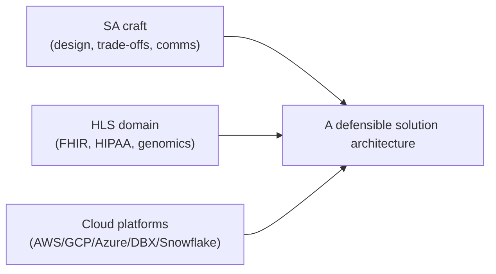

# How to use this book

> _Last reviewed: 2026-06-28 — see the [freshness policy](../appendix/maintenance.md)._

## Learning objectives

After this chapter you will be able to:

- Explain what this book does and does not try to teach.
- Choose a reading path that fits your background.
- Set up the tooling you need to do the labs.

## What this book is

A **course** for becoming a Solution Architect (SA) in health & life science (HLS).
It is opinionated and practical: every concept exists to help you make a real design
decision on a real project. It is *not* an exam cram for a specific cloud certification,
though it will make those exams much easier.

The book braids three strands:

You need all three. An architect who knows AWS cold but cannot read an HL7 message will
design the wrong thing confidently. One who knows clinical workflows but cannot reason
about cost or security will design something that never ships.

## Reading paths

| If you are… | Start at | Then |
| --- | --- | --- |
| An engineer new to architecture **and** healthcare | Module 0 → Part 1 | go in order |
| An experienced architect new to healthcare | Module 0 | jump to Parts 2, 3, 7 (add Part 2's [oncology](../02-interoperability/10-oncology-data.md) and [genomics standards](../07-genomics/04-genomics-data-standards.md) chapters if you touch precision medicine) |
| A healthcare data person new to cloud/SA | Module 0 → Part 1 | then Part 4, then [data strategy & mesh](../05-data-platforms/04-data-strategy.md) in Part 5 |
| Working across the US, Canada, or the EU | Module 0 → Part 1 | then [regional compliance](../03-compliance/05-regional-compliance.md) before anything region-specific |
| Deciding SA vs SE, or leveling yourself | [The SA & SE skills matrix](../01-foundations/04-sa-se-skills-matrix.md) | then follow the gaps it surfaces |
| Here for a specific problem | the relevant Part | follow lab links |

The curriculum has grown past the original ten parts — Part 2 now covers oncology and
genomics data standards alongside FHIR/HL7v2, Part 4 covers NVIDIA and on-prem/hybrid
alongside the clouds, and Part 5 covers data strategy and data mesh alongside the lakehouse.
[SUMMARY](../../SUMMARY.md) is always the current, authoritative table of contents.

**Time budget.** At roughly 20 minutes/chapter and 1–3 hours/lab (see [Bootcamp format](./03-bootcamp-format.md)),
reading everything takes a long weekend; doing every lab is realistically a 10–12 week cohort
pace. Most readers don't do everything — use the table above to pick a path.

## Set up your toolkit

You will get the most out of the labs with:

- A cloud account you can spend a little money in (AWS, GCP, **or** Azure — labs note which).
- **Terraform** ≥ 1.5 or **AWS CDK** for the IaC labs.
- **Python 3.11+** and **uv** (or `pip`) for the data/AI labs.
- **Docker** for running FHIR servers and pipelines locally.
- A **FHIR sandbox** — the public HAPI FHIR test server works for read-only exploration.

> **Cost guardrail.** Every lab includes a teardown step. Healthcare data services
> (managed FHIR stores, genomics engines) can be expensive if left running. Treat
> `terraform destroy` as part of finishing the lab, not an afterthought.

## How chapters are structured

Each chapter follows the same rhythm: **learning objectives → content → a diagram →
a lab → check-yourself questions → further reading.** When a chapter has a companion
repo, the **Lab** section links to it. Skim the objectives first; they tell you what
"done" looks like.

Every acronym and term of art (HIPAA, FHIR, GxP, OMOP, HITRUST…) is **auto-linked** to the
[Glossary](../../GLOSSARY.md) the first time it appears on a page — click it for a definition
and a primary-source reference instead of context-switching to search.

## Check yourself

1. Which of the three strands (craft, domain, platforms) is your current weakest, and
   which Part addresses it?
2. What is the cost guardrail rule, and why does it matter more in HLS than in a generic
   web app?
3. Which IaC tool will you use for the labs, and is it installed?

## Further reading

- [AWS Well-Architected Framework](https://aws.amazon.com/architecture/well-architected/)
- [The Open Group: role of the architect](https://www.opengroup.org/togaf)
