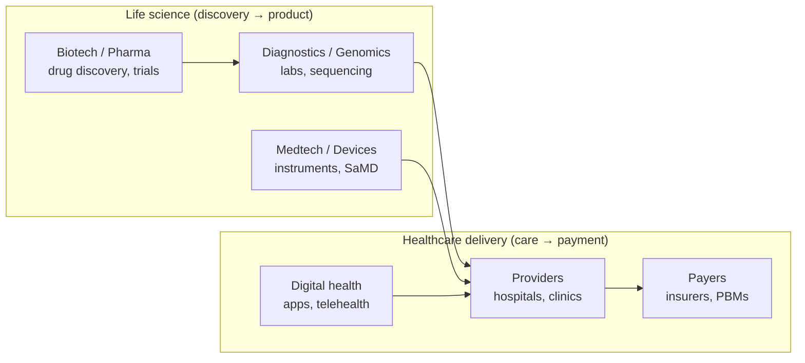

# The HLS industry map

## Learning objectives

After this chapter you will be able to:

- Name the major segments of health & life science and what each one buys technology for.
- Explain why "healthcare" and "life science" have different architectural centers of gravity.
- Identify who your stakeholders are likely to be in each segment.

## The segments

"Health & life science" is not one industry — it is a value chain with very different
buyers, data, and regulators at each stage.

### Life science

- **Biotech & pharma** — R&D and clinical trials. Data is experimental, longitudinal, and
  *regulated for integrity* (GxP, 21 CFR Part 11). Architectures center on data platforms,
  HPC/genomics, and trial systems. Cost of a wrong answer is measured in failed trials.
- **Medtech & devices** — physical instruments and **Software as a Medical Device (SaMD)**.
  Architectures center on edge/IoT, telemetry, and FDA-cleared software lifecycles.
- **Diagnostics & genomics** — high-throughput labs. Architectures center on **sequencing
  pipelines**, LIMS, and turning terabytes of reads into a clinical report.

### Healthcare delivery

- **Providers** (hospitals, health systems, clinics) — run on **EHRs** (Epic, Oracle Health/
  Cerner). Architectures center on **interoperability** (HL7v2, FHIR), integration engines,
  and analytics on top of clinical data. HIPAA is the dominant regulation.
- **Payers** (insurers, PBMs) — claims, eligibility, prior authorization, actuarial models.
  Architectures center on large-scale data warehousing and increasingly FHIR (CMS mandates).
- **Digital health** — apps, telehealth, remote monitoring. Cloud-native, fast-moving, but
  still HIPAA-bound the moment they touch PHI.

## Why the center of gravity differs

| Segment | Dominant data | Dominant regulator | Architect's first question |
| --- | --- | --- | --- |
| Pharma R&D | experimental, genomic | FDA (GxP / Part 11) | Is the data *trustworthy and traceable*? |
| Providers | clinical (EHR) | HHS/OCR (HIPAA) | Can systems *interoperate* safely? |
| Payers | claims, financial | CMS / state | Can we *scale* and *report*? |
| Medtech | telemetry, SaMD | FDA (510k / PMA) | Is the software *safe and validated*? |

A pattern that is excellent for a provider (a FHIR interoperability gateway) is irrelevant
to a pharma HPC pipeline. **Know which segment you are in before you reach for a pattern.**

## Stakeholders you will meet

- **Clinical / scientific** — physicians, nurses, bench scientists, bioinformaticians.
  They own the "is this correct and useful?" question.
- **Compliance / regulatory / privacy** — HIPAA security officers, GxP QA, IRB. They can
  stop a project; engage them on day one, not at launch.
- **IT / security** — the CISO and platform teams who will operate what you design.
- **Business** — the CFO who pays for it and the product owner who scoped it.

## Check yourself

1. A startup builds a sequencing-based cancer test sold to hospitals. Which segments does it
   touch, and which regulators apply?
2. Why is "interoperability" the provider architect's first concern but rarely the pharma R&D
   architect's?
3. Who can unilaterally stop your project, and when should you involve them?

## Further reading

- [ONC: about interoperability](https://www.healthit.gov/topic/interoperability)
- [FDA: device software functions and SaMD](https://www.fda.gov/medical-devices/digital-health-center-excellence)
