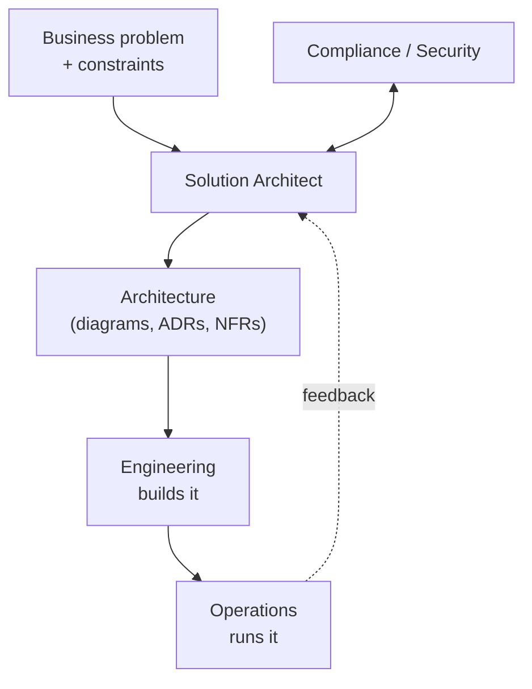
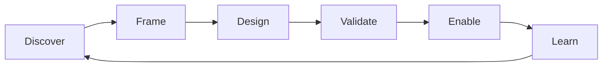

# The SA operating model

## Learning objectives

After this chapter you will be able to:

- Describe what a Solution Architect actually does day to day.
- Distinguish the SA role from enterprise, infrastructure, and software architects.
- Apply a simple operating loop to any new engagement.

## What an SA is on the hook for

A Solution Architect owns the **technical design of a solution to a specific business
problem**, end to end, and is accountable for it being **buildable, operable, compliant,
and affordable**. You are the bridge between what the business wants and what engineering
builds — translating in both directions.

You are *not* the person who writes most of the code, and you are *not* the project manager.
You are the person who can stand in front of a whiteboard and answer "why is it built this
way?" for every significant decision.

## How the SA differs from neighboring roles

| Role | Scope | Time horizon |
| --- | --- | --- |
| **Enterprise architect** | the whole organization's IT strategy | years |
| **Solution architect** | one solution / program | a release to a year |
| **Software/application architect** | the internals of one system | a sprint to a release |
| **Infrastructure / cloud architect** | the platform it runs on | ongoing |

In HLS the SA additionally carries a **domain + compliance** load that generic SAs do not:
you must encode HIPAA/GxP as design constraints, not afterthoughts.

## The operating loop

Most engagements, large or small, move through the same loop. Make it a habit.

1. **Discover** — understand the problem, users, data, and constraints. Resist designing yet.
2. **Frame** — write down non-functional requirements (security, latency, availability,
   cost, compliance) and the *forces* in tension.
3. **Design** — produce options, pick one, capture the decision in an **ADR**.
4. **Validate** — review with security/compliance, prototype the risky parts, estimate cost.
5. **Enable** — hand off to engineering with diagrams and ADRs; stay available.
6. **Learn** — watch it run; feed surprises back into the next design.

The biggest beginner mistake is skipping **Discover** and **Frame** to jump to **Design** —
producing an elegant solution to the wrong problem. In HLS that mistake is expensive because
a missed compliance constraint can invalidate the whole design late.

## Artifacts you produce

- **Context & container diagrams** (C4) — see Part 1.
- **Architecture Decision Records (ADRs)** — one per significant, hard-to-reverse choice.
- **Non-functional requirements (NFRs)** — the measurable bar the design must clear.
- **A cost model / TCO estimate** — what it costs to build and to run.
- **A security & compliance mapping** — which controls satisfy which regulation.

## Check yourself

1. Where does the SA role end and the software architect's begin?
2. Which step of the operating loop do beginners most often skip, and what does it cost in HLS?
3. Name three artifacts an SA is expected to produce on a typical engagement.

## Further reading

- [Architecture Decision Records (Michael Nygard)](https://cognitect.com/blog/2011/11/15/documenting-architecture-decisions)
- [C4 model](https://c4model.com/)
