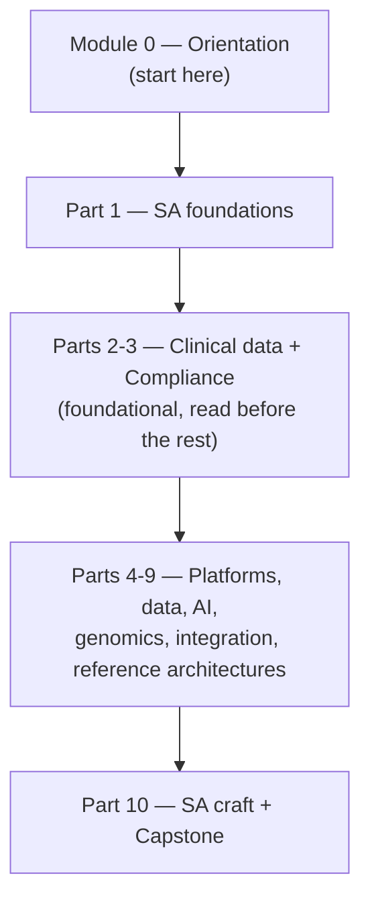
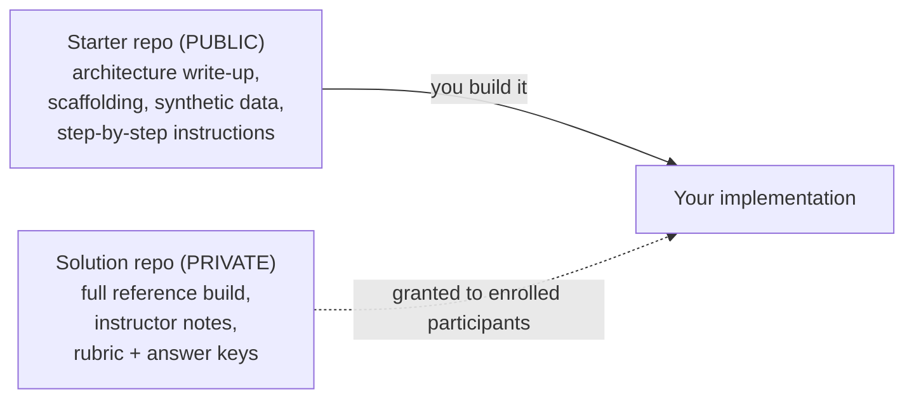

# Bootcamp format & labs

## Learning objectives

After this chapter you will be able to:

- Navigate the bootcamp's module structure and choose a pace.
- Understand how the labs work — the public-starter / private-solution model.
- Know how you are assessed and what "graduating" requires.

## This is a bootcamp, not just a book

The chapters read like a handbook, but the design is a **bootcamp**: you learn by building. Reading teaches you the vocabulary and the trade-offs; the **labs** are where you prove you can actually design and ship a health & life science solution. Treat the labs as the main event, not homework.

## Module structure

- **Module 0 (Orientation)** sets up vocabulary, the HLS industry map, the SA operating model, and this format guide.
- **Part 1** is the SA craft foundation — read it before everything else.
- **Parts 2–3** (clinical data + compliance) are foundational; most later parts assume them.
- **Parts 4–9** are largely independent modules — take them in the order your goals demand.
- **Part 10** is the SA craft capstone.

## Choosing a pace

| Mode | Cadence | Who it's for |
| --- | --- | --- |
| **Cohort** | ~10–12 weeks, ~one part/week | Groups with an instructor and deadlines |
| **Self-paced** | As fast or slow as you like | Individuals fitting it around work |

Budget roughly **20 minutes per chapter** to read and **1–3 hours per lab**. The capstone is a larger, multi-session effort.

## How the labs work

Labs use a deliberate **two-repo model** so that you get scaffolding and guidance without being handed the answer:

- **Starter repos are public.** Fork or clone them; they contain the architecture, scaffolding, synthetic data, and instructions. Building the solution yourself is the point.
- **Solution repos are private.** Complete reference implementations, instructor materials, grading rubrics, and assessment keys live in private repositories, granted to enrolled participants. Keeping the "major part" hidden preserves the learning value of doing the work.
- **Synthetic data only.** Every lab uses synthetic data (e.g. Synthea). Never put real PHI in a lab repo — that is the first rule of [Part 3](../03-compliance/00-hipaa.md).

The public starter repos are listed in the [README](../../README.md). To request access to the private solution repos — for a cohort, for teaching, or for any reuse — see the licensing note there.

## Assessment

You are assessed three ways, increasing in weight:

1. **Check yourself** — every chapter ends with 3–5 questions to confirm you absorbed the concepts. Self-graded.
2. **Lab deliverables** — each part's lab produces a working artifact (a deployed architecture, a pipeline, a query). This is the core evidence of competence.
3. **Capstone** — Part 10 sets a realistic brief: design a multi-cloud, multi-jurisdiction HLS platform end to end (discovery → requirements → architecture → compliance mapping → cost). Reviewed against a rubric.

## Graduating

You "graduate" the bootcamp by:

- completing the lab deliverables for the parts relevant to your track, and
- passing the capstone review against the Part 10 rubric.

There is no exam to cram; the bar is **can you design and defend a real HLS solution** — which is exactly what the SA role demands.

## Check yourself

1. Which modules should you read before branching into the platform/AI/genomics parts, and why?
2. Why are solution repos kept private while starter repos are public?
3. What are the three forms of assessment, and which one carries the most weight?

## Further reading

- [How to use this book](./00-how-to-use.md) — toolkit and setup
- [The SA operating model](./02-sa-operating-model.md) — the loop the labs exercise
