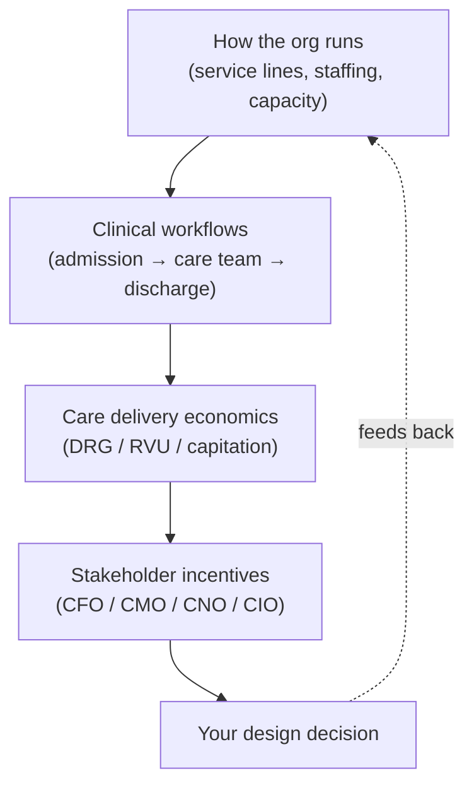
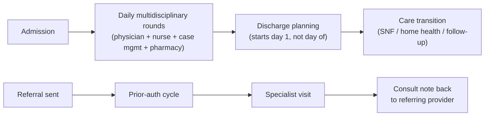

# Health system operations, clinical workflows & care economics

> _Last reviewed: 2026-07-03 — see the [freshness policy](../appendix/maintenance.md)._

## Learning objectives

After this chapter you will be able to:

- Describe how a hospital or health system is actually organized and run day to day.
- Explain the economic mechanisms (DRGs, RVUs, capitation) that determine who gets paid what for a
  clinical encounter, and why that shapes which systems get funded.
- Map a health system's stakeholders to their real incentives, and use that to explain why the
  "best" architecture on paper is not always the one that gets adopted.

## Why this belongs before you design anything

The rest of this book is technically strong on standards, platforms, and compliance — but a
design that is technically correct and operationally naive still fails. A system that adds two
clicks to a nurse's workflow, or that a department can't afford to run, or that helps the wrong
stakeholder, gets quietly abandoned no matter how clean its architecture is. This chapter deepens
the [industry map](./01-hls-industry-map.md) and the [SA operating model](./02-sa-operating-model.md)
by going one level down: how the *provider* segment specifically actually runs, spends, and
decides.

## How a health system is actually organized

A hospital or health system is not one monolith — it is a set of semi-autonomous **service
lines** (cardiology, oncology, orthopedics, behavioral health, primary care) each with its own
volume, margin, staffing, and often its own shadow IT. Above them sits an executive layer that
divides responsibility in a way every SA should recognize before proposing anything:

| Role | Owns | Cares most about |
| --- | --- | --- |
| **CEO** | Overall strategy, growth, community reputation | Market share, margin, high-visibility risk |
| **CFO** | Revenue cycle, cost accounting, capital allocation | Days-to-collect, cost per case, capital ROI |
| **CMO / CMIO** | Clinical quality, physician relations, EHR clinical content | Malpractice/safety risk, clinician burden, quality metrics |
| **CNO** | Nursing operations, staffing ratios | Patient safety, nurse retention, workload |
| **CIO / CISO** | IT infrastructure, security, integration debt | Uptime, breach risk, technical debt, HIPAA/HITRUST posture |
| **Department chairs / service-line leaders** | One service line's volume, staffing, and P&L | Their line's margin and referral volume specifically |

**Capacity is the operational constraint everything else sits on top of**: bed management
(how many inpatient beds are staffed, not just physically available), OR block scheduling,
provider FTE, and nurse-to-patient ratios. A brilliant new intake workflow that ignores bed
capacity just moves the bottleneck; this is why "add a system" often isn't the fix an SA is asked
for — "fit inside an already-constrained operation" is.

## Clinical workflows beyond the interface diagram

Standards chapters ([HL7v2](./00-hl7v2.md), [FHIR](./01-fhir.md), and the
[LIS order-to-result lifecycle](../08-integration/05-lis-architecture.md)) show the *data* flow of
a clinical event. The *human* workflow around it is broader and is where most adoption failures
happen:

- **Admission → rounding → discharge planning.** A patient's stay isn't one event; it's a daily
  cycle of multidisciplinary rounds (physician, nurse, case manager, pharmacist), each touching
  the chart differently, converging on a discharge plan that starts on **day one**, not the day
  of discharge. Systems that model "discharge" as a single terminal event misunderstand the
  workflow.
- **Referral loops.** A referral from primary care to a specialist is not a single message — it's
  a loop: referral sent → prior-authorization cycle (see [Da Vinci CRD/DTR](./11-payer-value-based-care.md))
  → specialist visit → consult note back to the referring provider. Each hop is a place data (and
  patients) get lost; "closing the referral loop" is a named operational metric many health
  systems track and fail at.
- **Care-team communication.** Handoffs (nursing shift change via **SBAR** — Situation,
  Background, Assessment, Recommendation — is the dominant structured-handoff format) and
  multidisciplinary rounds are where clinical judgment gets transferred between people, not just
  systems. A design that only moves data between *systems* and ignores how it needs to support a
  *conversation* between clinicians will be worked around.

## Care delivery economics: how the money actually moves

Understanding *how a hospital gets paid for an encounter* explains why some projects get funded
instantly and others can't get budget no matter how sound the technical case is.

- **DRG (Diagnosis-Related Group)** — Medicare's inpatient **prospective payment system**: a
  hospital is paid a fixed amount per admission based on the DRG assigned (from diagnoses,
  procedures, and complications/comorbidities), **regardless of the actual cost of the stay**.
  This is why accurate, complete documentation and coding directly determines revenue — an
  under-coded stay is paid at a lower DRG than the care actually delivered warranted, even though
  the cost was real.
- **RVU (Relative Value Unit)** — the unit behind Medicare's **RBRVS (Resource-Based Relative
  Value Scale)**, used to pay physicians/professional fees for outpatient and procedural work.
  Every billable service has an RVU value (reflecting work, practice expense, and malpractice
  risk); physician compensation in many health systems is still tied directly to **RVUs
  produced**, which is why clinicians resist any workflow change that costs them time without
  producing billable RVUs.
- **Capitation & value-based contracts** — a fixed per-member-per-month payment regardless of
  utilization, or a shared-savings/bundled-payment arrangement (an **ACO**, or **BPCI-A**-style
  bundle). This is the provider-side mirror of the [payer value-based care](../02-interoperability/11-payer-value-based-care.md)
  chapter — under capitation, the financial incentive **flips**: fewer, better-coordinated
  encounters increase margin, instead of more encounters increasing revenue.
- **Service-line margin varies enormously.** Procedural/surgical and imaging service lines are
  typically the health system's profit centers; the Emergency Department, primary care, and
  behavioral health frequently run at a loss but are kept because they're mission-critical or feed
  referral volume into profitable service lines. **Which service line sponsors your project tells
  you what "success" means to them** — a margin-positive surgical service line wants throughput; a
  loss-leading ED wants safety and length-of-stay reduction.

| Payment model | Who bears utilization risk | What it rewards |
| --- | --- | --- |
| Fee-for-service (DRG / RVU) | Payer | Volume and documentation completeness |
| Capitation | Provider | Efficient, coordinated care; fewer avoidable encounters |
| Bundled payment (e.g. BPCI-A) | Shared | Coordinated care across an episode (e.g. a surgery + 90-day recovery) |

## Stakeholder incentives, worked example

A hospital wants a new clinical-documentation/CDS tool. The same system means different things to
different sponsors:

- **CFO** — wants better HCC/DRG documentation capture, because it directly affects revenue
  (see [payer risk adjustment](../02-interoperability/11-payer-value-based-care.md) for the
  documentation-gap mechanism from the payer side).
- **CMIO** — worried the tool adds clicks and **alert fatigue** (see
  [real-time streaming clinical analytics](../08-integration/04-realtime-streaming-analytics.md))
  and increases physician burnout and turnover risk.
- **CNO** — cares whether it changes nursing workflow at shift handoff, not whether it improves
  coding.
- **CIO** — cares whether it's one more system to integrate, secure, and keep patched.

None of these stakeholders is wrong; they are optimizing for different, legitimate parts of the
organization. **The SA's job is to design (and frame) one system that is defensible against all
four lenses at once** — e.g. embedding suggested codes in the existing workflow at the point of
documentation (satisfies CFO) without adding a new screen or alert (satisfies CMIO/CNO) built on
infrastructure the CIO already operates (satisfies CIO) — rather than picking the sponsor who
shouts loudest and hoping the rest come along. See
[EHR usability & clinical documentation burden](../08-integration/07-ehr-usability-documentation-burden.md)
for a full treatment of this specific tension.

## Design guidance

1. **Ask which service line is sponsoring this, and what their margin situation is** — it tells
   you what "success" is measured against before you design anything.
2. **Model the human workflow, not just the data flow** — rounds, handoffs, and referral loops are
   where adoption succeeds or fails.
3. **Never add clinician-facing friction without a clinician-facing win** — a system that only
   helps billing or compliance, at the cost of physician/nurse time, will be worked around.
4. **Understand the payment model behind the request** — a DRG-optimization ask and a
   capitation/ACO ask point to opposite designs (maximize documented complexity vs. minimize
   avoidable utilization).
5. **Translate the request into every major stakeholder's language before proposing anything** —
   if you can't state the CFO, CMIO, CNO, and CIO case for your design, you haven't finished
   framing it.

## Check yourself

1. Why might two service lines in the same hospital react completely differently to the same new
   system?
2. A hospital signs a new capitation contract. What changes about what "good design" means for
   its care-coordination systems compared to when it was purely fee-for-service?
3. A CDS tool improves DRG capture but adds two clicks to a nurse's workflow. Whose incentive does
   it serve, whose does it burden, and how would you redesign it to satisfy both?

## Further reading

- [CMS — Inpatient Prospective Payment System (DRG)](https://www.cms.gov/medicare/payment/prospective-payment-systems/acute-inpatient-pps)
- [CMS — Resource-Based Relative Value Scale (RBRVS)](https://www.cms.gov/medicare/payment/fee-schedules/physician)
- [CMS — Bundled Payments for Care Improvement Advanced (BPCI-A)](https://www.cms.gov/priorities/innovation/innovation-models/bpci-advanced)
- [MGMA — physician compensation & RVU benchmarking](https://www.mgma.com/)
- [Failure-mode case studies](../10-sa-craft/05-failure-mode-case-studies.md) — case 3 covers a real medication-safety incident rooted in unsupported clinical workflow
