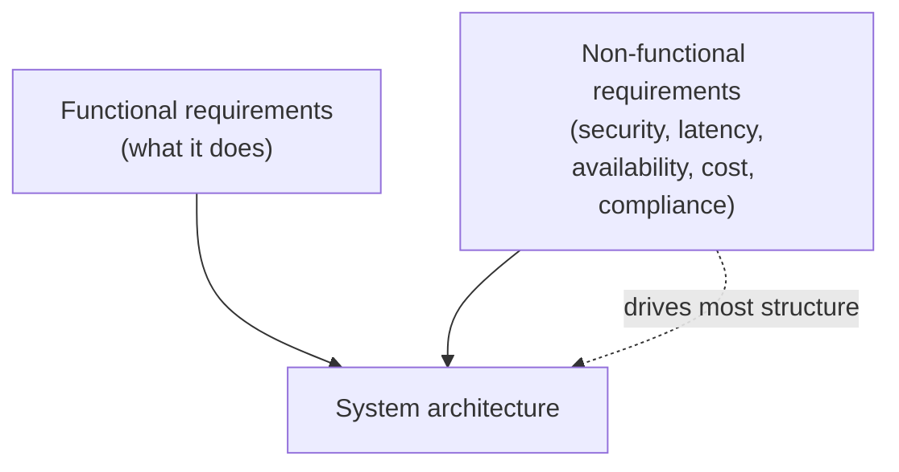
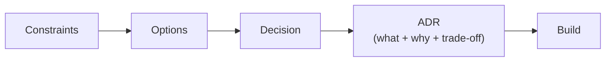

# Architecture thinking

> _Last reviewed: 2026-06-28 — see the [freshness policy](../appendix/maintenance.md)._

## Learning objectives

After this chapter you will be able to:

- Define an architecture as a set of decisions about elements, relationships, and properties.
- Separate functional requirements from the non-functional requirements that shape design.
- Reason about a design in terms of *quality attributes* and the trade-offs between them.

## What "architecture" means

> The architecture of a system is the set of **significant decisions** about its structure —
> the elements, how they relate, and the properties of both — where "significant" means
> *hard and expensive to change later*.

That definition has a useful corollary: **if a decision is cheap to reverse, it is not
architecture** — let the team make it. Architects spend their scarce attention on the
decisions that are load-bearing and sticky: data models, trust boundaries, the integration
style between systems, where state lives, and which regulations bind which components.

## Functional vs non-functional requirements

- **Functional requirements (FRs)** say *what* the system does: "clinicians can search a
  patient's medications."
- **Non-functional requirements (NFRs)** say *how well*: available 99.9% of the time,
  p95 latency < 500 ms, all PHI encrypted at rest and in transit, audit log retained 6 years.

Architecture is mostly driven by **NFRs**. Two systems with identical features can have
completely different architectures because one must be HIPAA-compliant and multi-region and
the other is an internal prototype. **Write the NFRs down early** — they are the forces your
design must balance.

## Quality attributes and trade-offs

NFRs map to **quality attributes** — measurable properties of the system. The architect's
craft is that these attributes **trade off against each other**: you cannot maximize all of
them, so you make explicit, defensible choices.

| Quality attribute | Example NFR | Common tension |
| --- | --- | --- |
| Security | PHI encrypted, least privilege | vs. developer velocity, latency |
| Availability | 99.9% uptime, multi-AZ | vs. cost, complexity |
| Performance | p95 < 500 ms | vs. cost, consistency |
| Scalability | 10× load with no redesign | vs. simplicity |
| Cost | < \$X/month to run | vs. nearly everything |
| Compliance | HITRUST-certifiable | vs. speed to market |
| Operability | one team can run it | vs. feature breadth |
| **Interoperability** | conforms to a named FHIR IG (e.g. US Core) | vs. schema flexibility, delivery speed |

Interoperability earns its own row in HLS: it is rarely optional (regulatory mandates force
it — see [FHIR profiles & regulation](../02-interoperability/06-fhir-profiles-us-ca.md)) and
it trades directly against how freely you can shape your own data model.

There is no free lunch. When you "improve" one attribute you usually spend another. The job
is not to avoid trade-offs — it is to **make them on purpose and record why** (that is what an
ADR is for, covered later in this part).

### A worked micro-example

A digital-health startup wants a patient-facing API over PHI.

- NFR: HIPAA-compliant, p95 < 300 ms, run by a 3-person team, < \$2k/month.
- Tension: a fully multi-region active-active design maximizes availability but blows the
  cost and operability budgets for a 3-person team.
- Decision: single-region, multi-AZ, managed services, automated backups + tested restore.
  Accept a higher RTO in a regional outage in exchange for cost and operability.
- That sentence — *what you chose and what you traded* — is the architecture.

## How to think, in practice

1. **Start from constraints, not solutions.** List what is fixed (regulation, budget, team,
   existing systems) before drawing boxes.
2. **Make the NFRs measurable.** "Fast" is not a requirement; "p95 < 500 ms" is.
3. **Name the dominant quality attribute.** Most systems have one or two that win ties.
4. **Generate at least two options.** A design with no considered alternative is a guess.
5. **Record the decision and its trade-off.** Future-you needs the *why*, not just the *what*. The tool for this is an ADR — covered in the next chapter: [C4 diagrams & ADRs](./02-c4-and-adrs.md).

## Frameworks & methods (use them, don't worship them)

You don't have to invent the practice of architecture — mature frameworks give you vocabulary, checklists, and templates. Borrow what helps; skip the ceremony that doesn't.

| Framework / method | What it gives you | Use it for |
| --- | --- | --- |
| **TOGAF** | An enterprise-architecture method (ADM) and a way to organize business/data/application/technology architectures and governance | Large orgs with formal EA governance; aligning a solution to an enterprise landscape |
| **C4 model** | A simple, layered way to *diagram* a system (Context→Container→Component→Code) | Every design — your default diagramming approach ([C4 & ADRs](./02-c4-and-adrs.md)) |
| **ADRs / MADR** | A lightweight record of *why* a decision was made | Capturing significant, hard-to-reverse decisions |
| **arc42** | A pragmatic template for architecture *documentation* (incl. quality requirements) | Structuring a design document without TOGAF's weight |
| **Cloud Well-Architected** | Pillar-based *review* checklists (security, reliability, cost…) | Reviewing a candidate design ([Well-Architected](./01-well-architected.md)) |

Rule of thumb for an SA: **TOGAF/arc42 for the enterprise and documentation altitude, C4 for diagrams, ADRs for decisions, Well-Architected for review.** A two-person startup needs ADRs and a C4 sketch, not a full TOGAF ADM cycle; a hospital's enterprise architecture team may require TOGAF artifacts. Match the ceremony to the stakes — over-applying a heavyweight framework is its own failure mode.

## Diagram

## Check yourself

1. Why is a cheap-to-reverse decision *not* considered architecture?
2. Rewrite this NFR to be measurable: "the system should be fast and reliable."
3. Pick two quality attributes from the table and describe a realistic situation where
   improving one degrades the other.

## Further reading

- Bass, Clements, Kazman — *Software Architecture in Practice* (quality attributes).
- [arc42 quality requirements](https://docs.arc42.org/section-10/)
