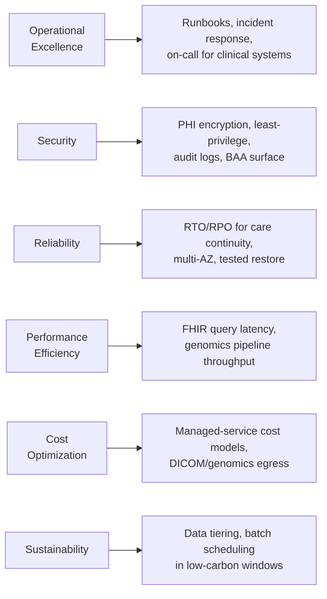

# Well-Architected frameworks

## Learning objectives

After this chapter you will be able to:

- Explain what a Well-Architected framework is and how to use it as a design-review tool, not a blueprint.
- Apply the AWS WAF six pillars to an HLS system with domain-specific concerns on each pillar.
- Locate equivalent guidance for GCP and Azure, and know when each is relevant.

## What a Well-Architected framework is (and is not)

A Well-Architected framework (WAF) is a **structured set of design principles and questions** that cloud providers publish to help you evaluate whether a system is built well. Think of it as a checklist your design must survive — not a recipe you follow to produce one.

> WAFs do not tell you *what* to build. They tell you *what to review* once you have a design.

In practice: after you have a candidate architecture, you run it through the relevant WAF pillar by pillar. Each pillar surfaces questions like "what happens if this component fails?" or "who has access to this data store and why?" The answers either validate your design or expose gaps to fix before they become incidents.

## AWS Well-Architected Framework — six pillars through an HLS lens

AWS WAF is the most widely adopted; GCP and Azure are structurally similar. Learn this one deeply and the others will be additive.

### Operational Excellence

Design for operations from day one. In HLS, clinical systems often have no tolerance for "we'll figure out the runbook later." Key questions:

- Is there a runbook for the three most likely failure modes?
- Can you deploy a change without downtime? EHR-integrated systems often need maintenance windows communicated to clinical staff in advance.
- Are logs and alerts structured and actionable — not just present?

### Security — the dominant pillar in HLS

Every HLS system touching PHI must pass this pillar before anything else. Key questions:

- Is PHI encrypted at rest (AES-256) and in transit (TLS 1.2+)?
- Is access controlled by least privilege and audited — who accessed which patient record, when?
- Have you minimised the **BAA surface** — the number of vendors who touch PHI and must sign a Business Associate Agreement?
- Is there a breach-notification workflow? HIPAA requires notifying HHS and affected individuals within 60 days of discovery.

See [HIPAA](../03-compliance/00-hipaa.md) for the full control list.

### Reliability

In healthcare, downtime has clinical consequences. Key questions:

- What are the **RTO** (Recovery Time Objective) and **RPO** (Recovery Point Objective)? A medication-dosing system tolerates far less downtime than a reporting dashboard.
- Are you multi-AZ? Single-AZ is rarely acceptable for patient-facing or clinician-facing systems.
- Have you tested the restore path, not just the backup path?
- Is the system designed to **fail safe**? If a CDS Hooks advisory service is unavailable, does the EHR workflow continue unblocked?

### Performance Efficiency

HLS has some extreme-scale workloads. Key questions:

- What is FHIR query latency at P99 under expected load?
- Can your genomics pipeline complete a whole-genome analysis within the clinical reporting SLA?
- Are DICOM images served from the right object storage tier (hot / warm / cold) based on access frequency?

### Cost Optimization

Managed HLS services have non-obvious cost profiles. Key questions:

- Have you modelled the **per-request** cost of managed FHIR stores (AWS HealthLake, Azure Health Data Services) at your expected query volume? A FHIR store that is cheap at 10 k requests/day is expensive at 10 M/day.
- Are large genomics or DICOM files on the right storage tier? Genomics data is written once but may sit for years before reanalysis.
- Is Snowflake or Databricks compute auto-suspending when idle?

See [Trade-offs, TCO & cost](./03-tradeoffs-tco.md) for estimation techniques.

### Sustainability

Increasingly a design requirement in enterprise HLS. Key questions:

- Can batch workloads (genomics pipelines, nightly ETL) be scheduled to run in low-carbon regions or off-peak hours?
- Is data tiered to lower-power storage when it ages out of active use?

## GCP and Azure equivalents

| Pillar theme | AWS WAF | GCP equivalent | Azure equivalent |
| --- | --- | --- | --- |
| Operational Excellence | Operational Excellence | Operational Excellence | Operational Excellence |
| Security | Security | Security, Privacy & Compliance | Security (Zero Trust) |
| Reliability | Reliability | Reliability | Reliability |
| Performance | Performance Efficiency | Performance Efficiency | Performance Efficiency |
| Cost | Cost Optimization | Cost Optimization | Cost Optimization |
| Sustainability | Sustainability | Carbon-aware computing | Sustainability guidance |

All three frameworks are structurally identical; vocabulary differs slightly. For a multi-cloud HLS design, run through the framework of the **primary** cloud and spot-check the others for platform-specific deviations.

Databricks publishes a [Well-Architected Guide](https://www.databricks.com/blog/well-architected-guide) focused on lakehouse design. Snowflake has an equivalent [Architecture Guide](https://docs.snowflake.com/en/guides-overview).

## How to use WAFs in practice

1. **After** you have a candidate design, go pillar by pillar and write one sentence answering the key question for each.
2. **Flag the gaps.** Pillars answered with "we haven't addressed this" are delivery risks — not optional homework.
3. **Prioritise Security first** in HLS. An architecture that is fast, cheap, and reliable but leaks PHI is not deployable.
4. Use the AWS Well-Architected Tool in the console for a guided, structured review; GCP and Azure offer equivalent tools.

## Check yourself

1. Why is the Security pillar the dominant one in HLS, compared to a generic SaaS system?
2. A genomics pipeline runs for 6 hours and costs \$400/run. Which WAF pillar does this fall under, and what is the right question to ask?
3. What does "fail safe" mean for a CDS service integrated with an EHR, and why does it matter for reliability?

## Further reading

- [AWS Well-Architected Framework](https://aws.amazon.com/architecture/well-architected/)
- [AWS HIPAA-eligible services reference](https://aws.amazon.com/compliance/hipaa-eligible-services-reference/)
- [GCP Well-Architected Framework](https://cloud.google.com/architecture/framework)
- [Azure Well-Architected Framework](https://learn.microsoft.com/en-us/azure/well-architected/)
