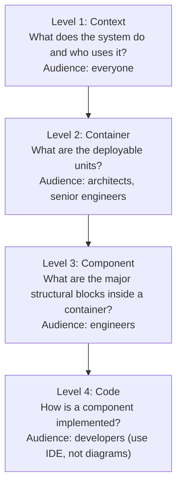
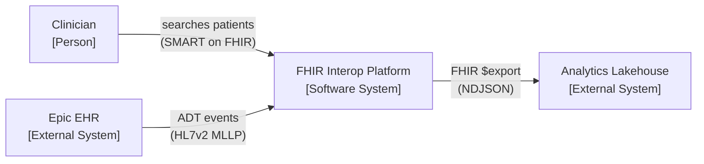
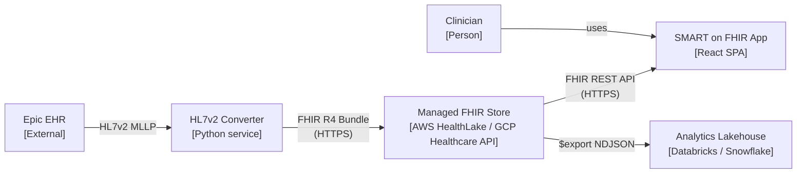

# C4 diagrams & ADRs

> _Last reviewed: 2026-06-28 — see the [freshness policy](../appendix/maintenance.md)._

## Learning objectives

After this chapter you will be able to:

- Draw C4 Level 1 (Context) and Level 2 (Container) diagrams for an HLS system.
- Explain when to stop at Level 2 and when to go deeper.
- Write an Architecture Decision Record (ADR) using the MADR format.

## The C4 model

The C4 model (Simon Brown) organises system diagrams into four levels of zoom. Each level answers a different question for a different audience.



**As a Solution Architect you live at L1 and L2.** Hand L3 to the engineering lead and skip L4 entirely — that is what the IDE is for.

### Level 1: Context diagram

A Context diagram shows your system as a single box in the middle, with the users and external systems around it. Nothing inside the box. It answers: "What problem does this solve and who are the actors?"

**HLS example — FHIR interoperability platform:**



Three boxes, three relationships. Anyone in the room can read it — the CTO, the CISO, the clinical informatics lead.

### Level 2: Container diagram

A Container diagram opens the system box and shows its **deployable units** (web apps, APIs, databases, queues, functions — anything that runs separately). It answers: "What are the technical building blocks and how do they talk?"

**HLS example — same FHIR platform, zoomed in:**



This is the diagram you bring to the security review, the cost-estimation session, and the engineering kickoff. It lives in version control as a Mermaid or PlantUML file alongside the ADRs.

### Practical tips

- **One diagram per audience.** Do not add PHI-flow annotations to the L1 diagram — that belongs in the L2 security view.
- **Keep it honest.** A C4 diagram that omits the message queue "because it complicates things" will cost you in the architecture review.
- **Version it.** Diagrams as code (Mermaid in Markdown) age gracefully; screenshots do not.
- **Name actors precisely.** "User" is not a person. "Admitting nurse" or "research analyst" is.

## Architecture Decision Records (ADRs)

An ADR captures a single significant, hard-to-reverse architectural decision: what you chose, the context that made it a decision, and the consequences — including what you gave up.

### When to write one

Write an ADR when:

- You are choosing between two or more real options.
- The decision is hard to reverse (data model choice, messaging protocol, managed vs. self-hosted).
- Future engineers need to know *why*, not just *what*.

Do not write an ADR for easily-reversible choices (variable naming, minor config) or for decisions with only one reasonable option.

### MADR format (recommended)

MADR (Markdown Architectural Decision Records) is a lightweight, structured format that stores ADRs as plain Markdown in `docs/adr/` alongside the code.

```markdown
# ADR-0001: Use managed FHIR store instead of self-hosted HAPI FHIR

**Status:** Accepted  
**Date:** 2024-11-15  
**Deciders:** Dmitry Shirokov, Platform team

## Context

We need a FHIR R4 server for the interop platform. We considered:
1. Self-hosted HAPI FHIR on Kubernetes
2. AWS HealthLake (managed)
3. GCP Cloud Healthcare API (managed)

## Decision

Use a managed FHIR store (AWS HealthLake for this deployment).

## Rationale

- The team has no HAPI FHIR operational expertise; managed eliminates server patching.
- HealthLake provides built-in HIPAA controls and CloudTrail audit logging.
- Per-request pricing is acceptable at our expected volume (<100 k/day).

## Consequences

- **Positive:** No HAPI server to operate; audit logs automatic; HIPAA BAA covered.
- **Negative:** Vendor lock-in at the FHIR-store level; per-request cost scales with volume.
- **Risk:** If volume exceeds 1 M requests/day, evaluate self-hosted for cost.
```

### Where to store ADRs

Keep ADRs in `docs/adr/` in the same repo as the code they govern. Name files sequentially: `0001-use-managed-fhir-store.md`. When a decision is superseded, update its status to "Superseded by ADR-XXXX" rather than deleting it — the history matters.

## Check yourself

1. A stakeholder asks: "What does your system do?" Which C4 level do you show them, and what goes in it?
2. Your team decides to use Delta Lake instead of Iceberg for the data lakehouse. Should this be an ADR? Why or why not?
3. Write the *context* and *consequences* sections of an ADR for the choice: "Deploy the HL7v2 converter as a serverless function vs. a long-running container service."

## Further reading

- [c4model.com](https://c4model.com/) — the definitive C4 reference (Simon Brown)
- [MADR](https://adr.github.io/madr/) — Markdown Architectural Decision Records spec
- [Michael Nygard — Documenting Architecture Decisions](https://cognitect.com/blog/2011/11/15/documenting-architecture-decisions)
