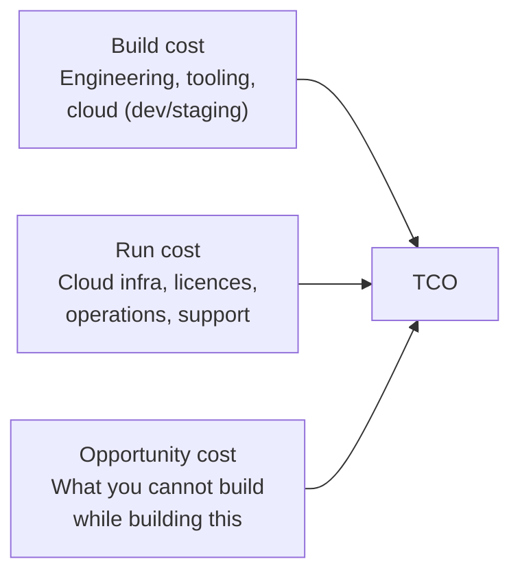

# Trade-offs, TCO & cost

## Learning objectives

After this chapter you will be able to:

- Build a back-of-envelope Total Cost of Ownership (TCO) model for a cloud HLS system.
- Identify the HLS-specific cost drivers that surprise teams most often.
- Apply a trade-off framework to common SA choices (build vs. buy, managed vs. self-hosted, multi-region vs. single).

## TCO: the three cost buckets

Total Cost of Ownership is the full cost of a system over its lifetime, not just its build cost. In HLS, teams almost always underestimate **run cost** — especially for managed clinical data services.

- **Build cost** is usually one-time or per-sprint: engineering hours, tooling licences, cloud spend during development.
- **Run cost** recurs monthly or yearly: cloud infrastructure, managed-service fees, operational effort (on-call, patching, capacity management), SaaS licences.
- **Opportunity cost** is invisible but real: while your team builds a custom HL7v2 integration engine, they are not building features. "Build vs. buy" decisions are always trade-offs between build/run costs and opportunity cost.

**HLS rule of thumb:** managed services shift cost from build+opportunity to run. Self-hosted shifts cost from run back to build. The right choice depends on team capability, volume, and how long the system lives.

## HLS-specific cost drivers (the surprises)

These are the line items that regularly blow cloud budgets in healthcare and life science:

| Service / resource | Surprise | Mitigation |
| --- | --- | --- |
| Managed FHIR store (HealthLake, AZ Health Data Services) | Per-request pricing at scale. 1 M FHIR reads/day × \$0.01/read = \$300 k/year. | Cache frequent reads; use Bulk $export for analytics instead of ad-hoc FHIR queries. |
| DICOM / imaging storage | Petabytes of lossless images; egress is expensive. | Keep images in the same region as compute; use intelligent tiering (hot → cold after 90 days). |
| Genomics compute (AWS HealthOmics, GCP Batch) | WGS = 100–300 GB raw data × many samples. | Batch overnight; use spot/preemptible instances; archive raw reads after QC. |
| Snowflake compute | Warehouses that never auto-suspend. | Set `AUTO_SUSPEND = 60` seconds; separate development and production warehouses. |
| Databricks DBUs | All-purpose clusters left running by data scientists. | Enforce job clusters for production; set cluster inactivity timeout; use serverless SQL warehouses. |
| Data egress (cross-region, cross-cloud) | Moving clinical data between regions for analytics hits egress fees. | Co-locate storage and compute; use cloud-native data sharing (Snowflake secure data share, Databricks Delta Sharing) rather than bulk copy. |

## The trade-off axes every SA navigates

Architectural trade-offs are not "good vs. bad" — they are "which cost are you willing to pay?"

### Build vs. buy

| | Build | Buy / managed |
| --- | --- | --- |
| **When to choose** | No vendor solves it; it is core differentiation | Commodity capability; vendor has compliance certs (BAA, HITRUST) |
| **Pay with** | Engineering time, opportunity cost, operational burden | Run cost; vendor lock-in |
| **HLS example** | Custom OMOP ETL for proprietary source schema | Managed FHIR store (HealthLake) for standard interop |

### Managed vs. self-hosted

Self-hosting a HAPI FHIR server on Kubernetes costs ~\$2–5 k/month in compute + a full-time engineer to operate it at scale. AWS HealthLake costs ~\$0.01/read but requires no operational overhead. The break-even point depends on query volume.

**Calculate the break-even:** if your team's fully-loaded cost is \$150 k/year and managed service run cost is \$36 k/year, managed wins unless you have compliance constraints that rule out the vendor.

### Multi-region vs. single-region

Multi-region active-active maximises availability but roughly doubles cost, triples operational complexity, and introduces data residency complexity (PHI in multiple jurisdictions). For most provider systems (not nationally-scaled payers), **single-region multi-AZ** with a tested RTO is the right balance.

### Latency vs. cost

Caching FHIR reads reduces managed-service costs but introduces cache invalidation complexity and potential staleness — unacceptable for medication lists that must reflect the latest order. Know which data must be real-time and which can tolerate a cache.

## Back-of-envelope TCO: worked example

**System:** FHIR interoperability platform for a mid-size health system (500-bed hospital), 50 k FHIR reads/day.

| Component | Unit cost | Monthly | Notes |
| --- | --- | --- | --- |
| AWS HealthLake reads | \$0.01 / 1k reads | \$15 | 50 k × 30 days / 1000 × \$0.01 |
| HealthLake storage | \$0.023 / GB-month | \$25 | ~1 TB FHIR data |
| HL7v2 converter (Lambda) | ~\$5 | \$5 | Low invocation rate |
| API Gateway | \$1.50 / 1 M calls | \$5 | |
| CloudWatch + audit logs | \$0.30 / GB ingested | \$30 | Audit logs are large |
| **Total run cost** | | **~\$80 / month** | At this volume, managed wins |

At 10× volume (500 k reads/day), run cost reaches ~\$800/month — still managed wins. At 10 M reads/day you re-evaluate HAPI FHIR or caching aggressively.

**Use cloud pricing calculators for real estimates:** [AWS Pricing Calculator](https://calculator.aws), [GCP Pricing Calculator](https://cloud.google.com/products/calculator), [Azure Pricing Calculator](https://azure.microsoft.com/en-us/pricing/calculator/).

## Check yourself

1. A team wants to self-host HAPI FHIR to "avoid vendor lock-in." What is the total cost they need to model, and what question should you ask about volume before advising them?
2. You are designing a DICOM image repository. Which WAF pillar and which cost driver is most relevant?
3. A clinical app requires real-time medication data (updated per-order). Is caching an appropriate cost mitigation here? Why or why not?

## Further reading

- [AWS TCO Calculator](https://aws.amazon.com/tco-calculator/)
- [FinOps Foundation](https://www.finops.org/) — cloud cost optimisation practices
- [AWS FHIR Works pricing](https://aws.amazon.com/healthlake/pricing/)
- [Snowflake cost management best practices](https://docs.snowflake.com/en/user-guide/cost-understanding-compute)
