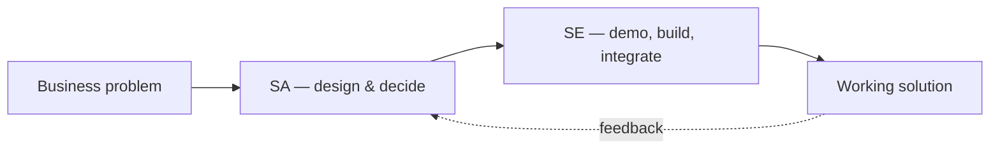

# The SA & SE skills matrix

> _Last reviewed: 2026-06-29 — see the [freshness policy](../appendix/maintenance.md)._

## Learning objectives

After this chapter you will be able to:

- Distinguish the Solution Architect (SA) and Solution Engineer (SE) roles in HLS.
- Use a competency matrix to assess where you are and what to grow next.
- Apply a leveling rubric (Associate → Principal) to the HLS-specific skill set.

## SA vs SE — two roles, one spectrum

"Solution Architect" and "Solution Engineer" overlap and are titled inconsistently across companies, but the centre of gravity differs:

- **Solution Architect (SA)** — *owns the design.* Translates a business problem into a defensible architecture, makes the hard-to-reverse decisions, and is accountable for it being buildable, compliant, operable, and affordable. Lives at the [C4](./02-c4-and-adrs.md) Context/Container altitude and in [ADRs](./02-c4-and-adrs.md).
- **Solution Engineer (SE)** — *makes it real and makes it land.* Often a pre-sales/customer-facing technical role (demos, proofs-of-concept, scoping) and/or a hands-on integration/implementation engineer. Closer to the keyboard, the customer, and the constraints.

In practice it is a spectrum: **pre-sales** SAs craft and sell the technical vision; **post-sales** SAs deliver inside legacy constraints; and **full-cycle** roles (common in smaller HLS firms) own the whole journey. Most people slide along this line over a career — the matrix below is the map.

## Competency domains (HLS-tuned)

The bootcamp's three strands — SA craft, HLS domain, platforms — expand into seven assessable domains. The **emphasis** differs by role (●●● = core, ●● = strong, ● = working knowledge):

| Competency domain | SA | SE | Where in this book |
| --- | --- | --- | --- |
| **Architecture craft** — NFRs, trade-offs, C4/ADRs, TCO | ●●● | ●● | [Part 1](./00-architecture-thinking.md) |
| **HLS interoperability** — FHIR/HL7v2/DICOM, terminologies, OMOP | ●●● | ●●● | [Part 2](../02-interoperability/01-fhir.md) |
| **Compliance & security** — HIPAA/GxP/HITRUST, regional, threat modeling | ●●● | ●● | [Part 3](../03-compliance/00-hipaa.md) |
| **Cloud & data platforms** — AWS/GCP/Azure/Databricks/Snowflake, lakehouse | ●●● | ●●● | [Parts 4–5](../04-cloud-platforms/00-overview-capability-map.md) |
| **AI/ML in HLS** — clinical AI, governance, SaMD | ●● | ●● | [Part 6](../06-ai-ml/00-clinical-nlp.md) |
| **Delivery & communication** — discovery, stakeholders, security review | ●●● | ●● | [Part 10](../10-sa-craft/00-discovery-requirements.md) |
| **Hands-on build & demo** — IaC, code, POCs, customer enablement | ●● | ●●● | the labs |

The split to remember: **SAs go deeper on design, compliance, and stakeholder communication; SEs go deeper on hands-on build, demos, and customer-facing problem-solving.** Both need strong interoperability and platform skills — those are the non-negotiable HLS core.

## Leveling rubric

Each domain also has a depth level. A pragmatic four-rung scale:

| Level | What it looks like |
| --- | --- |
| **Associate** | Executes within a defined design; knows the vocabulary; needs review on significant decisions. |
| **Mid** | Owns a component or a lab end-to-end; applies patterns; flags the right risks. |
| **Senior** | Owns a whole solution; makes and defends trade-offs; engages compliance/clinical stakeholders unaided. |
| **Principal** | Sets patterns across solutions; handles the multi-jurisdiction, multi-cloud, ambiguous brief; mentors others. |

The bootcamp is built to move you from Associate toward Senior: the chapters build judgment, the labs build hands-on depth, and the [capstone](../10-sa-craft/03-capstone.md) is a Senior-level exercise (own and defend a whole HLS design).

## The HLS-specific must-haves

Whatever your title or level, these separate an HLS architect/engineer from a generic one:

- **Compliance as a design input**, not an afterthought ([HIPAA](../03-compliance/00-hipaa.md)/[GxP](../03-compliance/02-gxp-part11.md)).
- **Fluency in clinical data** — you can read an HL7v2 message and a FHIR profile.
- **PHI instincts** — you reason about the BAA surface, de-identification, and data residency by reflex.
- **Stakeholder range** — you can talk to a clinician, a CISO, and a CFO ([stakeholders](../10-sa-craft/01-stakeholders.md)).

## How to use this matrix

1. **Self-assess** each domain (level × current depth) — honestly.
2. **Pick your role vector** (SA-leaning, SE-leaning, or full-cycle) and the domains it weights.
3. **Target the gaps** with the matching chapter + lab.
4. **Re-assess after the capstone.** Standard architecture-competency frameworks (e.g. the TOGAF Architecture Skills Framework) can supplement this for formal HR leveling.

## Check yourself

1. What is the core difference in accountability between an SA and an SE?
2. Which two competency domains are non-negotiable core for *both* roles in HLS, and why?
3. At which level should you be able to engage compliance and clinical stakeholders unaided?

## Further reading

- [TOGAF Architecture Skills Framework](https://pubs.opengroup.org/architecture/togaf91-doc/arch/chap52.html)
- [The SA operating model](../00-orientation/02-sa-operating-model.md) · [Bootcamp format](../00-orientation/03-bootcamp-format.md)
