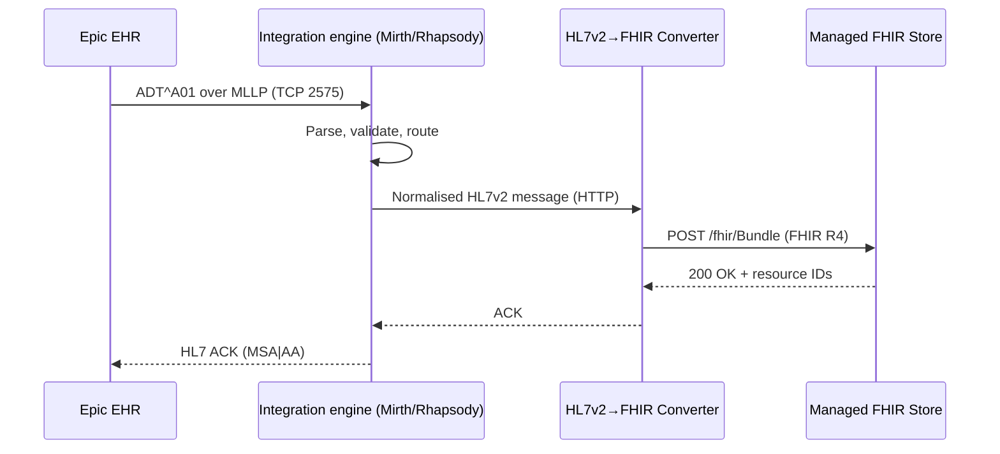
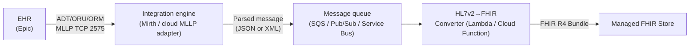

# HL7v2 messaging

> _Last reviewed: 2026-06-28 — see the [freshness policy](../appendix/maintenance.md)._

## Learning objectives

After this chapter you will be able to:

- Read an HL7v2 message and identify its key segments and fields.
- Explain how HL7v2 messages are transported and why MLLP matters.
- Design an integration pattern that converts HL7v2 events to FHIR resources.

## What HL7v2 is

HL7 Version 2 (HL7v2) is a messaging standard for exchanging clinical information between healthcare systems. First released in 1987, it remains the dominant wire protocol for **real-time clinical event feeds** in hospitals today — most ADT (admission/discharge/transfer) events, lab results, and orders still travel as HL7v2 messages over hospital networks.

If you are building anything that integrates with a hospital EHR (Epic, Oracle Health/Cerner, MEDITECH), you will encounter HL7v2. It is not going away; even modern FHIR-native EHRs still emit HL7v2 for downstream integrations.

## Message anatomy

An HL7v2 message is a series of **segments**, each on its own line, with fields separated by a pipe (`|`) delimiter. The message type is encoded in the MSH segment.

### ADT^A01 — patient admission (the most common message)

```
MSH|^~\&|SENDING_APP|SENDING_FAC|RECV_APP|RECV_FAC|20240115143022||ADT^A01^ADT_A01|MSG00001|P|2.5.1
EVN|A01|20240115143022
PID|1||MRN12345^^^HOSPITAL^MR||Smith^John^A||19801205|M|||123 Main St^^Springfield^IL^62701||(555)123-4567|||S||ACCT98765
PV1|1|I|4N^401^A^HOSPITAL|EL|||12345^Johnson^Emily^M^MD|||SUR||||A0||12345^Johnson^Emily^M^MD|IP|V12345|||||||||||||||||01||HS|20240115142500
```

| Segment | Purpose | Key fields |
| --- | --- | --- |
| **MSH** | Message Header — envelope | Sender, receiver, message type (ADT^A01), timestamp, version |
| **EVN** | Event Type — what triggered this message | Event code (A01 = admit), event time |
| **PID** | Patient Identification | MRN, name, DOB, sex, address, phone |
| **PV1** | Patient Visit | Location (ward/room/bed), attending physician, admission type, account number |
| **OBX** | Observation/Result | Lab or clinical observation (value, unit, normal range) |

### Message types that matter most

| Trigger event | Code | Meaning |
| --- | --- | --- |
| Patient admit | ADT^A01 | Patient is admitted to the hospital |
| Patient discharge | ADT^A03 | Patient leaves the hospital |
| Patient transfer | ADT^A02 | Patient moves wards or beds |
| Order placed | ORM^O01 | A lab or radiology order is created |
| Result reported | ORU^R01 | A lab or imaging result is available |
| Registration update | ADT^A08 | Patient demographic information changes |

## Transport: MLLP

HL7v2 messages travel over TCP/IP using the **Minimal Lower Layer Protocol (MLLP)** — a thin wrapper that adds start-of-block (0x0B) and end-of-block (0x1C 0x0D) characters around the message, replacing HTTP's header/body framing. MLLP is the reason HL7v2 integration engines exist: you cannot receive MLLP natively with a standard HTTP listener.



Integration engines (Mirth Connect, Rhapsody, Azure API for FHIR's MLLP adapter, AWS HealthLake Inbound) receive HL7v2 over MLLP, optionally enrich or filter, and forward to downstream consumers. Most modern architectures use the integration engine as the MLLP termination point and push to a queue or API.

## Common pitfalls

- **Version fragmentation:** HL7v2 has versions 2.1 through 2.9. Most hospitals run 2.3, 2.3.1, or 2.5.1. Field positions and segment usage differ between versions. Always agree on a version profile with the EHR team before building a parser.
- **Z-segments:** Any site can define non-standard segments prefixed with Z (e.g., `ZPI`, `ZPD`). These carry site-specific data and are not part of the HL7 standard. Your converter must handle them gracefully (skip or map).
- **Character encoding:** Legacy EHRs may use ISO-8859-1 or Windows-1252 instead of UTF-8. A Spanish patient's accented name can break a parser that assumes ASCII.
- **ACK handling:** If your system does not return an ACK, the EHR will retry indefinitely. Every MLLP endpoint must emit an `MSA|AA` (accept) or `MSA|AE` (error) acknowledgement.

## Integration pattern



Queue between the integration engine and converter decouples the real-time MLLP layer from the conversion logic, allowing the converter to scale independently and retry on failure without stalling the integration engine.

## Lab

See [`hls-fhir-interop`](https://github.com/anothernoise/hls-fhir-interop): the `samples/` directory contains synthetic ADT^A01 and ORU^R01 messages you can feed to Mirth Connect locally to explore parsing and routing.

## Check yourself

1. What are the four most important segments in an ADT^A01 message and what does each contain?
2. Why can you not receive HL7v2 with a standard REST API endpoint? What does MLLP add?
3. A Z-segment (`ZPI`) appears in an HL7v2 message from a hospital client. How should your converter handle it?

## Further reading

- [HL7.org: HL7 Version 2 Product Suite](https://www.hl7.org/implement/standards/product_brief.cfm?product_id=185)
- [Mirth Connect open-source integration engine](https://www.nextgen.com/products-and-services/integration-engine)
- [AWS HealthLake MLLP adapter](https://docs.aws.amazon.com/healthlake/latest/devguide/mllp-adapter.html)
