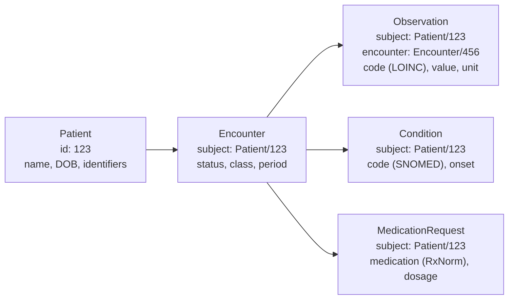
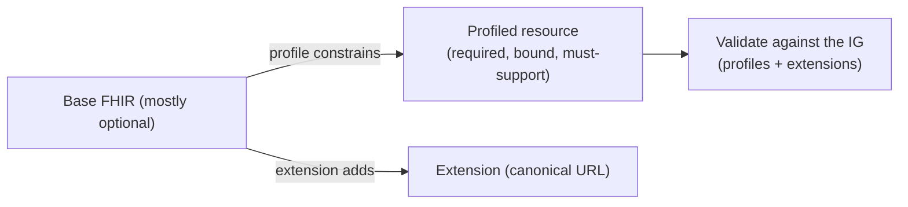

# FHIR R4

## Learning objectives

After this chapter you will be able to:

- Describe the FHIR resource model and use the FHIR REST API to read and write clinical data.
- Explain why FHIR is now regulatory-mandated for payers and certified EHRs in the US.
- Choose between FHIR R4 and HL7v2 for a given integration scenario.

## What FHIR is

**Fast Healthcare Interoperability Resources (FHIR)** is an HL7 standard for representing and exchanging health information as **resources** via a RESTful HTTP API. Released as a normative standard in 2019 (R4), it is now the primary standard for new healthcare application integrations.

FHIR's design principles make it accessible to any developer with REST experience:
- Resources are JSON (or XML) objects with a predictable structure.
- The API is standard REST: GET, POST, PUT, DELETE, PATCH.
- Resources link to each other by reference (like hyperlinks in a document).
- Search uses URL query parameters: `GET /Observation?subject=Patient/123&code=8302-2`.

## The FHIR resource model

Everything in FHIR is a **resource** — a unit of clinical or administrative information with an `id`, a `resourceType`, and typed fields. Resources reference each other rather than embedding:



The most important resources for an HLS SA:

| Resource | What it represents |
| --- | --- |
| **Patient** | Demographics, identifiers (MRN, SSN), contact info |
| **Encounter** | A clinical visit, admission, or telehealth session |
| **Observation** | Lab results, vital signs, survey scores (coded with LOINC) |
| **Condition** | Diagnoses and problems (coded with SNOMED CT or ICD-10) |
| **MedicationRequest** | A prescription or medication order (coded with RxNorm) |
| **DiagnosticReport** | A structured report (lab panel, radiology read) with attached Observations |
| **DocumentReference** | A pointer to an unstructured document (clinical note, PDF) |
| **Bundle** | A container for multiple resources — used for transactions and search results |

## Key API patterns

```bash
# Read a single Patient by ID
GET /Patient/123

# Search for a patient by identifier (MRN)
GET /Patient?identifier=http://hospital.org/mrn|MRN12345

# Get all Observations for a patient (last 30 days)
GET /Observation?subject=Patient/123&date=gt2024-01-01&_count=100

# Create a new Observation (POST)
POST /Observation
Content-Type: application/fhir+json
{ "resourceType": "Observation", "status": "final", ... }

# Transaction Bundle: create Patient + Encounter atomically
POST /  (with Bundle of type "transaction")

# Everything operation: get all resources for a patient
GET /Patient/123/$everything

# Bulk Data export (async): get all Patients in NDJSON
GET /Patient/$export
```

The `$export` (Bulk Data) operation is especially important for analytics workloads: it emits all matching resources as NDJSON files in object storage, bypassing the per-resource REST overhead. Use `$export` to feed your lakehouse; use the REST API for real-time reads.

## FHIR vs HL7v2

| Dimension | HL7v2 | FHIR R4 |
| --- | --- | --- |
| **Protocol** | MLLP over TCP | HTTPS REST |
| **Format** | Pipe-delimited segments | JSON / XML |
| **Design era** | 1987 | 2019 |
| **Deployment** | Ubiquitous in hospitals (legacy + modern) | Required for new integrations; adopted by payers, apps |
| **Developer experience** | Requires specialist tooling | Any HTTP client works |
| **Semantics** | Loose (Z-segments, version fragmentation) | Strict resource model + implementation guides |
| **Use for** | Real-time hospital event feeds (ADT, lab) | APIs for apps, payer portals, analytics, AI |

**Practical rule:** You will consume HL7v2 *from* hospital systems and produce FHIR *for* your downstream consumers (apps, analytics, AI). The HL7v2→FHIR conversion is the most common integration task in provider-facing HLS architecture.

## Implementation Guides (IGs)

A bare FHIR Patient resource can hold any data in any shape. An **Implementation Guide** constrains the resource for a specific use case — required fields, allowed code systems, must-support elements.

Key IGs for the US market:

| IG | What it constrains | Why it matters |
| --- | --- | --- |
| **US Core** | The minimum FHIR profile set for US healthcare | Required for ONC certification; every certified EHR must support it |
| **SMART on FHIR** | OAuth2 scopes and launch context for clinical apps | Enables patient-facing and clinician-facing apps to launch from within the EHR |
| **Da Vinci PDex** | Payer data exchange — claims to FHIR mapping | CMS rule requires payers to expose this |
| **mCODE** | Cancer staging and genomic data | Standard for oncology data exchange |

When you implement a FHIR API, always validate your resources against the relevant IG — not just against base FHIR. A Patient resource missing `identifier` (required by US Core) will fail interoperability testing.

## Profiles, extensions & the "everything is optional" problem

The reason IGs exist is base FHIR's defining weakness for interoperability: **almost every element is optional and repeatable.** Two systems can both be "valid FHIR" and still not exchange usefully. Profiling and extensions are how you turn flexible FHIR into a real contract.

- **Profile** — a `StructureDefinition` that *constrains* a resource: makes elements required, fixes cardinality, binds a code element to a specific value set, or marks elements **must-support** (a consumer must be able to process them). US Core and CA Baseline are sets of profiles. Profiles only narrow base FHIR — they cannot loosen it.
- **Extension** — the *standard* way to add data FHIR doesn't model natively. Rather than inventing fields, you attach an `extension` with a canonical URL that defines its meaning and type. (US Core race/ethnicity are extensions.) Extensions keep additions interoperable instead of proprietary.
- **Profiling pitfalls:** over-constraining (so real-world data won't validate), under-constraining (so consumers still can't rely on anything), and "extension soup" (custom extensions nobody else understands). Reuse registered extensions before creating your own.



**SA implication:** "supports FHIR" is meaningless without naming the **profiles** (and version). Conformance is to an IG's profiles, validated with tooling (e.g. the FHIR validator, Inferno), not to base FHIR. See [FHIR profiles & regulation: US & Canada](./06-fhir-profiles-us-ca.md).

## Regulatory mandate

FHIR is no longer optional in the US:

- **CMS Interoperability and Patient Access Rule (2020):** payers (Medicare Advantage, Medicaid, etc.) must expose a FHIR R4 Patient Access API so patients can download their claims data.
- **ONC § 170.315(g)(10):** certified EHR technology must support a SMART on FHIR API and US Core profiles. This is why Epic, Cerner, and MEDITECH all expose FHIR APIs today.
- **21st Century Cures Act:** prohibits information blocking — restricting clinically relevant FHIR data access for patients is illegal.

These mandates are why every health system you work with will have a FHIR endpoint. The question is no longer "should we use FHIR?" but "which IG and which version?"

## Lab

See [`hls-fhir-interop`](https://github.com/anothernoise/hls-fhir-interop) for curl examples against the public HAPI FHIR R4 sandbox:

```bash
# No account needed — public read access
curl -s 'https://hapi.fhir.org/baseR4/Patient?_count=1' | jq '.entry[0].resource.name'
curl -s 'https://hapi.fhir.org/baseR4/Observation?_count=1&_summary=true'
```

## Check yourself

1. A payer needs to expose its claims data to patients. Which FHIR resource and which Implementation Guide apply?
2. Your analytics platform needs a nightly snapshot of all Observations for 500 k patients. Should you use GET `/Observation?subject=...` in a loop, or `$export`? Why?
3. A hospital sends you an ADT^A01 message. Which FHIR resources does it map to (at minimum)?

## Further reading

- [HL7 FHIR R4 specification](https://hl7.org/fhir/R4/)
- [SMART Health IT](https://smarthealthit.org/)
- [US Core Implementation Guide](https://www.hl7.org/fhir/us/core/)
- [FHIR Bulk Data Access specification](https://hl7.org/fhir/uv/bulkdata/)
