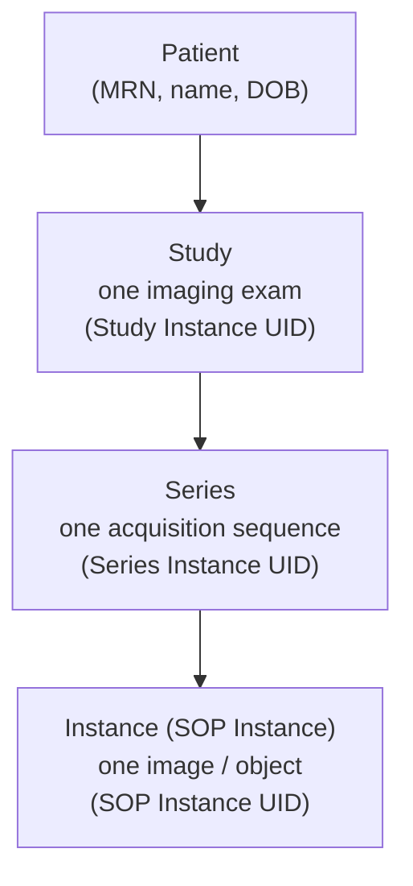
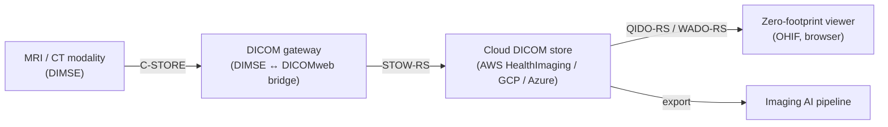

# DICOM & medical imaging

## Learning objectives

After this chapter you will be able to:

- Explain the DICOM data model and how images, series, and studies relate.
- Choose between legacy DIMSE networking and modern DICOMweb for an imaging integration.
- Design a cloud architecture for storing and serving medical images at scale and at sane cost.

## What DICOM is

DICOM (Digital Imaging and Communications in Medicine) is the standard for representing, storing, and transmitting medical images and their metadata. It governs everything from the MRI scanner to the radiologist's viewing workstation. A DICOM file is not just pixels — it is pixels plus a rich set of metadata tags (patient, study, equipment, acquisition parameters) in a single object.

Medical imaging is one of the highest-volume data types in HLS. A single CT study can be hundreds of megabytes; a hospital's image archive (PACS — Picture Archiving and Communication System) is routinely measured in petabytes. This makes storage tiering and egress cost central architectural concerns.

## The DICOM information model

DICOM organises imaging data into a strict hierarchy:

- **Patient** → has many **Studies** (e.g., "chest CT on 2024-01-15").
- **Study** → contains many **Series** (e.g., axial, coronal, sagittal reconstructions).
- **Series** → contains many **Instances** (the individual image slices).

Each level has a globally-unique identifier (UID). When you integrate imaging, you query and retrieve by these UIDs.

> **PHI note:** DICOM metadata tags carry PHI — patient name, MRN, birth date, and sometimes burned-in annotations *in the pixel data itself*. De-identifying DICOM is harder than de-identifying structured data because you must scrub tags **and** detect burned-in text. See [De-identification & consent](../03-compliance/04-deidentification-consent.md).

## Two transport mechanisms: DIMSE vs DICOMweb

### Legacy: DIMSE

The original DICOM networking protocol (DIMSE — DICOM Message Service Element) runs over a TCP port (usually 104 or 11112) and requires both endpoints to be pre-registered with each other via an "Application Entity Title." Operations include C-STORE (push an image), C-FIND (query), and C-MOVE (retrieve). DIMSE is ubiquitous inside hospital networks and notoriously firewall-unfriendly — it predates the web.

### Modern: DICOMweb

DICOMweb is DICOM's web-native transport, defined in **DICOM Part 18**. It exposes the same operations over RESTful HTTPS, which makes it the right choice for cloud and any zero-footprint (browser-based) viewer:

| Service | Verb | Purpose |
| --- | --- | --- |
| **STOW-RS** | POST | **St**ore — upload DICOM instances (no pre-registration needed) |
| **QIDO-RS** | GET | **Q**uery — search studies/series/instances, returns JSON metadata (no pixels) |
| **WADO-RS** | GET | **R**etrieve — stream pixel data and metadata at study/series/instance level |

The major cloud imaging services (AWS HealthImaging, GCP Cloud Healthcare API DICOM stores, Azure Health Data Services DICOM service) all speak DICOMweb. **Default to DICOMweb for any new cloud imaging integration**; bridge to DIMSE only where you must connect to legacy on-prem modalities or PACS.

## Cloud architecture concerns

### Storage tiering

Imaging data has a characteristic access pattern: heavily accessed for days after acquisition, then rarely. Design tiering accordingly:

- **Hot** (recent studies, active reads): standard object storage.
- **Cold/archive** (studies older than 90 days): infrequent-access or archive tiers (S3 Glacier, GCS Archive). Cuts storage cost by 5–10×.
- Cloud DICOM services (AWS HealthImaging) handle some tiering internally; verify the pricing model before assuming.

### Egress and co-location

Image egress is a major hidden cost. Keep the DICOM store, the viewer's image proxy, and any AI pipeline **in the same cloud region**. Moving a petabyte archive across regions or clouds for analytics can cost more than storing it for a year.

### Pixel data vs metadata

QIDO-RS returns metadata only — use it for worklists and search without paying to move pixels. Only WADO-RS the pixel data when a clinician or model actually needs to view/process it. This separation is the single biggest lever on imaging serving cost.

## Lab

There is no dedicated imaging spoke repo yet. To explore hands-on: stand up a local [Orthanc](https://www.orthanc-server.com/) server (open-source, speaks both DIMSE and DICOMweb), load sample studies from the [public TCIA datasets](https://www.cancerimagingarchive.net/), and view them with the [OHIF viewer](https://ohif.org/).

## Check yourself

1. A clinician opens a worklist of 200 studies. Should the worklist query use QIDO-RS or WADO-RS, and why does the choice matter for cost?
2. Why is DICOMweb preferred over DIMSE for a cloud-native imaging architecture?
3. Name two reasons de-identifying DICOM is harder than de-identifying a FHIR Patient resource.

## Further reading

- [DICOM Standard, Part 18 (DICOMweb)](https://www.dicomstandard.org/using/dicomweb)
- [AWS HealthImaging](https://aws.amazon.com/healthimaging/)
- [GCP Cloud Healthcare API — DICOM stores](https://cloud.google.com/healthcare-api/docs/concepts/dicom)
- [Azure Health Data Services — DICOM service](https://learn.microsoft.com/en-us/azure/healthcare-apis/dicom/)
- [OHIF zero-footprint viewer](https://ohif.org/)
