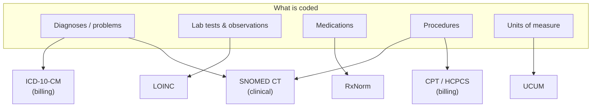

# Clinical terminologies

## Learning objectives

After this chapter you will be able to:

- Name the major clinical code systems and what each one codes.
- Explain why terminology binding is the hardest part of clinical data integration.
- Design a value-set and code-mapping strategy for a FHIR or OMOP data platform.

## Why terminologies matter more than you expect

A FHIR `Condition` resource that says the patient has "diabetes" is nearly useless for analytics. A `Condition` coded as SNOMED CT `44054006` (Diabetes mellitus type 2) is queryable, mappable, and comparable across institutions. **The code is the data**; the human-readable text is just a label.

Every serious HLS data task — interoperability, analytics, AI, quality measures — depends on data being coded with the *right* standard terminology. Getting terminology binding wrong is the most common reason a data integration "works" in a demo and fails in production.

## The major code systems

| System | Codes | Maintained by | Used for |
| --- | --- | --- | --- |
| **SNOMED CT** | Diagnoses, findings, procedures, body structures — the broadest clinical vocabulary | SNOMED International | FHIR `Condition`, `Procedure` (clinical meaning) |
| **ICD-10-CM** | Diagnoses (US clinical modification) | CDC / CMS | Billing, claims, reporting. **The US is still on ICD-10-CM**; ICD-11 is not yet adopted (projected 2025–2027, no firm date). |
| **LOINC** | Lab tests, vital signs, survey instruments | Regenstrief Institute | FHIR `Observation.code`, `DiagnosticReport.code` |
| **RxNorm** | Medications (normalized drug names) | US NLM | FHIR `MedicationRequest`, `Medication` |
| **CPT / HCPCS** | Procedures and services (billing) | AMA (CPT) / CMS (HCPCS) | Claims, reimbursement |
| **UCUM** | Units of measure (mg, mmol/L) | Regenstrief | FHIR `Quantity.code` — the unit on every numeric value |

Note the recurring split: **SNOMED CT / LOINC / RxNorm carry clinical meaning; ICD-10-CM / CPT carry billing meaning.** A single diabetes diagnosis is often coded *twice* — once in SNOMED for the chart, once in ICD-10-CM for the claim. Your data platform usually needs both.

All of SNOMED CT, LOINC, and RxNorm are integrated in the US NLM's **UMLS Metathesaurus**, which maps equivalences between them — invaluable when you need to cross-walk codes.

## US Core terminology requirements

The [US Core Implementation Guide](https://hl7.org/fhir/us/core/) (required for ONC-certified EHRs) **binds specific resources to specific code systems**:

- `Condition` (problems) → SNOMED CT or ICD-10-CM
- `Observation` (labs, vitals) → LOINC, with UCUM units
- `MedicationRequest` → RxNorm
- `Procedure` → SNOMED CT, CPT, or HCPCS

When you build a FHIR API, validate that codes come from the **bound value set**, not just any code system. A `Condition` coded in a proprietary local system will fail US Core conformance and break downstream interoperability.

## Value sets and bindings

A **value set** is a curated list of codes drawn from one or more code systems for a specific purpose (e.g., "the set of LOINC codes that count as an HbA1c result"). A **binding** ties a FHIR element to a value set, with a strength:

- **required** — the code *must* come from the value set.
- **extensible** — use the value set if a suitable code exists, otherwise another code is allowed.
- **preferred** / **example** — guidance only.

The **VSAC (Value Set Authority Center)** at the NLM is the US canonical source for value sets used in quality measures and US Core.

## Terminology services

Don't hard-code terminology logic. Use a **terminology server** (the FHIR `$validate-code`, `$expand`, `$lookup`, and `$translate` operations) to validate codes, expand value sets, and map between systems. Options:

- Cloud-native: GCP Cloud Healthcare API terminology features; managed FHIR servers with terminology support.
- Open-source: HAPI FHIR terminology server, [Snowstorm](https://github.com/IHTSDO/snowstorm) (SNOMED CT), [Ontoserver](https://ontoserver.csiro.au/).

## Mapping strategy for a data platform

When building an OMOP lakehouse or a FHIR analytics layer, codes from source systems rarely match your target standard. Plan for mapping:

1. **Standardize on target vocabularies** — OMOP uses SNOMED CT as the standard for conditions; map ICD-10-CM source codes to SNOMED via the OMOP vocabulary tables.
2. **Use published crosswalks** — UMLS, OMOP vocabulary, VSAC, and NLM mappings exist; do not invent your own.
3. **Track unmapped codes** — every ETL must report the percentage of source codes that failed to map. Unmapped clinical codes are silently lost evidence.
4. **Version your vocabularies** — code systems are updated (often quarterly). Pin the version used in any reproducible analysis.

See [OMOP Common Data Model](./04-omop-cdm.md) for how this mapping plays out in a real schema.

## Check yourself

1. A patient's lab result arrives as "glucose, 95 mg/dL." Which two code systems do you need to represent this fully in FHIR, and for what part of the value?
2. Why might a single diabetes diagnosis be coded in both SNOMED CT and ICD-10-CM in the same record?
3. Your ETL maps 82% of source diagnosis codes to OMOP standard concepts. What must you do about the other 18%, and why is ignoring them dangerous?

## Further reading

- [SNOMED CT](https://www.snomed.org/)
- [LOINC](https://loinc.org/)
- [RxNorm (NLM)](https://www.nlm.nih.gov/research/umls/rxnorm/)
- [UMLS Metathesaurus](https://www.nlm.nih.gov/research/umls/index.html)
- [Value Set Authority Center (VSAC)](https://vsac.nlm.nih.gov/)
- [US Core terminology bindings](https://hl7.org/fhir/us/core/)
