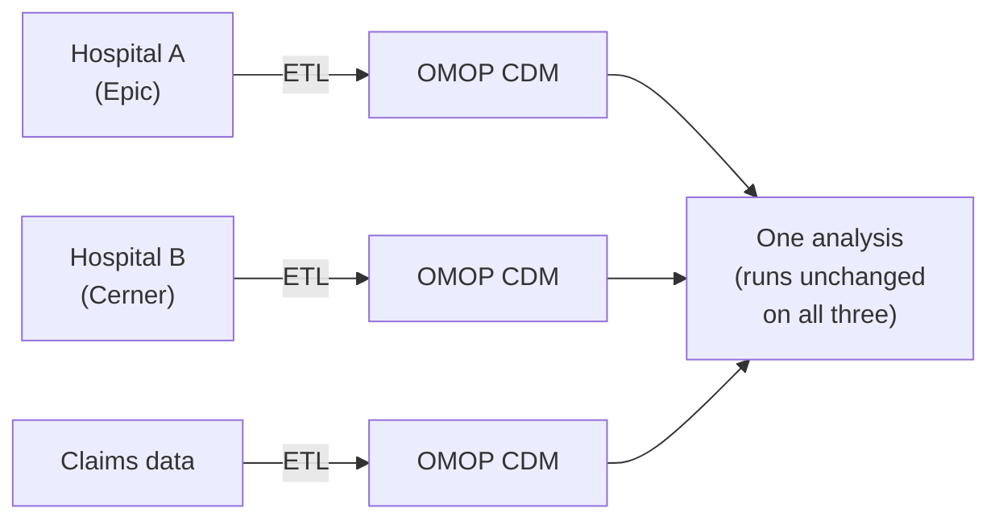
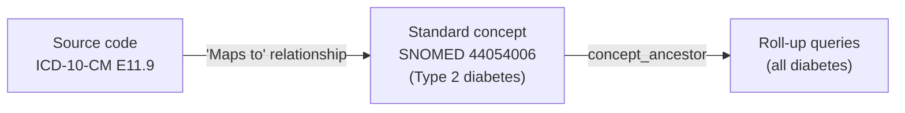
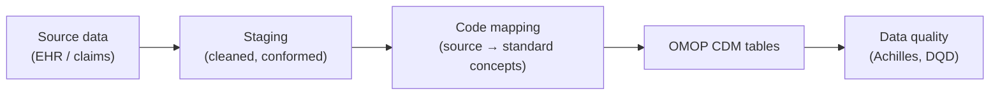

# OMOP Common Data Model

## Learning objectives

After this chapter you will be able to:

- Describe the OMOP CDM schema and its core tables.
- Explain why standardizing to OMOP enables cross-institution analytics and RWE.
- Outline an ETL strategy for converting source clinical data to OMOP CDM v5.4.

## What OMOP is and why it exists

The **OMOP (Observational Medical Outcomes Partnership) Common Data Model** is an open community standard for representing observational health data — EHR records, claims, registries — in a single, consistent schema with standardized vocabularies. It is maintained by the **OHDSI** (Observational Health Data Sciences and Informatics) community. The current version is **CDM v5.4**.

The problem OMOP solves: every health system stores data differently. A study that works on one institution's data cannot run on another's without rewriting all the queries. OMOP fixes this by defining *one* schema and *one* set of standard vocabularies, so that an analysis written once runs **unchanged** across any OMOP-compliant dataset — at a single hospital or across a federated network of dozens.

This is what makes OMOP the foundation for **real-world evidence (RWE)** at scale and for federated studies where data never leaves each institution — only the analytic results are shared.

## The schema: core tables

OMOP is **person-centric**. Everything ties back to a `person`, and every clinical fact is timestamped and coded to a standard concept.

| Table | Holds | Notes |
| --- | --- | --- |
| `person` | One row per patient | Demographics, with concept-coded gender/race/ethnicity |
| `observation_period` | Spans when a person is "observed" | Critical: you can only make claims about data inside these windows |
| `visit_occurrence` | Encounters / visits | Inpatient, outpatient, ER |
| `condition_occurrence` | Diagnoses / problems | Coded to SNOMED CT standard concepts |
| `drug_exposure` | Medications, immunizations | Coded to RxNorm |
| `procedure_occurrence` | Procedures | Coded to SNOMED CT / CPT4 |
| `measurement` | Labs, vitals, quantitative results | Coded to LOINC, with value + unit |
| `observation` | Clinical facts that aren't measurements | Social history, symptoms |
| `death` | Death records | |

### The vocabulary tables (the heart of OMOP)

OMOP's power comes from its **standardized vocabulary** tables (`concept`, `concept_relationship`, `concept_ancestor`, `vocabulary`). Every source code (an ICD-10-CM diagnosis, a local lab code) is mapped to a **standard concept** (usually SNOMED CT for conditions, RxNorm for drugs, LOINC for measurements).

The `concept_ancestor` table enables hierarchical queries: "find everyone with *any* form of diabetes" walks the SNOMED hierarchy automatically. This is why OMOP analytics are so much more powerful than raw ICD-10 queries. See [Clinical terminologies](./03-terminologies.md) for the underlying code systems.

## ETL: converting source data to OMOP

Converting source data to OMOP ("the OMOP ETL") is the central engineering effort. The OHDSI community provides conventions (THEMIS) and tooling, but every source system needs custom mapping work.

Key steps and tools:

1. **Map the vocabularies** — use the OMOP vocabulary tables (downloaded from [Athena](https://athena.ohdsi.org/)) to translate every source code to a standard concept. Track and report unmapped codes.
2. **Build observation periods** — derive the windows during which each person is observed; analyses depend on these.
3. **Run data quality checks** — [Achilles](https://github.com/OHDSI/Achilles) (data characterization) and the [Data Quality Dashboard](https://github.com/OHDSI/DataQualityDashboard) (DQD) catch ETL errors systematically.
4. **Validate against the analytics tools** — if [ATLAS](https://github.com/OHDSI/Atlas) can build a cohort on your CDM, the ETL is structurally sound.

## OMOP on the cloud

OMOP is just a relational schema, so it runs anywhere — but at RWD scale (millions of patients, billions of rows) you want a lakehouse or warehouse:

- **Databricks** — OMOP on Delta Lake; OHDSI has published Spark-based tooling.
- **Snowflake** — OMOP as native tables; strong for SQL-heavy analytics and data sharing.
- **BigQuery** — Google publishes OMOP-on-BigQuery patterns.

See [OMOP on the cloud](../05-data-platforms/01-omop-on-cloud.md) and the [`hls-lakehouse-rwd`](https://github.com/anothernoise/hls-lakehouse-rwd) lab for the lakehouse build.

## The OHDSI analytics ecosystem

Standardizing to OMOP unlocks a mature open-source toolset — the real payoff:

- **ATLAS** — web UI for cohort definition, characterization, and analysis.
- **HADES** — R packages for population-level estimation and patient-level prediction.
- **Achilles / DQD** — data quality and characterization.

These tools work on *any* OMOP CDM, which is the whole point: build the ETL once, inherit the entire ecosystem.

## Lab

See [`hls-lakehouse-rwd`](https://github.com/anothernoise/hls-lakehouse-rwd) — builds a medallion lakehouse that lands source data and transforms it to OMOP CDM v5.4 on Databricks and Snowflake.

## Check yourself

1. Why can an analysis written for one OMOP dataset run unchanged on another institution's data?
2. What is the role of the `concept_ancestor` table, and what kind of query does it make easy that raw ICD-10 cannot?
3. Why are `observation_period` rows essential before you can make any epidemiological claim from OMOP data?

## Further reading

- [OMOP CDM v5.4 specification](https://ohdsi.github.io/CommonDataModel/cdm54.html)
- [The Book of OHDSI](https://ohdsi.github.io/TheBookOfOhdsi/)
- [Athena — OMOP vocabularies](https://athena.ohdsi.org/)
- [OHDSI tools (ATLAS, HADES, Achilles)](https://www.ohdsi.org/software-tools/)
