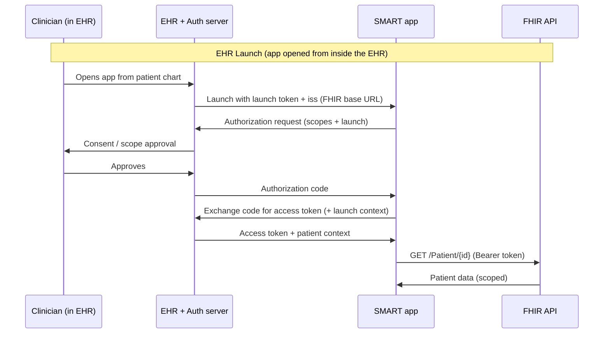

# SMART on FHIR

> _Last reviewed: 2026-06-28 — see the [freshness policy](../appendix/maintenance.md)._

## Learning objectives

After this chapter you will be able to:

- Explain how SMART on FHIR lets an app launch inside an EHR and access FHIR data securely.
- Distinguish the EHR launch and standalone launch flows.
- Read and design SMART scopes, including v2 granular (`cruds`) scopes.

## What SMART on FHIR is

SMART (Substitutable Medical Applications, Reusable Technologies) on FHIR is the standard that lets a third-party app **launch from within an EHR**, authenticate with OAuth2, and read/write clinical data through the EHR's FHIR API. It is what makes the "app store for healthcare" model possible: write an app once, and it runs inside Epic, Cerner, and any other certified EHR.

The current specification is **SMART App Launch v2.2.0** (2024), built on OAuth 2.0, OpenID Connect, and FHIR R4. Crucially, **ONC § 170.315(g)(10)** requires certified EHRs to support SMART App Launch — which is why every major EHR exposes it. See [FHIR R4](./01-fhir.md) for the underlying API.

## The two launch flows



- **EHR launch** — the clinician opens the app from inside the EHR (e.g., a button in the patient chart). The EHR passes a **launch context** so the app already knows which patient is open. This is the common clinician-facing flow.
- **Standalone launch** — the app is opened independently (e.g., a patient opens a health app on their phone) and the user picks which provider/EHR to connect to. Common for patient-facing apps.

The mechanics are OAuth 2.0 authorization-code flow; SMART adds the **launch context** (which patient, which encounter) and a standardized **scope** language.

## Scopes: the permission language

A SMART scope says *who*, *what resource*, and *what operations* an app may access. The shape:

```
<context>/<resource>.<permissions>
```

- **context** — `patient` (data for the one launched patient), `user` (everything the logged-in user can see), or `system` (backend, no user).
- **resource** — a FHIR resource type (`Observation`, `Condition`) or `*` for all.
- **permissions** — what the app may do.

### v1 vs v2 scope syntax

SMART v1 used coarse `read` / `write` / `*`:

```
patient/Observation.read     # read observations for the launched patient
user/*.read                  # read everything the user can see
```

**SMART v2 introduced granular `cruds` scopes** — far more precise, letting an app request exactly the operations it needs:

```
patient/Observation.rs       # read + search Observations (not create/update/delete)
patient/Condition.r          # read Conditions only
user/MedicationRequest.cruds # full create/read/update/delete/search
```

Where `c`=create, `r`=read, `u`=update, `d`=delete, `s`=search. **Design apps to request the minimum scope** — `patient/Observation.rs` rather than `patient/*.cruds`. This is least-privilege (a [HIPAA](../03-compliance/00-hipaa.md) Security Rule principle) expressed at the API layer, and EHRs/users increasingly reject over-broad requests.

SMART v2 also supports **granular sub-resource scopes** (e.g., restrict to a specific Observation category like vital signs vs labs), required by the HL7 FHIR API certification criterion and tied to US Core categories.

### Backend services (`system` scopes)

For server-to-server access with no user present (bulk analytics, automated pipelines), SMART **Backend Services** uses the OAuth2 client-credentials flow with a signed JWT and `system/` scopes — e.g., `system/Patient.rs` for a nightly Bulk Data `$export` job. This is how you wire a data platform to an EHR's FHIR API without a human in the loop.

## Design guidance

- **Request the narrowest scopes that work.** Over-broad scope requests get rejected and erode trust.
- **Never put PHI in the redirect URL or browser history.** Tokens go in the `Authorization` header.
- **Validate the `iss` (issuer)** matches an EHR you trust before sending the launch — a forged launch is an attack vector.
- **Cache the access token's lifetime; refresh, don't re-launch.** Use refresh tokens where the EHR issues them.
- **For backend jobs, rotate the signing keys** and register the public key with the EHR.

## Lab

See [`hls-fhir-interop`](https://github.com/anothernoise/hls-fhir-interop) — includes a minimal SMART on FHIR app that performs an EHR launch against a sandbox and reads patient data with scoped access. The [SMART App Launcher](https://launch.smarthealthit.org/) public sandbox lets you test launch flows without an EHR.

## Check yourself

1. A clinician clicks a button in a patient's chart to open your app. Which launch flow is this, and what does the EHR give the app that a standalone launch would not?
2. Your app only needs to read and search lab results. Write the correct v2 SMART scope, and explain why `patient/*.cruds` would be wrong.
3. A nightly job exports all Patients to your data lake with no user logged in. Which SMART flow and scope context applies?

## Further reading

- [SMART App Launch v2.2.0](https://hl7.org/fhir/smart-app-launch/)
- [SMART Scopes and Launch Context](https://hl7.org/fhir/smart-app-launch/scopes-and-launch-context.html)
- [SMART Backend Services](https://hl7.org/fhir/smart-app-launch/backend-services.html)
- [SMART App Launcher sandbox](https://launch.smarthealthit.org/)
