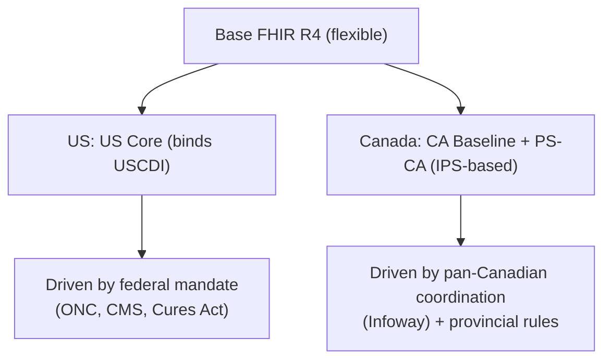

# FHIR profiles & regulation: US & Canada

> _Last reviewed: 2026-06-28 — see the [freshness policy](../appendix/maintenance.md)._

## Learning objectives

After this chapter you will be able to:

- Explain why base FHIR is not enough and what profiles/IGs add.
- Contrast the US and Canadian FHIR regulatory landscapes and profile sets.
- Apply the field's hard-won pain points, lessons, and best practices.

## Base FHIR is a starting point, not a contract

A bare [FHIR](./01-fhir.md) resource can hold almost anything in almost any shape, so two "FHIR-compliant" systems can still fail to interoperate. **Implementation Guides (IGs)** close that gap by constraining resources for a jurisdiction or use case — required fields, allowed code systems, must-support elements. The IG you must conform to depends on **where you operate**, and the US and Canada have taken very different regulatory paths.

## United States — mandate-driven

The US has pushed FHIR through **federal regulation**, which makes conformance largely non-optional:

- **US Core IG** implements **USCDI** (the standardized data classes/elements). USCDI advances regularly (v5 in 2024, v6 in 2025), and US Core tracks it.
- **ONC § 170.315(g)(10)** requires certified EHRs to expose a SMART on FHIR API supporting US Core — which is why Epic and Oracle Health all have FHIR endpoints.
- **CMS Interoperability & Patient Access** rules require payers to expose FHIR APIs (Patient Access, Provider Directory), and the **Prior Authorization** rule adds FHIR APIs to streamline prior auth.
- **21st Century Cures Act** prohibits **information blocking** — restricting access to electronic health information is unlawful.
- **TEFCA** provides nationwide exchange via Qualified Health Information Networks, increasingly FHIR-based.
- **CMS-0057** (Interoperability & Prior Authorization Final Rule, 2024) expands payer FHIR APIs and mandates an electronic prior-authorization API — see [Document & claims standards](./09-cda-x12-claims.md).

The result: strong forcing functions, broad availability of FHIR endpoints, and clear conformance targets (US Core + USCDI version).

## Canada — coordination-driven, provincially fragmented

Canada has **no single federal mandate** equivalent to ONC/CMS. Health delivery is **provincial**, and interoperability is driven by **pan-Canadian coordination** rather than federal rule:

- **CA Baseline** — the FHIR Canadian Baseline profiles (the rough analogue of US Core), maintained by **Canada Health Infoway** to harmonize across provinces.
- **PS-CA (pan-Canadian Patient Summary)** — a FHIR IG based on the **International Patient Summary (IPS)**, defining a standardized snapshot of essential health data for transitions and unplanned care.
- **Provincial variation** — each province runs its own systems and privacy law ([PHIPA](../03-compliance/05-regional-compliance.md), etc.), so a national rollout is really a set of provincial ones.

The result: less top-down forcing, more coordination; conformance targets exist (CA Baseline, PS-CA) but adoption is uneven across provinces. See [Canadian HLS architecture](./17-canadian-hls-architecture.md) for the provincial deep dive — a "Canadian" integration is really a portfolio of separate provincial ones (Alberta Netcare, Ontario Health/Connecting Ontario, BC PharmaNet/Health Gateway, Quebec), each at its own standards vintage and privacy regime.

## US vs Canada at a glance

| | United States | Canada |
| --- | --- | --- |
| Core profiles | US Core (binds USCDI) | CA Baseline; PS-CA (IPS-based) |
| Driver | Federal mandate (ONC, CMS, Cures Act) | Pan-Canadian coordination (Infoway) + provinces |
| Enforcement | Certification + info-blocking penalties | Largely voluntary / provincial |
| Nationwide exchange | TEFCA (QHINs) | Provincial HIEs + pan-Canadian initiatives |
| Privacy backdrop | HIPAA + state laws | PIPEDA + provincial (PHIPA, etc.) |

For a cross-border product, **conform to US Core in the US and CA Baseline/PS-CA in Canada** — they share base FHIR but differ in profiles, terminology bindings, and identifiers.

## Pain points (lessons from the field)

- **Data not available over FHIR.** Mandates cover a defined data set; clinically important elements outside it may still require old interfaces or manual work.
- **Variable endpoint quality.** "Has a FHIR API" ≠ "implements the IG well" — expect missing must-support fields, non-standard codes, and quirks per vendor and per site.
- **Versioning drift.** US Core/USCDI versions advance; sites lag. Pin and test against the *specific* version a partner supports.
- **Identifiers & patient matching.** No national patient identifier (US or Canada); matching across sources is hard and error-prone.
- **Implementation timelines.** Real integrations commonly take 6–18 months across multiple sites — budget for it.
- **Authorization friction.** Each EHR and health system has its own app-onboarding and approval process.

## Best practices

1. **Validate against the IG, not just base FHIR.** Use validators and a conformance test suite (e.g. Inferno for US Core) before you trust an endpoint.
2. **Target a specific IG version** and negotiate it explicitly with each partner.
3. **Plan for messy reality** — defensive parsing, code mapping ([terminologies](./03-terminologies.md)), and unmapped-data reporting.
4. **Use Bulk Data for analytics, the REST API for real-time** (see [FHIR](./01-fhir.md)).
5. **Engage the vendor app program and the health system's IT/security early** — these are lead-time items.
6. **Design jurisdiction-aware** — US Core vs CA Baseline, and data residency per [regional compliance](../03-compliance/05-regional-compliance.md).

## Lab

[`hls-fhir-interop`](https://github.com/anothernoise/hls-fhir-interop) — exercise US Core conformance and validation against a sandbox; an extension adds a CA Baseline profile variant.

## Check yourself

1. Why does base FHIR conformance not guarantee interoperability, and what closes the gap?
2. Name two structural differences between how the US and Canada drive FHIR adoption.
3. Give three field-tested best practices for integrating with a partner's FHIR endpoint.

## Further reading

- [US Core IG](https://www.hl7.org/fhir/us/core/) · [USCDI](https://www.healthit.gov/isp/united-states-core-data-interoperability-uscdi)
- [CA Baseline IG](https://build.fhir.org/ig/HL7-Canada/ca-baseline/) · [PS-CA (Infoway)](https://www.infoway-inforoute.ca/en/component/edocman/resources/interoperability/patient-summary)
- [Inferno (US Core test suite)](https://inferno.healthit.gov/) · [ONC information blocking](https://www.healthit.gov/topic/information-blocking)
