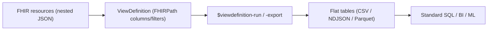
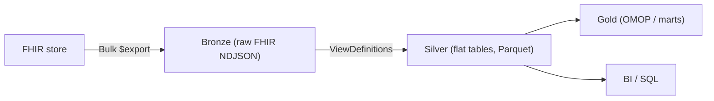

# SQL-on-FHIR

> _Last reviewed: 2026-06-28 — see the [freshness policy](../appendix/maintenance.md)._

## Learning objectives

After this chapter you will be able to:

- Explain why FHIR's nested JSON is hard to analyze and what SQL-on-FHIR solves.
- Use a ViewDefinition to project FHIR resources into flat, queryable tables.
- Place SQL-on-FHIR in an analytics/lakehouse architecture.

## The problem: FHIR is great for exchange, awkward for analytics

[FHIR](./01-fhir.md) resources are deeply nested JSON optimized for *exchange*, not for SQL. Asking "what is the average HbA1c by clinic this quarter?" means traversing nested `Observation` structures, repeated elements, and references — every analyst re-writing the same brittle flattening logic. **SQL-on-FHIR** standardizes that flattening so FHIR data becomes ordinary tables.

## ViewDefinition: portable, tabular views of FHIR

The HL7 **SQL on FHIR (v2)** specification defines the **ViewDefinition** — a declarative, portable definition of a flat, tabular view over a *single* FHIR resource type. Columns, filters, and unnesting are expressed with **FHIRPath**, so the same ViewDefinition runs on any conformant engine and yields the same table.

Conceptually, a ViewDefinition over `Observation` might declare columns `patient_id` (`subject.reference`), `code` (`code.coding.code`), `value` (`value.quantity.value`), and a filter for a LOINC code — producing one tidy row per observation that any SQL tool can query.

## Standard operations

The spec defines FHIR operations so views are runnable as a service:

- **`$viewdefinition-run`** — synchronous evaluation, streamed results.
- **`$viewdefinition-export`** — asynchronous bulk export to CSV, NDJSON, or **Parquet** (lakehouse-friendly).
- **`$sqlquery-run` / `-export`** — run shareable SQL (as FHIR `Library` resources) over the materialized view tables.

## Where it fits in the architecture

SQL-on-FHIR is the clean bridge from a FHIR store to a [lakehouse/warehouse](../05-data-platforms/00-lakehouse-vs-warehouse.md):

- It complements [Bulk Data](./01-fhir.md): export raw FHIR, then apply ViewDefinitions to flatten in the silver layer.
- ViewDefinitions are **shareable and versionable** — an IG can ship standard views so teams stop re-inventing flattening (a recurring [data-contract](../05-data-platforms/03-governance-contracts.md) win).
- It is complementary to [OMOP](./04-omop-cdm.md): SQL-on-FHIR flattens FHIR for direct querying; OMOP is a separate standardized analytic model. Many platforms use both — ViewDefinitions to flatten, then map to OMOP gold.

## Best practices

1. **Keep ViewDefinitions in version control** and treat them as data contracts.
2. **Export to Parquet** for lakehouse efficiency.
3. **Pin the FHIR profile/version** a view targets — flattening assumes a shape ([US Core / CA Baseline](./06-fhir-profiles-us-ca.md)).
4. **Layer views**: thin resource-level views in silver, business logic in SQL on top — easier to test and reuse.

## Lab

The [`hls-lakehouse-rwd`](https://github.com/anothernoise/hls-lakehouse-rwd) silver layer is a natural home for ViewDefinition-based flattening of exported FHIR before OMOP mapping.

## Check yourself

1. Why is raw FHIR awkward for analytics, and what does a ViewDefinition produce instead?
2. What language defines ViewDefinition columns and filters, and why does that make views portable?
3. How do SQL-on-FHIR and OMOP relate in a lakehouse — competing or complementary?

## Further reading

- [SQL on FHIR v2 IG](https://sql-on-fhir.org/ig/)
- [SQL on FHIR — Tabular views using FHIRPath (npj Digital Medicine, 2025)](https://www.nature.com/articles/s41746-025-01708-w)
- [FHIRPath](https://hl7.org/fhirpath/)
