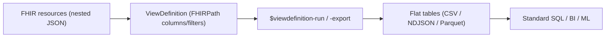
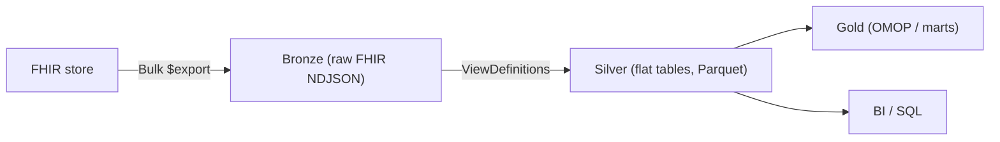

# SQL-on-FHIR

> _Last reviewed: 2026-06-28 — see the [freshness policy](../appendix/maintenance.md)._

## Learning objectives

After this chapter you will be able to:

- Explain why FHIR's nested JSON is hard to analyze and what SQL-on-FHIR solves.
- Read and write a ViewDefinition — columns, filters, constants, and unnesting (`forEach`).
- Choose an engine (Pathling, Aidbox, …) and place SQL-on-FHIR in a lakehouse architecture.

## The problem: FHIR is great for exchange, awkward for analytics

[FHIR](./01-fhir.md) resources are deeply nested JSON optimized for *exchange*, not for SQL. Asking "what is the average HbA1c by clinic this quarter?" means traversing nested `Observation` structures, repeated elements, and references — every analyst re-writing the same brittle flattening logic. **SQL-on-FHIR** standardizes that flattening so FHIR data becomes ordinary tables.

## ViewDefinition: portable, tabular views of FHIR

The HL7 **SQL on FHIR (v2)** specification defines the **ViewDefinition** — a declarative, portable definition of a flat, tabular view over a *single* FHIR resource type. Columns, filters, and unnesting are expressed with **FHIRPath**, so the same ViewDefinition runs on any conformant engine and yields the same table.



Conceptually, a ViewDefinition over `Observation` might declare columns `patient_id` (`subject.reference`), `code` (`code.coding.code`), `value` (`value.quantity.value`), and a filter for a LOINC code — producing one tidy row per observation that any SQL tool can query.

## Anatomy of a ViewDefinition

A ViewDefinition is itself a FHIR resource. Here is a complete one that flattens HbA1c results into a tidy table:

```json
{
  "resourceType": "ViewDefinition",
  "resource": "Observation",
  "status": "active",
  "constant": [
    { "name": "hba1c", "valueString": "4548-4" }
  ],
  "where": [
    { "path": "code.coding.exists(system='http://loinc.org' and code=%hba1c)" }
  ],
  "select": [
    {
      "column": [
        { "path": "getResourceKey()", "name": "id" },
        { "path": "subject.getReferenceKey('Patient')", "name": "patient_id" },
        { "path": "effectiveDateTime", "name": "effective" },
        { "path": "value.ofType(Quantity).value", "name": "value" },
        { "path": "value.ofType(Quantity).unit", "name": "unit" }
      ]
    }
  ]
}
```

The building blocks:

- **`resource`** — the single FHIR resource type the view projects (one view = one resource type).
- **`select` / `column`** — each column has a **`path`** (a FHIRPath expression) and a **`name`** (the output column). This is the core of the flattening.
- **`where`** — row filters: FHIRPath expressions returning a boolean; a row is included only if all pass.
- **`constant`** — reusable values referenced as `%name` (here `%hba1c`), to keep paths readable and DRY.
- **`getResourceKey()` / `getReferenceKey()`** — helper functions that return stable keys for joining (e.g. linking an Observation to its Patient) — the reliable way to wire views together in SQL.

### Unnesting: `forEach`, `forEachOrNull`, `unionAll`

FHIR elements are often **collections** (a `code` has many `coding`s; a patient has many addresses). You control how these become rows:

- **`forEach`** — produce one row per element of a collection (inner-join semantics — no row if the collection is empty). Use it to explode `code.coding` into one row per coding.
- **`forEachOrNull`** — like `forEach` but emits a single null-filled row when the collection is empty (left-join semantics), so you never silently drop the parent.
- **`unionAll`** — concatenate the outputs of several nested selects into one result (e.g. combine home and work addresses into one address table). Row order is not guaranteed.

```json
"select": [
  { "column": [{ "path": "getResourceKey()", "name": "obs_id" }] },
  { "forEach": "code.coding",
    "column": [
      { "path": "system", "name": "code_system" },
      { "path": "code",   "name": "code" }
    ] }
]
```

> **Note on FHIRPath:** ViewDefinitions use a defined **subset** of FHIRPath (plus the SQL-on-FHIR helper functions). Each column must resolve to a single primitive value (or you unnest with `forEach`) — engines reject expressions that would yield a collection in a scalar column.

## Standard operations

The spec defines FHIR operations so views are runnable as a service:

- **`$viewdefinition-run`** — synchronous evaluation, streamed results.
- **`$viewdefinition-export`** — asynchronous bulk export to CSV, NDJSON, or **Parquet** (lakehouse-friendly).
- **`$sqlquery-run` / `-export`** — run shareable SQL (as FHIR `Library` resources) over the materialized view tables.

## Engines & implementations

A ViewDefinition is just a spec; a **view runner** executes it. The portability promise only holds because multiple independent engines implement the same standard:

- **Pathling** (CSIRO) — open-source runner that compiles a ViewDefinition to **Apache Spark SQL** and executes over NDJSON, FHIR Bundles, or streaming sources. The natural fit for a [lakehouse](../05-data-platforms/00-lakehouse-vs-warehouse.md) — run views over Bulk-exported FHIR at scale and write Parquet/Delta.
- **Aidbox** (Health Samurai) — commercial FHIR server that runs and optionally **materializes** views over PostgreSQL via the FHIR API.
- **Reference runner + test suite** — the IG ships a shared conformance **test suite** (the `sql-on-fhir-v2` project) so engines can prove they produce identical results; a `fhirpath.js`-based reference implementation exists for validation.

> **Portability isn't just theory.** The v2 spec was validated by replicating a real MIMIC-IV clinical study across **two independent engines (Pathling and Aidbox) over ~580 million FHIR resources** — both produced identical results. That cross-engine equivalence is the whole point: write the view once, run it anywhere.

### Materialized vs on-read

Two ways to consume a view: **materialize** it (run `$viewdefinition-export` to Parquet/Delta tables refreshed on a schedule — best for repeated analytics and BI) or run it **on-read** (`$viewdefinition-run` against the live FHIR store — best for ad-hoc or always-current queries). Lakehouse pipelines almost always materialize into the silver layer.

## Where it fits in the architecture

SQL-on-FHIR is the clean bridge from a FHIR store to a [lakehouse/warehouse](../05-data-platforms/00-lakehouse-vs-warehouse.md):



- It complements [Bulk Data](./01-fhir.md): export raw FHIR, then apply ViewDefinitions to flatten in the silver layer.
- ViewDefinitions are **shareable and versionable** — an IG can ship standard views so teams stop re-inventing flattening (a recurring [data-contract](../05-data-platforms/03-governance-contracts.md) win).
- It is complementary to [OMOP](./04-omop-cdm.md): SQL-on-FHIR flattens FHIR for direct querying; OMOP is a separate standardized analytic model. Many platforms use both — ViewDefinitions to flatten, then map to OMOP gold.

## Best practices

1. **Keep ViewDefinitions in version control** and treat them as data contracts.
2. **Export to Parquet** for lakehouse efficiency.
3. **Pin the FHIR profile/version** a view targets — flattening assumes a shape ([US Core / CA Baseline](./06-fhir-profiles-us-ca.md)).
4. **Layer views**: thin resource-level views in silver, business logic in SQL on top — easier to test and reuse.

## Lab

The [`hls-lakehouse-rwd`](https://github.com/anothernoise/hls-lakehouse-rwd) silver layer is a natural home for ViewDefinition-based flattening of exported FHIR before OMOP mapping.

## Check yourself

1. Why is raw FHIR awkward for analytics, and what does a ViewDefinition produce instead?
2. A `code` element has multiple `coding`s. Which ViewDefinition construct turns them into one row each, and how does `forEach` differ from `forEachOrNull`?
3. What do `getResourceKey()` and `getReferenceKey()` give you, and why do you need them?
4. What evidence is there that a ViewDefinition is truly portable across engines?
5. How do SQL-on-FHIR and OMOP relate in a lakehouse — competing or complementary?

## Further reading

- [SQL on FHIR v2 IG](https://sql-on-fhir.org/ig/) · [ViewDefinition reference](https://sql-on-fhir.org/ig/latest/StructureDefinition-ViewDefinition.html)
- [SQL on FHIR — Tabular views using FHIRPath (npj Digital Medicine, 2025)](https://www.nature.com/articles/s41746-025-01708-w)
- [Pathling (CSIRO)](https://pathling.csiro.au/) · [Aidbox SQL-on-FHIR](https://docs.aidbox.app/modules/sql-on-fhir/reference)
- [FHIRPath](https://hl7.org/fhirpath/)
