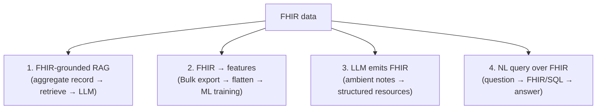

# AI with FHIR

> _Last reviewed: 2026-06-28 — see the [freshness policy](../appendix/maintenance.md)._

## Learning objectives

After this chapter you will be able to:

- Describe the main patterns for combining FHIR data with AI/LLMs.
- Explain why large nested FHIR strains LLMs and how to mitigate it.
- Design a FHIR-grounded AI feature that keeps PHI in-boundary.

## Why FHIR + AI go together

FHIR gives AI a **standardized, queryable source of patient data** — the same model across EHRs — which is exactly what makes models portable and groundable. The pairing shows up across the field: FHIR-grounded [RAG](../06-ai-ml/02-rag-clinical.md) for decision support, [Bulk FHIR](./01-fhir.md) feeding ML training, and LLMs that read or even emit FHIR. This chapter is the interoperability view; see [Part 6](../06-ai-ml/02-rag-clinical.md) for the AI architecture and safety depth.

## The main patterns

1. **FHIR-grounded RAG.** Aggregate a patient's record via FHIR, retrieve the relevant parts, and ground an LLM on them for decision support or chart Q&A (e.g. FHIR-RAG approaches, LLMonFHIR). Answers cite real resources.
2. **FHIR → ML features.** Use [Bulk Data `$export`](./01-fhir.md) to pull cohorts, flatten with [SQL-on-FHIR](./07-sql-on-fhir.md), and engineer features for outcome-prediction models (the pattern behind federated FHIR learning systems like Cumulus).
3. **LLM emits FHIR.** Ambient documentation and extraction tools turn conversation or free text into structured FHIR resources — closing the loop from unstructured to standardized.
4. **Natural-language query over FHIR.** Translate a question into FHIR searches or SQL-on-FHIR views and answer from the result.

## The hard part: big structured data vs LLM context

LLMs struggle with **large-scale nested FHIR**. As a patient's record grows, stuffing raw FHIR JSON into a prompt blows the context window, raises cost, and *lowers* accuracy. Mitigations:

- **Retrieve, don't dump.** Select only the relevant resources (RAG), not the whole record.
- **Flatten first.** Convert to tidy tables with [SQL-on-FHIR](./07-sql-on-fhir.md) so the model (or a tool) sees compact, relevant rows.
- **Summarize hierarchically.** Pre-summarize sections; feed summaries plus drill-down on demand.
- **Use tools, not just context.** Let an [agent](../06-ai-ml/03-agentic-ai.md) query FHIR via tools rather than holding the record in the prompt.

## Keep PHI in-boundary

FHIR data is PHI, so the AI architecture inherits every [HIPAA](../03-compliance/00-hipaa.md) constraint:

- Use **BAA-covered** managed models or **self-hosted** inference ([NVIDIA NIM](../04-cloud-platforms/07-nvidia.md)) so records don't reach an un-covered API.
- **Authorize retrieval** — the AI must only see resources the user is permitted to (mirror [SMART scopes](./05-smart-on-fhir.md)); don't let AI bypass record-level access.
- **Audit** prompts, retrieved resources, and outputs; **cite sources**; keep a human in the loop for clinical decisions.

## Best practices

1. **Ground, don't free-generate** — answer from retrieved FHIR and say "not found" otherwise.
2. **Flatten + retrieve** to fit context and control cost.
3. **Validate emitted FHIR** against the target [profile](./06-fhir-profiles-us-ca.md) before writing it back.
4. **Treat the AI as an untrusted actor** at the data boundary (authorize every access).

## Lab

[`RAGonGCP`](https://github.com/anothernoise/RAGonGCP) (FHIR-grounded RAG) and [`aws-health-agents`](https://github.com/anothernoise/aws-health-agents) (FHIR tools via an agent) both exercise these patterns.

## Check yourself

1. Why does dumping a full FHIR record into an LLM prompt often *reduce* accuracy, and what are two mitigations?
2. Which pattern turns ambient clinical conversation into structured data, and what must you validate?
3. Two ways to keep PHI in-boundary when grounding an LLM on FHIR data?

## Further reading

- [SMART/HL7 Bulk Data](https://hl7.org/fhir/uv/bulkdata/) · [SQL on FHIR](https://sql-on-fhir.org/ig/)
- [RAG over clinical corpora](../06-ai-ml/02-rag-clinical.md) · [Agentic AI](../06-ai-ml/03-agentic-ai.md)
