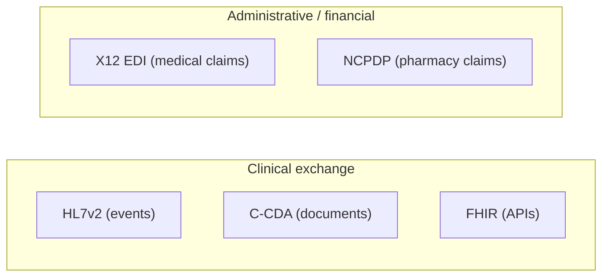

# Document & claims standards: C-CDA, X12 & prior auth

> _Last reviewed: 2026-06-28 — see the [freshness policy](../appendix/maintenance.md)._

## Learning objectives

After this chapter you will be able to:

- Place C-CDA (clinical documents) and X12 (administrative/claims EDI) alongside FHIR and HL7v2.
- Name the key X12 transactions and where NCPDP fits for pharmacy.
- Explain what CMS-0057 changes for payers and prior authorization.

## FHIR is not the only standard in the building

[FHIR](./01-fhir.md) gets the attention, but real HLS systems still run on **document** and **EDI** standards that predate it and aren't going away. An SA must recognize them and know when each is the wire format: documents (C-CDA) for summaries and transitions, X12 for the money (claims/eligibility), NCPDP for pharmacy, FHIR for modern APIs.

## C-CDA — clinical documents

**Consolidated Clinical Document Architecture (C-CDA)** is an HL7 standard for structured
clinical *documents* in XML (built on the older CDA). The common document type is the
**Continuity of Care Document (CCD)** — a patient summary — plus discharge summaries,
referral notes, and progress notes.

- **Where it's used:** transitions of care, referrals, and exchange via Direct messaging
  and HIEs. ONC certification has long required C-CDA generation/consumption, so there is a
  vast installed base.
- **C-CDA vs FHIR:** documents (a fixed, signed snapshot) vs granular API resources. They
  coexist; **C-CDA on FHIR** maps document content to FHIR, and FHIR has its own Document
  paradigm (a `Bundle` of type `document` led by a `Composition`).
- **SA implication:** expect to *ingest and parse* C-CDA from partners even in FHIR-first
  designs; extract structured data (often into [FHIR](./01-fhir.md) or [OMOP](./04-omop-cdm.md))
  and watch for the usual messy-document realities (free text, inconsistent sections).

## X12 — the administrative/claims EDI standard

**ASC X12** is the EDI standard for US healthcare's administrative and financial
transactions — HIPAA names specific X12 versions as the required standards. The ones an SA
meets most:

| Transaction | Purpose |
| --- | --- |
| **837** | Healthcare claim (professional / institutional / dental) |
| **835** | Claim payment / remittance advice |
| **270 / 271** | Eligibility inquiry / response |
| **276 / 277** | Claim status request / response |
| **278** | Services review — **prior authorization** request/response |
| **834** | Benefit enrollment and maintenance |
| **820** | Premium payment |

For **medical** claims, X12 837 is the wire format; for **retail pharmacy** claims, the
standard is **NCPDP** (Telecommunication D.0), which is why the [PBM claims lab](https://github.com/anothernoise/hls-pbm-claims-aws)
deals in NCPDP, not X12. A payer platform typically handles **both**.

## CMS-0057 — interoperability & prior authorization

The **CMS Interoperability and Prior Authorization Final Rule (CMS-0057-F, 2024)** pushes
payers toward FHIR for the administrative pain points X12 has historically owned. Impacted
payers (Medicare Advantage, Medicaid, CHIP, ACA marketplace plans) must:

- Expand the **Patient Access API** and add a **Provider Access API** and **Payer-to-Payer API** (all FHIR).
- Implement a **Prior Authorization API** (the "PARDD" / Da Vinci-based APIs) to make prior
  auth electronic and faster, and report prior-auth metrics. The operational prior-auth
  provisions begin in **2026**, and the FHIR API requirements (Provider Access, Payer-to-Payer,
  Prior Authorization) have compliance dates generally from **Jan 1, 2027**. All APIs use **FHIR R4**.

This is the regulatory bridge from EDI to FHIR: prior auth (X12 278 today) gets a FHIR API
path, and payers must expose far more data via FHIR. See [FHIR profiles & regulation](./06-fhir-profiles-us-ca.md)
for the broader US/Canada landscape.

## Best practices

1. **Plan to consume legacy formats** (C-CDA, X12) even in FHIR-first designs — partners
   send what they send.
2. **Normalize to one internal model** (FHIR and/or OMOP); don't let X12/C-CDA quirks leak
   downstream.
3. **Pick the right wire format per domain**: NCPDP for pharmacy claims, X12 837 for medical
   claims, C-CDA for documents, FHIR for modern APIs.
4. **Track CMS-0057 timelines** if you build for payers — the FHIR API surface is expanding.

## Check yourself

1. A partner sends patient summaries as C-CDA documents while you run a FHIR-first platform. What do you do with them?
2. Which X12 transaction carries a medical claim, and which standard carries a retail pharmacy claim instead?
3. What does CMS-0057 require payers to do about prior authorization, and how does that relate to X12 278?

## Further reading

- [HL7 C-CDA](https://www.hl7.org/implement/standards/product_brief.cfm?product_id=492) · [C-CDA on FHIR](https://hl7.org/fhir/us/ccda/)
- [X12 (HIPAA transactions)](https://x12.org/) · [CMS — administrative simplification](https://www.cms.gov/regulations-and-guidance/administrative-simplification)
- [CMS-0057-F Final Rule](https://www.cms.gov/newsroom/fact-sheets/cms-interoperability-and-prior-authorization-final-rule-cms-0057-f)
