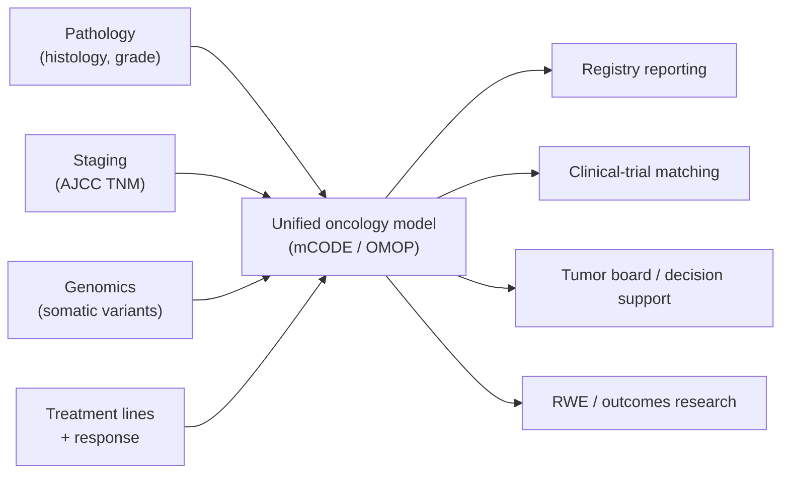

# Oncology data

> _Last reviewed: 2026-06-28 — see the [freshness policy](../appendix/maintenance.md)._

## Learning objectives

After this chapter you will be able to:

- Explain why oncology data is uniquely complex and multi-modal.
- Name the core oncology standards — ICD-O-3, AJCC TNM staging, mCODE, NAACCR.
- Design a data flow that unifies pathology, genomics, staging, treatment, and outcomes.

## Why oncology is its own data problem

Cancer care produces some of the most complex longitudinal data in medicine. A single patient's record spans **pathology** (histology, grade), **staging** (how advanced), **genomics** (somatic mutations driving therapy), **imaging**, **treatment lines** (surgery, radiation, systemic therapy), and **response/outcomes** over years. It is also **reporting-mandated** — providers must report cancers to central registries — and **fast-evolving**, as precision oncology ties new biomarkers to new drugs constantly. Generic [clinical data](./01-fhir.md) models capture only part of this; oncology needs its own standards.

## The core standards

| Standard | What it codes | Notes |
| --- | --- | --- |
| **ICD-O-3** | Cancer **topography** (site) + **morphology** (histology/behavior) | Distinct from ICD-10; the registry/pathology cancer classification |
| **AJCC TNM staging** | Tumor (T), Nodes (N), Metastasis (M) → stage group | Clinical vs pathologic staging; part of USCDI |
| **mCODE** | A minimal common FHIR data set for oncology | HL7 FHIR IG (v4), driven by the **CodeX** accelerator — the interoperability backbone |
| **NAACCR** | Central cancer-registry data dictionary | Mandated reporting to state/central registries (annual version, e.g. v26 for 2026) |
| **CAP eCC** | Synoptic pathology checklists | Structured pathology reporting |
| **OncoKB / ClinVar / COSMIC** | Variant interpretation knowledge bases | Map somatic variants to clinical/therapeutic significance |

**mCODE** is the one to anchor on: it standardizes the primary cancer condition, secondary/metastatic disease, TNM staging, tumor markers, cancer-related genomics, treatments, and disease status as FHIR resources — so oncology data can move between EHRs, registries, trial-matching services, and research without custom interfaces.

## Precision oncology: genomics drives therapy

Modern oncology is genomics-led. An NGS panel (or [whole-genome/exome sequencing](../07-genomics/00-sequencing-pipelines.md)) on a tumor produces **somatic** variants, which are interpreted (OncoKB/ClinVar, tiered by AMP/ASCO/CAP guidelines) to select **targeted therapies**. The architecture must therefore link the [variant store](../07-genomics/02-variant-stores.md) to the clinical record:

- Distinguish **somatic** (tumor-acquired) from **germline** (inherited) variants — different consent, interpretation, and reporting.
- Carry the variant → interpretation → therapy chain so a tumor board (and an audit) can see *why* a therapy was chosen.
- mCODE's genomics profiles (built on the FHIR Genomics work) are the standard way to represent this in the record.

## Architecture implications

- **Unify multi-modal data.** Pathology, staging, genomics, imaging, and treatment arrive from different systems; mCODE (FHIR) is the conformance target, OMOP the analytics model (with an oncology extension). Map source codes carefully — histology in ICD-O-3, diagnoses in ICD-10/SNOMED ([terminologies](./03-terminologies.md)).
- **Registry reporting is a pipeline, not an afterthought.** NAACCR reporting is mandated; design the extract early. mCODE-to-registry tooling (CodeX) reduces manual abstraction.
- **Clinical-trial matching** is a flagship oncology use case: structured mCODE data (stage, biomarkers, prior therapy) matches patients to trial eligibility — a strong [AI/agent](../06-ai-ml/03-agentic-ai.md) opportunity.
- **Staging is hard.** TNM has clinical vs pathologic variants, edition dependencies, and site-specific rules; treat it as a first-class, validated data element, not a free-text field.

## Pain points & best practices

- **Histology/site coding** (ICD-O-3) and **staging** require trained abstraction — expect data-quality work and validate against registry rules.
- **Biomarkers move fast** — the variant-to-therapy knowledge base changes constantly; version it (like [vocabularies](./04-omop-cdm.md)) and date interpretations.
- **Somatic vs germline governance** — germline findings are inherited PHI for the family; handle consent and return-of-results deliberately (see [de-identification & consent](../03-compliance/04-deidentification-consent.md)).
- **Anchor on mCODE** for interoperability; don't invent a local oncology model.

## Lab

Extend the [`hls-fhir-interop`](https://github.com/anothernoise/hls-fhir-interop) lab with mCODE profiles, and join tumor variants from [`hls-variant-store-aws`](https://github.com/anothernoise/hls-variant-store-aws) to the clinical record. Generate synthetic oncology patients with the [`hls-synthea-data`](https://github.com/anothernoise/hls-synthea-data) lab (Synthea has cancer modules).

## Check yourself

1. Why is ICD-O-3 needed alongside ICD-10/SNOMED for cancer data?
2. What does mCODE standardize, and why anchor an oncology platform on it?
3. Why must somatic and germline variants be governed differently?

## Further reading

- [mCODE Implementation Guide](https://hl7.org/fhir/us/mcode/) · [CodeX FHIR Accelerator](https://confluence.hl7.org/display/COD/CodeX+Home)
- [AJCC TNM staging](https://www.facs.org/quality-programs/cancer-programs/american-joint-committee-on-cancer/) · [NAACCR](https://www.naaccr.org/)
- [ICD-O-3 (WHO)](https://www.who.int/standards/classifications/other-classifications/international-classification-of-diseases-for-oncology) · [SEER](https://seer.cancer.gov/) · [OncoKB](https://www.oncokb.org/)
