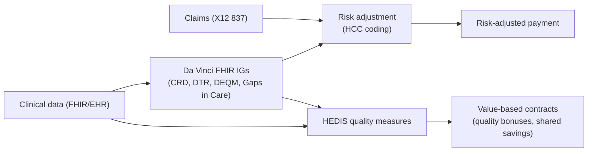

# Payer data & value-based care

> _Last reviewed: 2026-06-29 — see the [freshness policy](../appendix/maintenance.md)._

## Learning objectives

After this chapter you will be able to:

- Explain HEDIS, risk adjustment/HCC coding, and how they drive payer architecture.
- Place the HL7 Da Vinci FHIR implementation guides in a payer/provider data flow.
- Design a data platform that supports quality measurement and value-based contracts.

## The payer side has its own data problem

Providers optimize around clinical data and interoperability; **payers optimize around
measurement and risk** — proving quality was delivered (HEDIS), pricing risk accurately
(risk adjustment), and increasingly exchanging both electronically via FHIR (the
[Da Vinci](https://www.hl7.org/about/davinci/) accelerator). This is the payer-side
counterpart to [Document & claims standards](./09-cda-x12-claims.md) (which covers the
claims wire formats) and the [industry map](../00-orientation/01-hls-industry-map.md)'s payer
and PBM segments.

## HEDIS: measuring quality

**HEDIS** (Healthcare Effectiveness Data and Information Set), maintained by NCQA, is the
dominant quality-measurement standard payers report against — six domains: effectiveness of
care, access/availability, experience of care (via CAHPS surveys), utilization, and more.
Architecturally, HEDIS has historically meant expensive **hybrid measures** — combining
claims data with manual chart abstraction. NCQA is actively moving measures toward **ECDS**
(Electronic Clinical Data Systems) and **FHIR-based** reporting, which is why a modern payer
data platform needs first-class clinical-data ingestion (FHIR/[OMOP](./04-omop-cdm.md)), not
just a claims warehouse.

## Risk adjustment & HCC coding

**Risk adjustment** prices a health plan's payment to the actual health risk of its enrolled
population, using **HCC (Hierarchical Condition Category)** coding derived from diagnosis
codes. Three operating modes matter architecturally:

- **Prospective** — risk scores set before the payment period, from prior-year diagnoses.
- **Concurrent** — validated in near-real-time against current-encounter documentation.
- **Retrospective** — completed charts reviewed after claims processing to find missed/under-coded diagnoses.

The common failure mode is **under-documentation**: a condition the clinician is actively
managing never gets coded with sufficient specificity, so the risk score — and the payment —
understates true risk. A risk-adjustment platform's job is closing that documentation gap,
which increasingly means surfacing suggested codes **in the clinical workflow** (a
[CDS Hooks](./00-hl7v2.md)-style pattern) rather than after the fact. The same pattern applies to
**Z-code (SDOH) under-coding** as health-equity-adjusted risk models mature — see
[SDOH & health equity data](./18-sdoh-health-equity.md).

## Da Vinci: FHIR for payer-provider exchange

The HL7 **Da Vinci Project** is the accelerator producing the FHIR Implementation Guides that
make payer-provider data exchange interoperable rather than proprietary per-payer feeds.
The IGs an SA meets most:

| IG | Purpose |
| --- | --- |
| **HRex (Health Record Exchange)** | Common FHIR profiles/operations reused across the other Da Vinci IGs |
| **CRD (Coverage Requirements Discovery)** | Tells a provider, at order time, what documentation/prior-auth a payer will require |
| **DTR (Documentation Templates and Rules)** | Delivers the actual questionnaire/form for that requirement, computable |
| **PAS (Prior Authorization Support)** | Submits the prior-auth request/response as FHIR — the CMS-0057 mechanism (see [Document & claims standards](./09-cda-x12-claims.md)) |
| **CDex (Clinical Data Exchange)** | Provider ↔ payer clinical data exchange (e.g. supporting a claim or audit) |
| **DEQM (Data Exchange for Quality Measures)** | Includes **Gaps in Care** — tells a provider which quality measures a patient is due/overdue for |
| **Risk Adjustment IG** | Structured exchange of risk-adjustment-relevant data and suspected/confirmed HCC gaps |
| **PDex (Payer Data Exchange)** | The FHIR API payers expose to patients/providers (CMS Patient/Provider Access rules) |

The pattern across all of them: **move payer logic to the point of care as a computable FHIR
call**, instead of the traditional retrospective claims-based catch-up loop.

## Architecture implications

- **You need both claims and clinical data.** A payer platform that is claims-only can't do
  modern (ECDS/FHIR-based) HEDIS or concurrent risk adjustment — you need a
  [lakehouse](../05-data-platforms/00-lakehouse-vs-warehouse.md) that ingests both, typically
  modeled to [OMOP](./04-omop-cdm.md) for the clinical side.
- **Push logic to the point of care.** CRD/DTR/Gaps-in-Care exist so the provider sees the
  requirement or the gap *during* the encounter, not weeks later in a claims denial or a
  quality-report reconciliation.
- **PHI and audit rules are unchanged.** Risk-adjustment and quality data are still PHI —
  every [HIPAA](../03-compliance/00-hipaa.md) control applies, and the [PBM claims lab](https://github.com/anothernoise/hls-pbm-claims-aws)
  pattern of a fast, audited adjudication path generalizes here.

## Lab

Extend [`hls-lakehouse-rwd`](https://github.com/anothernoise/hls-lakehouse-rwd) with a
synthetic HEDIS-style measure computed from OMOP data, and a Gaps-in-Care FHIR response
against the [`hls-fhir-interop`](https://github.com/anothernoise/hls-fhir-interop) sandbox.

## Check yourself

1. Why is a claims-only data platform insufficient for modern (ECDS/FHIR) HEDIS reporting?
2. What is the difference between prospective, concurrent, and retrospective risk adjustment, and what failure mode does concurrent adjustment target?
3. Which Da Vinci IG tells a provider what prior-authorization documentation a payer needs, and which one delivers the actual form?

## Further reading

- [NCQA — HEDIS](https://www.ncqa.org/hedis/) · [HL7 Da Vinci Project](https://www.hl7.org/about/davinci/)
- [Da Vinci DEQM (Gaps in Care)](https://build.fhir.org/ig/HL7/davinci-deqm/) · [Da Vinci Risk Adjustment IG](https://build.fhir.org/ig/HL7/davinci-ra/)
- [Document & claims standards: C-CDA, X12 & prior auth](./09-cda-x12-claims.md)
