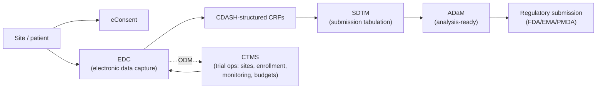

# Clinical trial technology

> _Last reviewed: 2026-06-29 — see the [freshness policy](../appendix/maintenance.md)._

## Learning objectives

After this chapter you will be able to:

- Place EDC, CTMS, and eConsent in the clinical-trial technology stack.
- Explain the CDISC standards (CDASH, SDTM, ADaM, ODM) and why each exists.
- Design a trial-data architecture that bridges CDISC and FHIR.

## The trial technology stack

[The HLS industry map](../00-orientation/01-hls-industry-map.md) introduced CROs as the
organizations that execute most sponsor trials. This chapter covers the **systems** a trial
actually runs on — the software an SA architects around when building for a sponsor, a CRO,
or a site network.

- **EDC (Electronic Data Capture)** — where site staff enter patient data during a trial
  (Medidata Rave, Oracle InForm, Veeva Vault EDC). The system of record for trial data.
- **CTMS (Clinical Trial Management System)** — manages the *operations*: site selection,
  enrollment tracking, monitoring visits, budgets/payments. Distinct from EDC (which holds
  data) — CTMS holds process.
- **eConsent** — electronic informed-consent workflows, increasingly required to support
  remote/decentralized trials and auditable proof of consent.

## The CDISC standards: why four, not one

**CDISC** (Clinical Data Interchange Standards Consortium) defines the data standards that
make a trial's data usable across the industry and submittable to regulators. Each of the
four core standards exists for a different stage:

| Standard | Stage | Purpose |
| --- | --- | --- |
| **CDASH** (Clinical Data Acquisition Standards Harmonization) | Collection | Standardizes the case report form (CRF) fields the EDC system captures |
| **SDTM** (Study Data Tabulation Model) | Submission | Organizes raw collected data into standardized domains/tables for regulatory review |
| **ADaM** (Analysis Data Model) | Analysis | Derives analysis-ready datasets from SDTM for statistical analysis and submission |
| **ODM** (Operational Data Model) | Interchange | An XML format for exchanging trial data and metadata *between systems* (e.g. EDC ↔ CTMS) |

The reason there are four: **collection, tabulation, analysis, and system interchange are
different jobs with different consumers** (site staff vs. regulator vs. statistician vs.
another system) — collapsing them into one format has been tried and consistently fails to
serve all four well.

## Where this is heading: automation and FHIR convergence

Two live developments matter for an SA building trial infrastructure today:

- **CDISC 360i** (launched February 2025) — an initiative pushing toward **end-to-end
  automation** from study design through results, reducing the manual mapping that has
  historically eaten trial-data timelines.
- **FHIR-to-CDISC Joint Mapping Implementation Guide** (HL7 + CDISC collaboration) —
  formal mappings between **FHIR R4** and **CDASHIG/SDTMIG**, so real-world clinical data
  (from an EHR) can flow into a trial's CDASH/SDTM pipeline without a bespoke one-off mapping
  each time. This is the direct bridge between [FHIR](./01-fhir.md) — the clinical-care
  world this bootcamp otherwise focuses on — and the trial-data world.
- **FDA Dataset-JSON** — a modern JSON-based replacement for the legacy SAS Transport (XPT)
  format historically required for regulatory submissions.

## Architecture implications

- **EDC and CTMS are different systems with different data.** Don't conflate "the trial
  database" — plan the integration between them (often via ODM) explicitly.
- **Design for the FHIR bridge, not a one-off ETL.** If you ingest EHR data into a trial
  (site source-data verification, real-world-data-augmented trials, decentralized trials),
  build to the FHIR-to-CDISC mapping rather than inventing your own — see [RWD/RWE](../05-data-platforms/02-rwd-rwe.md)
  for the broader real-world-data pattern this connects to.
- **GxP applies throughout.** Trial data is squarely GxP/21 CFR Part 11 territory — audit
  trails, validation, and access control are not optional (see
  [GxP & 21 CFR Part 11](../03-compliance/02-gxp-part11.md)).
- **CROs mean multi-vendor integration is the default,** not the exception — a sponsor's data
  platform usually receives data from a CRO's EDC/CTMS instance, not its own.

## Check yourself

1. Why does CDISC define four separate standards instead of one, and which stage does each serve?
2. What is the difference between what an EDC system holds and what a CTMS holds?
3. What does the FHIR-to-CDISC Joint Mapping IG let you avoid building yourself?

## Further reading

- [CDISC standards overview](https://www.cdisc.org/standards)
- [CDISC 360i](https://www.cdisc.org/360i) · [FHIR-to-CDISC mapping](https://www.cdisc.org/)
- [FDA Dataset-JSON](https://www.fda.gov/industry/fda-data-standards-advisory-board/study-data-standards-resources)
