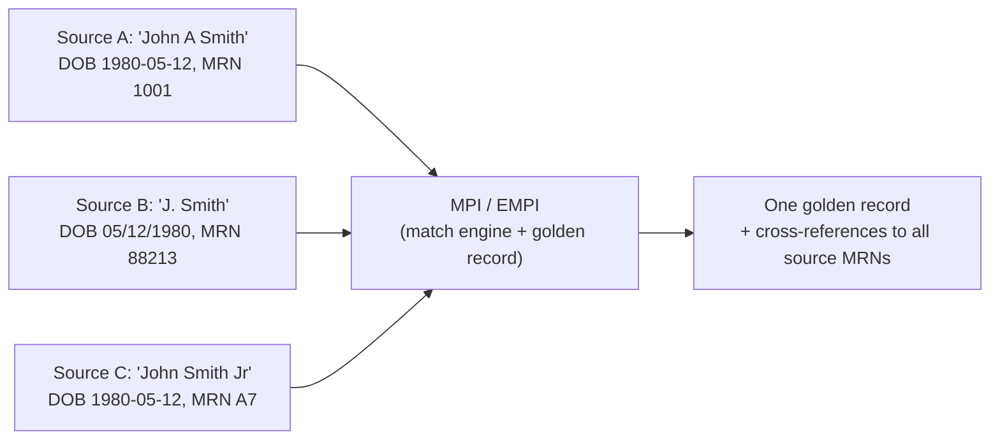

# Patient & provider identity matching

> _Last reviewed: 2026-07-03 — see the [freshness policy](../appendix/maintenance.md)._

## Learning objectives

After this chapter you will be able to:

- Explain why the US has no national patient identifier and what that forces architecturally.
- Compare deterministic, probabilistic, and hybrid patient-matching algorithms.
- Design a Master Patient Index (MPI) and use the NPI registry for provider identity.

## The problem base FHIR doesn't solve

Every [FHIR](./01-fhir.md) `Patient` resource has an `identifier`, but nothing guarantees two
systems assign the **same** patient the **same** identifier. The US has no national patient
identifier (a policy choice, not a technical gap), so every multi-system HLS platform must
solve **patient matching** itself — deciding whether "John A Smith, DOB 1980-05-12" in system
A is the same person as "John Smith, DOB 05/12/1980" in system B. Get this wrong and you
either **merge two different patients' records** (a serious safety incident) or **split one
patient across two records** (fragmented, incomplete care history). Both failure modes are
common: **over 90% of duplicate-record errors originate at registration** (a Johns Hopkins
study), not from some later system fault — the problem starts the moment a human types a name.

## The Master Patient Index (MPI)

An **MPI** (or **EMPI** — Enterprise MPI, spanning multiple facilities/systems) is the
system of record that reconciles patient identity across every source feeding your platform.

### Matching algorithms

| Approach | How it decides a match | Trade-off |
| --- | --- | --- |
| **Deterministic** | Exact match on a fixed rule (e.g. SSN + DOB + last name, all exact) | Simple, auditable, but brittle — any typo or format difference (05/12/1980 vs 1980-05-12) is a miss |
| **Probabilistic** | Weighted statistical scoring across many fields (name, DOB, address, phone), producing a match *probability* | Handles real-world messy data far better; needs tuning to control false positives |
| **Hybrid / AI-assisted** | Probabilistic scoring plus ML models that learn patterns (nicknames, transpositions, common data-entry errors) from historical confirmed matches | State of the art; still needs human review for borderline scores |

Probabilistic and hybrid approaches consistently outperform pure deterministic matching on
real registration data, but every approach needs a **review queue** for borderline scores — no
algorithm should auto-merge above some threshold and auto-reject below it without a "manual
review" band in between for genuinely ambiguous cases.

### Design guidance

- **Fix data quality at the point of capture.** Since most errors originate at registration,
  invest in standardized capture (address validation, DOB format enforcement) before investing
  in ever-cleverer matching downstream.
- **Never silently auto-merge at scale without an audit trail.** A wrong merge is a patient-safety
  incident; keep the golden-record/source-record linkage reversible and logged.
- **Match early, not per-query.** Resolve identity once (at ingest, into the MPI/lakehouse — see
  [governance & data contracts](../05-data-platforms/03-governance-contracts.md)), not
  ad hoc in every downstream consumer.
- **This is exactly the linkage problem [tokenization](../05-data-platforms/02-rwd-rwe.md) solves
  across organizational boundaries** — an MPI matches identity *within* your platform;
  tokenization matches it *across* organizations without exposing PII. Related problem,
  different trust boundary.

## Provider identity: the NPI

Providers have a solved version of this problem: every US healthcare provider (individual or
organization) has a unique **NPI (National Provider Identifier)**, assigned via **NPPES**
(National Plan and Provider Enumeration System) and publicly queryable. Use the NPI as the
canonical provider identifier in your data model — don't invent your own, and don't rely on a
provider's name or a local system ID, which vary by source exactly like patient names do.

## Check yourself

1. Why do most patient-matching errors originate at registration rather than in the matching algorithm itself?
2. When would you prefer probabilistic matching over deterministic, and what does it cost you in return?
3. How does an MPI's matching problem differ from the tokenization problem in RWD linkage?

## Further reading

- [ONC — patient matching](https://www.healthit.gov/topic/interoperability/patient-matching)
- [NPPES — National Provider Identifier registry](https://nppes.cms.hhs.gov/)
- [RWD/RWE tokenization](../05-data-platforms/02-rwd-rwe.md)
