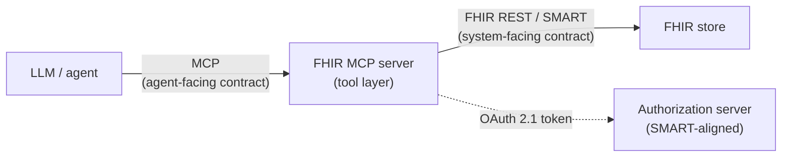

# AI agents on FHIR

> _Last reviewed: 2026-07-03 — see the [freshness policy](../appendix/maintenance.md)._

## Learning objectives

After this chapter you will be able to:

- Explain the difference between the agent-facing contract (MCP) and the system-facing contract (FHIR/SMART).
- Design an MCP-based agent architecture over a FHIR store with the correct authorization model.
- Apply HIPAA and least-privilege discipline to every tool call an agent makes against FHIR.

## Two contracts, not one

[AI with FHIR](./08-ai-with-fhir.md) covered the general patterns for combining LLMs and FHIR
data; [Agentic AI](../06-ai-ml/03-agentic-ai.md) covered agent design generally. This chapter
is the specific, fast-emerging pattern where an **agent's tools are FHIR operations** —
letting an LLM search, read, and (carefully) write FHIR resources as part of a multi-step
reasoning process, standardized through the **Model Context Protocol (MCP)**.

The framing to hold onto: **MCP standardizes the agent-facing contract; FHIR (and SMART on
FHIR) remains the system-facing contract.** A medical MCP server is not a replacement for
FHIR, SMART on FHIR, or an EHR API — it sits *above* them as a tool layer an LLM can call
through a standard interface, while the underlying clinical semantics, authorization model,
and data model are exactly what the rest of Part 2 already teaches.

## What MCP is (briefly)

**MCP** is an open protocol (introduced by Anthropic, November 2024, donated to the Linux
Foundation's Agentic AI Foundation in December 2025) for connecting AI agents to external
tools and data sources through a standard client-server interface. An **MCP server** exposes
a set of callable "tools" (e.g. "search Observations for a patient," "get active
MedicationRequests") that any MCP-compatible agent can discover and invoke — the same idea as
an API, purpose-built for LLM tool-calling rather than human developers.

Several **FHIR MCP servers** have emerged specifically to expose FHIR data this way — both
open-source projects (e.g. a WSO2-published FHIR MCP server) and healthcare-specific agent
projects — letting a natural-language agent query a FHIR store without the calling code
hand-writing every REST call.

## Authorization: this is SMART on FHIR again, one layer up

The MCP server sits between the agent and your FHIR store, and it must be authorized exactly
as rigorously as any other client:

- The MCP server typically acts as an **OAuth 2.1 Resource Server**; a separate
  **Authorization Server** issues tokens — structurally the same client/authorization-server
  split as [SMART on FHIR](./05-smart-on-fhir.md), just fronting MCP tool calls instead of
  direct FHIR REST calls.
- **Scope the MCP tools as narrowly as SMART scopes** — a tool named `search_observations`
  should carry the same `patient/Observation.rs`-style minimum-necessary scope discussed in
  [SMART on FHIR](./05-smart-on-fhir.md) and [Agentic AI](../06-ai-ml/03-agentic-ai.md), not a
  blanket `system/*.cruds`.
- **Watch the multi-hop delegation gap.** A plain OAuth token authenticates the final call,
  but in a chain where an orchestrating agent delegates to a specialist agent that then calls
  an MCP tool, standard OAuth carries **no record of that delegation chain** — it proves the
  last hop was authorized, not that the whole chain should have been. This is an active area
  of work (e.g. proposed Agent Identity Protocols for verifiable delegation); until it
  matures, compensate with **complete audit logging of every hop**, not just the final tool
  call.

## Compliance: HIPAA enforcement moves to the MCP server layer

Every control from [HIPAA](../03-compliance/00-hipaa.md) still applies — the MCP server is
just where they now get enforced for agent traffic specifically:

- **Authenticated access** (OAuth 2.1, SSO integration) — no anonymous tool calls.
- **Role-based authorization** per tool, mirroring minimum-necessary access.
- **Audit logging of every tool call** — request, response, and the identity/role that
  invoked it — this is the agent-era version of the FHIR-API audit trail from
  [API management](../08-integration/02-api-management.md).
- **Encryption** in transit (TLS 1.2+) and at rest (AES-256) for anything the MCP server
  caches or logs.
- **A signed BAA** with any third-party MCP hosting/platform provider — the MCP server is a
  business associate the moment it touches PHI, exactly as any other vendor would be.

A healthcare-specific compliance profile for MCP (sometimes discussed as "HMCP" —
compliance-by-design MCP profiles for regulated settings) is emerging as of 2026 but is not
yet a mature, universally adopted standard — treat it as a trend to watch, and build the
controls above directly rather than waiting for a formal profile to standardize them.

## Design guidance

1. **Keep the system-of-record contract as FHIR, not MCP.** MCP is the agent's window into
   your data; don't let agent-specific shortcuts leak into how you model or store clinical
   data.
2. **Mirror SMART scopes onto MCP tool definitions** — the least-privilege discipline from
   [Agentic AI](../06-ai-ml/03-agentic-ai.md) applies tool-by-tool.
3. **Treat the MCP server as the enforcement point**, not just a convenience layer — every
   control a direct FHIR API client would need, the MCP server needs too.
4. **Log the full call chain**, not just the final hop, until delegation-chain standards
   mature.
5. **Prefer read-heavy, narrowly-scoped tools**; gate any write-capable tool (e.g. creating an
   order) behind human-in-the-loop approval, exactly as [Agentic AI](../06-ai-ml/03-agentic-ai.md)
   recommends for consequential actions.

## Check yourself

1. What is the difference between the "agent-facing contract" and the "system-facing contract" in an MCP-over-FHIR architecture, and why does that distinction matter?
2. Why is the MCP server's authorization model structurally similar to SMART on FHIR's, and what should you scope a `search_observations` tool to?
3. What gap exists in a multi-hop agent-delegation scenario using plain OAuth, and how do you compensate for it today?

## Further reading

- [AI with FHIR](./08-ai-with-fhir.md) · [Agentic AI](../06-ai-ml/03-agentic-ai.md) · [SMART on FHIR](./05-smart-on-fhir.md)
- [Model Context Protocol](https://modelcontextprotocol.io/) · [MCP Authorization specification](https://modelcontextprotocol.io/specification/draft/basic/authorization)
