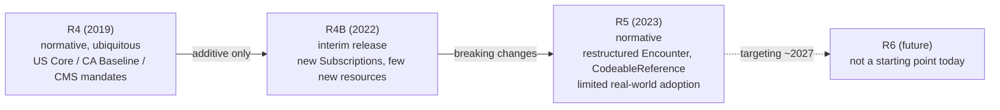
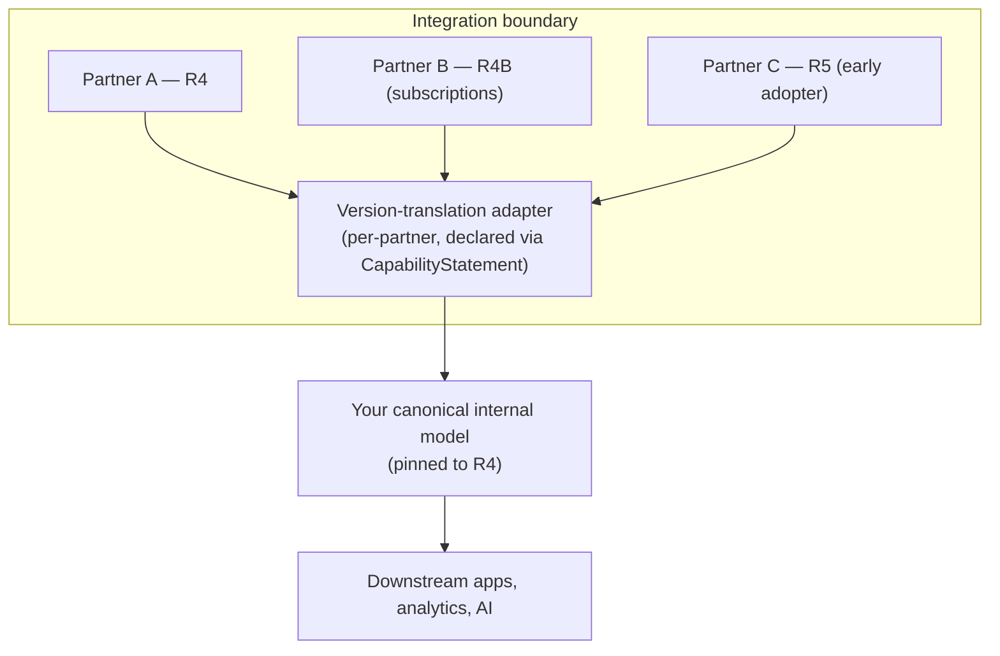

# FHIR version migration & compatibility: R4, R4B & R5

> _Last reviewed: 2026-07-03 — see the [freshness policy](../appendix/maintenance.md)._

## Learning objectives

After this chapter you will be able to:

- Explain what actually changed between FHIR R4, R4B, and R5 — and what didn't.
- Decide when a platform should stay on R4, adopt R4B features, or take on R5.
- Design a coexistence architecture that isolates the rest of your system from version churn at the boundary.

## Why this is a design problem, not a trivia question

[FHIR](./01-fhir.md) is not one fixed standard — it is a sequence of releases, and every US/Canada
regulatory mandate targets a *specific* one. An SA who treats "FHIR" as version-less will
eventually ship an integration that technically "supports FHIR" and still fails a partner's
conformance test because the shapes don't match. The practical question is never "do you support
FHIR" — it's "which version, and how do you keep supporting the old one while the ecosystem
slowly moves."

## What each release actually is

- **R4 (2019)** — the version every mandate you'll meet targets: US Core (and therefore ONC
  certification), CA Baseline, CMS-0057, and the EHDS implementation guides being built in Europe.
  It is normative, meaning HL7 guarantees the core won't break under you. **This is where you
  build by default**, as already noted in [FHIR R4](./01-fhir.md).
- **R4B (2022)** — a narrow, *interim* release, not a full version bump. It exists because a small
  set of features (most notably a redesigned, **topic-based Subscriptions** framework) needed to
  ballot and ship before the next full release was ready. R4B is **strictly additive over R4** —
  every valid R4 resource is still valid R4B, and nothing in R4 was removed or reshaped. Treat
  R4B as "R4 plus a few new capabilities," not a migration.
- **R5 (2023)** — a full normative release, and the first one with **real breaking changes**
  against R4. Adoption has been slow: US/Canada mandates are pinned to R4, so most production
  traffic an SA will touch in 2026 is still R4 or R4B. R5 mostly matters today when a specific
  vendor, research platform, or forward-leaning IG has adopted it early.
- **R6** — targeting a first normative release around 2027 per current HL7 planning. Not a
  concern for a system you are designing today; note it and move on.

## What actually breaks between R4 and R5

Most of R5 is additive (new resources: `SubscriptionTopic`, `ActorDefinition`, `Requirements`,
`TestPlan`, and others), but a handful of changes reshape resources you already use:

| Change | R4 shape | R5 shape | Why it matters |
| --- | --- | --- | --- |
| **Encounter restructuring** | `Encounter.status` had a linear state list; history tracked via `statusHistory`/`classHistory` on the resource itself | Status history moves to a separate **`EncounterHistory`** resource; `Encounter.participant`/`location` reshaped | A consumer reading `Encounter.statusHistory` on an R5 server gets nothing — it has to know to query `EncounterHistory` instead |
| **`CodeableReference` introduced** | Several fields were *either* a `CodeableConcept` *or* a `Reference` as two separate elements (e.g. `MedicationRequest.reasonCode` + `reasonReference`) | Merged into one `CodeableReference` field that can hold either | Code written against the R4 two-field pattern silently stops populating the merged field on an R5 payload |
| **Subscriptions** | Criteria-based, polling-oriented subscriptions (fragile at scale) | Topic-based subscriptions (`SubscriptionTopic` + `Subscription`), backported into R4B — see [Event-driven & real-time architecture on modern infra](../08-integration/09-event-streaming-modern-infra.md) for the build-out | Anyone on R4 (not R4B) doesn't get this at all — a real capability gap, not just a shape change |
| **General cardinality/must-support tightening** | Looser in places | Multiple resources tightened bindings and cardinality | Old validators pass R4 payloads that a strict R5 validator now rejects |

None of this is exotic — it's the normal cost of a normative standard evolving — but it means
**"R5-ready" code cannot be produced by find-and-replacing a version string.**

## Coexistence: the pattern that actually works

The wrong instinct is "upgrade the whole platform to R5." The right instinct: **isolate version
handling at the boundary and keep your internal model on one version.**

1. **Pin one internal version.** Model your canonical store and internal APIs on **R4** — it's
   what every regulatory IG you'll be asked to conform to actually targets. Don't let an early
   partner's R5 endpoint pull your whole platform forward.
2. **Negotiate version explicitly per partner.** Every FHIR server publishes its version in its
   `CapabilityStatement.fhirVersion`. Check it programmatically before you assume a shape; don't
   discover the mismatch in production.
3. **Translate at the edge, not in the core.** Write a thin adapter per partner that maps their
   version's quirks (e.g. R5's `CodeableReference` vs R4's split fields) onto your canonical R4
   shape. This is the same "translate at the boundary, keep the core stable" discipline used for
   [HL7v2 → FHIR](./00-hl7v2.md) conversion — version migration is a special case of the same
   problem, not a new one.
4. **Adopt R4B features selectively, not wholesale.** If you need topic-based subscriptions,
   you can often adopt that one R4B capability without treating it as a full version migration —
   confirm your FHIR server supports the R4B subscription resources even while advertising R4B
   overall as "R4 plus this."
5. **Validate against both IGs' `StructureDefinition`s during any transition window.** Don't rely
   on hand-testing; run the official validator against the specific version and profile you claim
   to support, the same discipline covered in [FHIR profiles & regulation](./06-fhir-profiles-us-ca.md).
6. **Track cross-version conversion tooling, but don't depend on it long-term.** HL7 publishes
   R4↔R5 conversion mappings and "backport" IGs (bringing an R5 feature into R4B as an extension)
   precisely so early adopters and laggards can interoperate during the transition. Use these as a
   bridge, not as your permanent architecture.

## Why regulatory mandates make this simpler in practice

The US and Canada tracks you are most likely to build against — US Core (binding USCDI), CA
Baseline, CMS-0057 — are all pinned to **R4**, and none has a published timeline to move to R5.
That means for most HLS SA work, "which FHIR version" is a settled question until a mandate says
otherwise. The migration skill in this chapter matters most for: **vendors who ship ahead of the
mandate**, **research/academic FHIR platforms** (which adopt new releases faster), and **being
ready** for the day a mandate does move — not for chasing R5 today.

## Design guidance

1. **Default to R4** for anything a regulator will ask about; treat this as the stable baseline.
2. **Adopt R4B a la carte** when you need a specific capability (subscriptions), without calling
   it a migration.
3. **Never let one partner's version dictate your canonical model** — isolate it in an adapter.
4. **Budget dual-version support as a real, ongoing cost**, not a one-time project, for as long as
   you have partners on different versions — which, in practice, is indefinitely.
5. **Re-check `CapabilityStatement.fhirVersion` on every new integration** rather than assuming.

## Check yourself

1. A partner's `CapabilityStatement` reports `fhirVersion: 5.0.0`. Name one specific field-level
   change you need to handle before mapping their `MedicationRequest` data into your R4 store.
2. Why is R4B better described as "R4 plus a feature" than as a step toward R5?
3. Your platform ingests from three partners on R4, R4B, and R5 respectively. Where should
   version-specific translation logic live, and why not in your canonical data model?

## Further reading

- [HL7 — FHIR R4B](https://hl7.org/fhir/R4B/) · [HL7 — R4 to R5 changes](https://hl7.org/fhir/R5/diff.html)
- [HL7 — FHIR R5](https://hl7.org/fhir/R5/)
- [FHIR profiles & regulation: US & Canada](./06-fhir-profiles-us-ca.md)
