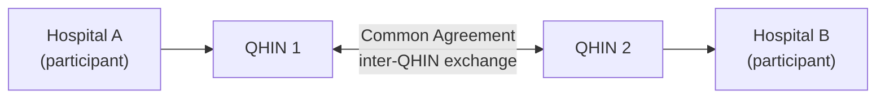

# USCDI, information blocking & TEFCA: operational labs

> _Last reviewed: 2026-07-03 — see the [freshness policy](../appendix/maintenance.md)._

## Learning objectives

After this chapter you will be able to:

- Run a repeatable USCDI version-gap analysis against your own FHIR API.
- Apply the information-blocking exceptions to a concrete request and decide whether they hold.
- Trace a real patient-record request through the TEFCA network-of-networks to a specific integration decision.

## Why labs, not just concepts

[FHIR profiles & regulation: US & Canada](./06-fhir-profiles-us-ca.md) already introduces USCDI,
information blocking, and TEFCA as concepts. What most SAs actually need is the **muscle memory of
running the exercise** — because USCDI revises annually, information-blocking exceptions are only
useful if you can apply them to a specific request under time pressure, and TEFCA integration is a
concrete vendor/network decision, not an abstract mandate. These three labs are designed to be run
as-is against your own systems.

## Lab 1 — USCDI version-gap analysis

USCDI (United States Core Data for Interoperability) revises on a roughly annual cycle — a new
version is proposed, opened for comment, and finalized — and **US Core tracks it with a lag**.
Because the specific data classes added in any given year are a moving target (check the current
list at [healthit.gov/isp/USCDI](https://www.healthit.gov/isp/united-states-core-data-interoperability-uscdi)
rather than trusting a static table in this book), the durable skill is the **method**, not this
year's element list:

1. **Identify your currently-certified/implemented version** — the USCDI version your US Core
   profile actually implements today (check your FHIR server's `CapabilityStatement` and your ONC
   certification records).
2. **Pull the target version's full data-class/element list** — the version you're required to
   move to (the current ONC certification requirement) or the draft version you want to get ahead
   of.
3. **Diff element-by-element.** For every element new in the target version, classify it:
   - **No source data exists** — a new capture workflow is needed (a form field, a discrete order
     type) before there's anything to expose.
   - **Data exists but is uncoded** — e.g. captured only as free text in a note — needs a
     terminology-mapping project (see [Clinical terminologies](./03-terminologies.md)) before it
     can populate a structured FHIR element.
   - **Data exists and is coded, but not exposed via the API** — a US Core profile/implementation
     gap, typically the cheapest fix.
4. **Produce a gap table** and prioritize by effort × mandate deadline, not by which is easiest.

**Worked example — Social Determinants of Health (SDOH).** USCDI added SDOH-related data classes
(problems/health concerns, goals, interventions, assessments) in recent version cycles, driven by
the Gravity Project's FHIR IG work. A typical gap-analysis finding:

| USCDI element | Source system reality | Gap type | Remediation |
| --- | --- | --- | --- |
| SDOH problem/health concern | Captured only as free text in a social-work note | Uncoded | Adopt Gravity Project value sets (SDOH Z-codes); add a discrete capture field |
| SDOH goal | Not captured at all today | No source data | Design a new care-planning workflow field before any FHIR mapping is possible |
| SDOH assessment score | Captured in a validated screening tool, structured, but only in a PDF scan | Data exists, not exposed | US Core profile/API work — the cheapest of the three |

This table shape — not the specific SDOH content — is what you re-run every USCDI cycle. See
[SDOH & health equity data](./18-sdoh-health-equity.md) for the full architecture treatment —
the Gravity Project's FHIR profiles, standard screening tools, and closed-loop referral design.

## Lab 2 — Information-blocking exception scenarios

The 21st Century Cures Act prohibits information blocking, but ONC recognizes a defined set of
**exceptions** — each with specific conditions that must **all** be met, not a blanket excuse.
The core exceptions fall into two groups: those covering *not fulfilling* a request (Preventing
Harm, Privacy, Security, Infeasibility, Health IT Performance) and those covering *how* a request
is fulfilled (Content and Manner, Fees, Licensing — with a later-added TEFCA-specific route
recognizing exchange via TEFCA as a way to satisfy the Manner condition). Work through these
scenarios before you need to decide one in production:

| Scenario | Likely exception | Why it might (or might not) hold |
| --- | --- | --- |
| A behavioral-health provider withholds substance-use-disorder notes from the patient portal without consent | **Privacy Exception** | Disclosure without consent could violate [42 CFR Part 2](../03-compliance/05-regional-compliance.md) — but confirm the specific note actually falls under Part 2's scope, not just "behavioral health" generally |
| A hospital delays releasing a pathology report 48 hours pending clinician review, to avoid a patient reading a cancer diagnosis unmediated | **Preventing Harm Exception** | Requires an *individualized* determination of harm risk for this patient/result — a blanket "hold all pathology 48 hours" policy does not qualify |
| An EHR vendor charges a large flat fee for a custom FHIR export beyond certification requirements | **Fees Exception** (maybe) | Must be cost-based and non-discriminatory; a fee that isn't tied to actual incremental cost is not protected |
| A system is down for scheduled maintenance, announced in advance, affecting API access for two hours | **Infeasibility / Health IT Performance Exception** | Requires advance notice, a defined and reasonable duration, and non-discriminatory application across requestors |

**The discipline:** for each scenario, check *every* condition of the claimed exception — missing
even one means the actor doesn't get that exception's protection. Document the reasoning at the
time of the decision, not reconstructed afterward; this reasoning *is* your defense if
investigated.

## Lab 3 — Tracing a request through TEFCA

TEFCA (Trusted Exchange Framework and Common Agreement) is a **network of networks**, not a
network you join directly — it federates regional/state [HIEs](../08-integration/06-hie-architecture.md)
and vendor networks (Carequality, CommonWell) rather than replacing them. A health system connects through a **QHIN (Qualified Health
Information Network)** — accredited by the Recognized Coordinating Entity (RCE, currently The
Sequoia Project) against the Common Agreement — usually via an existing HIE or EHR vendor that is
itself a QHIN participant. (The live roster of operational QHINs changes as new ones onboard —
check the RCE's site rather than assume a fixed list.)

Walk through a concrete **treatment-purpose query**:

1. A clinician at Hospital A needs records for a patient recently seen at Hospital B, a different
   health system on a different QHIN.
2. Hospital A's system issues a patient-discovery query through its own QHIN — it never talks to
   Hospital B or QHIN 2 directly.
3. QHIN 1 routes the query to QHIN 2 under the Common Agreement's inter-QHIN exchange rules.
4. QHIN 2 resolves patient identity against Hospital B's records using probabilistic matching (see
   [Patient & provider identity matching](./13-patient-provider-identity.md) for the matching
   mechanics) and returns available records for the stated purpose (treatment, in this case).
5. Records are typically returned as **C-CDA** today, with FHIR-based exchange growing across
   QHINs; Hospital A logs the exchange per its minimum-necessary and audit obligations.

**The actual SA decision** is not "how do we implement TEFCA" — it's **"which QHIN(s) does our HIE
or EHR vendor already participate in, and does that reach the specific exchange partners we
need?"** Most organizations get TEFCA reach as a byproduct of a vendor or HIE relationship they
already have, not as a project of its own.

## Design guidance

1. **Re-run the USCDI gap analysis every version cycle**, on a calendar reminder, not reactively
   when a partner complains about a missing element.
2. **Document information-blocking exception reasoning at decision time.** A reconstructed
   justification after a complaint is far weaker than a contemporaneous record.
3. **Never claim an exception on a blanket policy** — every exception ONC recognizes requires an
   individualized, documented basis, not a standing rule.
4. **Treat TEFCA reach as a vendor/QHIN selection question**, not a build project — confirm QHIN
   participation before assuming you need custom integration work.
5. **Log every inter-organizational exchange** (TEFCA or otherwise) with purpose-of-use, since
   that's what both information-blocking defense and TEFCA's own accountability model depend on.

## Check yourself

1. A hospital wants to delay releasing all imaging results for three business days as standing
   policy. Does the Preventing Harm Exception protect this? Why or why not?
2. Your FHIR API implements USCDI v4 fully. USCDI v6 is now the certification target. What are
   the three gap categories you'd sort each new v6 element into, and which is typically cheapest
   to close?
3. Why does a hospital's TEFCA integration decision usually reduce to "which QHIN does our vendor
   use," rather than "how do we build a TEFCA connection"?

## Further reading

- [USCDI — current version and data classes](https://www.healthit.gov/isp/united-states-core-data-interoperability-uscdi)
- [ONC — information blocking exceptions](https://www.healthit.gov/topic/information-blocking)
- [TEFCA / RCE — The Sequoia Project](https://rce.sequoiaproject.org/)
- [FHIR profiles & regulation: US & Canada](./06-fhir-profiles-us-ca.md) · [Patient & provider identity matching](./13-patient-provider-identity.md)
