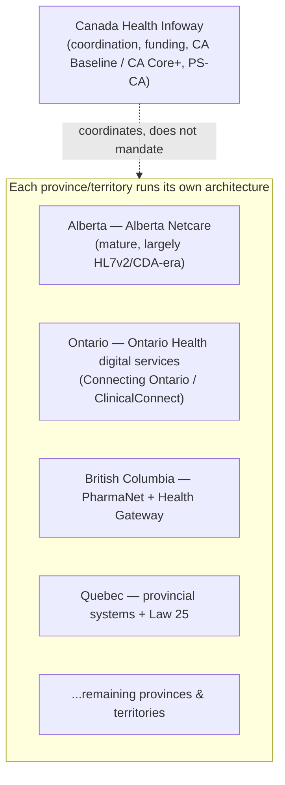

# Canadian HLS architecture

> _Last reviewed: 2026-07-03 — see the [freshness policy](../appendix/maintenance.md)._

## Learning objectives

After this chapter you will be able to:

- Explain why a "Canadian" HLS integration is really 13 separate provincial/territorial integrations.
- Name the major provincial EHR-viewer architectures and what vintage of standards they run on.
- Design a pan-Canadian platform that budgets for provincial privacy variation and mixed HL7v2/FHIR maturity rather than assuming one national target.

## Canada is a federation, not a single integration target

[FHIR profiles & regulation: US & Canada](./06-fhir-profiles-us-ca.md) already establishes the
headline difference: the US drives FHIR adoption through federal mandate; Canada drives it through
**pan-Canadian coordination** (Canada Health Infoway) layered over **provincial** health-system
authority. This chapter is the deep dive an SA needs before actually building for the Canadian
market: **each province runs its own architecture, its own privacy law, and its own standards
vintage** — "supports Canada" is not a single target, it's a portfolio of up to 13 separate ones.

## The pan-Canadian layer: Infoway's coordinating role

**Canada Health Infoway** is a federally funded, not-for-profit that coordinates — it does not
mandate. Its interoperability artifacts:

- **CA Baseline** — the foundational pan-Canadian FHIR profile set (already introduced in
  [FHIR profiles & regulation](./06-fhir-profiles-us-ca.md)).
- **CA Core+** — Infoway's ongoing work extending CA Baseline toward a more complete profile set
  (closer to US Core's depth of coverage), reflecting gaps identified since CA Baseline's initial
  publication. **This area is actively evolving** — confirm the current state and exact scope
  directly against Infoway's published IG rather than treating any fixed description (including
  this one) as current; it is exactly the kind of fast-moving regional detail this book's
  [freshness policy](../appendix/maintenance.md) exists to flag.
- **PS-CA** — the pan-Canadian Patient Summary (IPS-based), for cross-jurisdiction and unplanned-care
  data exchange.

**The critical design implication:** none of this is enforced the way ONC certification or a CMS
rule is. Provinces adopt Infoway's standards at their own pace and by their own choice — so a
pan-Canadian platform cannot assume uniform conformance just because a pan-Canadian profile exists.

## Provincial privacy law: no single "Canadian HIPAA"

[Regional compliance](../03-compliance/05-regional-compliance.md) already introduces PIPEDA
(federal, general-purpose) and the provincial layer (PHIPA in Ontario, Quebec's Law 25). The
pattern generalizes further than a two-province example suggests: **most provinces have their own
health-information-specific act**, each a custodian-based regime with its own rules for consent,
disclosure, and breach notification — Alberta's **Health Information Act (HIA)**, Ontario's
**PHIPA**, and equivalents elsewhere, each independently interpreted by its own provincial privacy
commissioner. (Saskatchewan's provincial health-privacy law is also commonly abbreviated **HIPA** —
a naming collision with the US HIPAA worth flagging explicitly so it doesn't cause confusion on a
cross-border team.)

**Design implication:** a consent-management or data-residency control built for Ontario's PHIPA
does not automatically generalize to Alberta's HIA or Quebec's Law 25. Map each province you
operate in as its own regime, the same discipline [Regional compliance](../03-compliance/05-regional-compliance.md)
recommends for multi-jurisdiction design generally — just applied *within* one country.

## Provincial architecture patterns

Because health delivery is constitutionally provincial, each province built its own centralized
clinical-data infrastructure independently, on its own timeline — which is why they sit at very
different standards vintages today:

- **Alberta — Alberta Netcare.** One of the longest-running, most comprehensive province-wide EHR
  viewers in Canada, aggregating labs, pharmacy dispenses, diagnostic imaging reports, and clinical
  documents across virtually the entire province. It predates FHIR and still runs substantially on
  **HL7v2/CDA-era feeds** at the ingestion layer — a mature architecture, but not a FHIR-native one.
- **Ontario — Ontario Health digital services.** Ontario consolidated its digital-health agency
  (formerly **eHealth Ontario**) into **Ontario Health** in a provincial reorganization — a naming
  change worth knowing before you go looking for "eHealth Ontario" and find it's now a division of
  a larger body. Its clinical-viewer capability (**Connecting Ontario / ClinicalConnect**)
  aggregates records across hospitals and providers province-wide, similar in purpose to Alberta
  Netcare but a separate implementation with its own integration requirements.
- **British Columbia — PharmaNet + Health Gateway.** **PharmaNet** is BC's province-wide pharmacy
  dispense network (every dispensing pharmacy in the province connects to it), and **Health
  Gateway** is BC's patient-facing access layer on top of the province's clinical repositories —
  a useful concrete example of a provincial *consumer*-facing pattern, distinct from Alberta
  Netcare's and Ontario's clinician-facing viewers.
- **Quebec** — runs its own provincial systems under the added constraint of **Law 25**'s
  GDPR-like consent and privacy-impact-assessment requirements, distinct from the rest of the
  country's PIPEDA-based baseline.

**The pattern to internalize:** you are not integrating with "the Canadian health system" — you
are integrating with **N separate provincial systems**, each a different age, a different mix of
HL7v2/CDA and FHIR, and governed by a different privacy act. Budget accordingly, and never let a
successful integration with one province's viewer become an assumption about the next one.

## Design guidance

1. **Scope by province explicitly** — "we support Canada" is not a buildable requirement; "we
   support Alberta and Ontario, with BC planned" is.
2. **Confirm CA Core+/CA Baseline's current status directly with Infoway** before committing an
   architecture to it — this is one of the fastest-moving areas in the book.
3. **Map each province's privacy act independently** — do not assume PHIPA's rules, or any single
   province's, generalize nationally.
4. **Expect legacy HL7v2/CDA feeds alongside newer FHIR endpoints within the same province** —
   Alberta Netcare's vintage is not an edge case, it's representative of what a mature provincial
   system actually looks like today.
5. **Treat Infoway as a standards coordinator, not an enforcement body** — provincial adoption is
   voluntary and staggered, unlike the ONC/CMS forcing functions in the US.

## Check yourself

1. Why is "we support Canada" not a scoped, buildable integration requirement on its own?
2. A platform built its consent-management controls around Ontario's PHIPA. What has to be
   re-verified before deploying the same controls in Alberta?
3. Why does Alberta Netcare's continued reliance on HL7v2/CDA-era feeds matter for a vendor
   assuming Canadian integrations will be FHIR-native?

## Further reading

- [Canada Health Infoway](https://www.infoway-inforoute.ca/) · [CA Baseline IG](https://build.fhir.org/ig/HL7-Canada/ca-baseline/)
- [Alberta Netcare](https://www.albertanetcare.ca/) · [Ontario Health](https://www.ontariohealth.ca/)
- [Ontario IPC — PHIPA](https://www.ipc.on.ca/en/health-individuals/health-privacy-ontario) · [Alberta — Health Information Act](https://www.alberta.ca/health-information-act)
- [FHIR profiles & regulation: US & Canada](./06-fhir-profiles-us-ca.md) · [Regional compliance](../03-compliance/05-regional-compliance.md)
