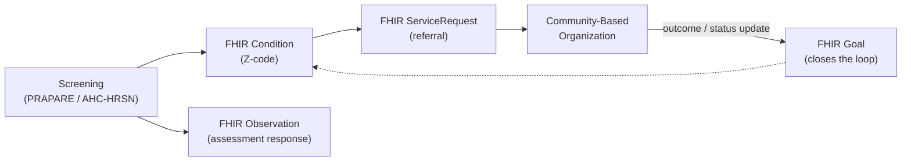

# SDOH & health equity data

> _Last reviewed: 2026-07-09 — see the [freshness policy](../appendix/maintenance.md)._

## Learning objectives

After this chapter you will be able to:

- Explain why Social Determinants of Health (SDOH) data is architecturally different from clinical data.
- Apply the Gravity Project's FHIR profiles and standard screening tools (PRAPARE, AHC-HRSN) to SDOH capture.
- Design a closed-loop referral architecture connecting clinical systems to community-based organizations.

## Why SDOH doesn't fit the patterns built so far

Every data-standards chapter so far assumes the source of truth is a clinical system — an EHR, a
lab, an imaging archive. **Social Determinants of Health (SDOH)** — housing instability, food
insecurity, transportation barriers, interpersonal safety, financial strain — are widely cited as
driving a majority of health outcomes, yet the data about them is frequently captured **outside**
the EHR entirely: by community health workers, social workers, and community-based organizations
(CBOs) using their own systems, with their own taxonomies. [USCDI, information blocking & TEFCA](./16-uscdi-tefca-labs.md)
already used SDOH as its worked gap-analysis example; this chapter is the full architecture
treatment.

## The Gravity Project

The **Gravity Project** is the HL7 FHIR accelerator that standardized SDOH data — it's the reason
USCDI added SDOH-related data classes, and it defines specific profiles across recognized domains
(food insecurity, housing instability, transportation access, interpersonal safety, financial
strain, and others), each tied to a **recommended standardized screening tool**:

- **PRAPARE** (Protocol for Responding to and Assessing Patients' Assets, Risks, and Experiences) —
  a widely used, standardized SDOH screening instrument designed for primary care and community
  health center settings.
- **AHC-HRSN** (Accountable Health Communities Health-Related Social Needs screening tool) —
  developed by CMS specifically for its Accountable Health Communities model, now used more broadly
  as a standard screening instrument.

Using a recognized tool matters architecturally: it means the screening questions and response
options are already mapped to standard codes, instead of your organization inventing a bespoke
survey that then needs its own custom terminology mapping.

## FHIR resources for SDOH

The Gravity Project defines profiles on **existing** FHIR resources rather than inventing new ones
— consistent with how [FHIR profiles](./01-fhir.md) generally work:

| FHIR resource | SDOH use |
| --- | --- |
| **Condition** | An identified SDOH problem/health concern, coded with an **ICD-10-CM Z-code** (the Z55–Z65 range: "persons with potential health hazards related to socioeconomic and psychosocial circumstances") |
| **Observation** | A structured screening/assessment response (e.g. a PRAPARE or AHC-HRSN answer) |
| **Goal** | An SDOH-related care goal (e.g. "patient will have stable housing within 90 days") |
| **ServiceRequest** | A referral to a community-based organization for an intervention |

**Z-codes are the standard diagnosis-adjacent coding for SDOH problems** — but they have
historically been **under-coded** because, unlike a clinical diagnosis, they haven't directly
driven reimbursement. This is changing as [payer value-based care](./11-payer-value-based-care.md)'s
risk-adjustment and quality-measurement models increasingly recognize health-equity-adjusted risk;
expect Z-code documentation completeness to matter more over time, the same documentation-capture
tension already covered in [EHR usability & clinical documentation burden](../08-integration/07-ehr-usability-documentation-burden.md).

## Closed-loop referral: the core architecture pattern

Identifying a need is only half the problem — the architecture has to close the loop:

1. **Screening** identifies a need (e.g. food insecurity) via a structured tool.
2. **Referral** is sent to a CBO capable of addressing it — a **`ServiceRequest`**, not just a
   phone number handed to the patient.
3. **The CBO provides the service** — usually on a system your clinical platform has no visibility
   into by default.
4. **An outcome or status update flows back** to the clinical system, closing the loop and updating
   the linked **`Goal`**.

Commercial **closed-loop referral platforms** (a distinct product category — Unite Us, findhelp,
and NowPow are well-known examples) exist specifically to bridge step 3 and step 4, because
healthcare and social-service systems have historically never needed to interoperate and mostly
still don't share infrastructure. **Design implication:** budget for this integration as its own
project — it is not a byproduct of your EHR integration work, because the CBO side of the
connection is a different kind of organization with different systems and often no HIPAA
covered-entity status at all.

## Privacy: sharing sensitive data with non-covered entities

SDOH data is sensitive — housing, financial, and safety information — and sharing it with a CBO
that may **not** be a HIPAA covered entity or business associate raises real questions a standard
EHR-to-EHR integration doesn't: what legal basis permits the disclosure, what the CBO's own data
handling looks like, and what the patient actually consented to. This is exactly the
[consent management architecture](../03-compliance/09-consent-management-architecture.md)
problem applied to a new kind of recipient — model SDOH-sharing consent explicitly (recipient-based
or purpose-of-use-based, per that chapter's granularity models) rather than assuming standard
treatment/payment/operations consent already covers it.

## Design guidance

1. **Use a recognized screening tool (PRAPARE, AHC-HRSN)** rather than a bespoke survey — the
   coding and mapping work is already done for you.
2. **Code SDOH problems with Z-codes**, and expect (and design for) historical under-coding as a
   data-quality reality, not a source-system bug.
3. **Treat the CBO integration as its own project** with its own timeline — don't assume it rides
   along with EHR/FHIR integration work.
4. **Model SDOH-sharing consent explicitly** — a CBO recipient is a different trust boundary than a
   typical treatment-purpose data flow.
5. **Design for the loop to close, not just open** — a referral with no outcome data flowing back
   is a one-way announcement, not a closed-loop intervention.

## Check yourself

1. Why is SDOH data architecturally different from clinical data in terms of where the source of
   truth lives?
2. What does a closed-loop referral platform provide that a simple referral `ServiceRequest` alone
   does not?
3. Why might a standard HIPAA treatment-purpose consent not be sufficient to justify sharing SDOH
   data with a community-based organization?

## Further reading

- [The Gravity Project](https://www.hl7.org/about/gravity-project/) · [PRAPARE](https://prapare.org/)
- [CMS — Accountable Health Communities HRSN screening tool](https://innovation.cms.gov/innovation-models/ahcm)
- [USCDI, information blocking & TEFCA](./16-uscdi-tefca-labs.md) · [Consent management architecture](../03-compliance/09-consent-management-architecture.md)
