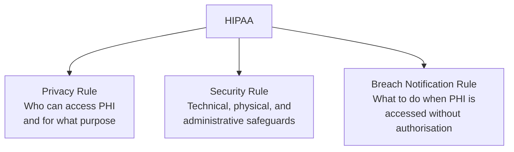
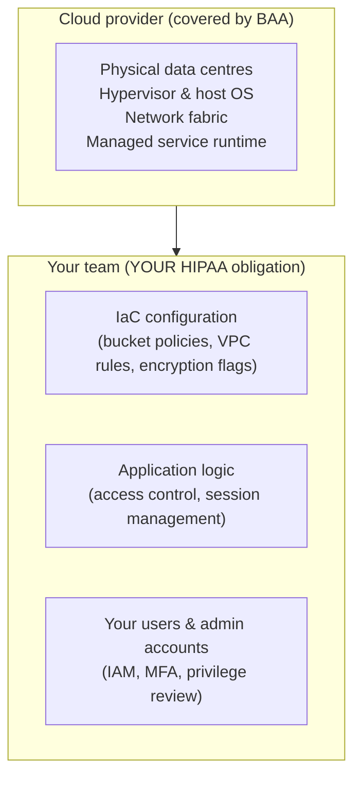

# HIPAA

> _Last reviewed: 2026-06-28 — see the [freshness policy](../appendix/maintenance.md)._

## Learning objectives

After this chapter you will be able to:

- State what PHI is and identify the 18 Safe Harbor de-identification identifiers.
- Map the three HIPAA rules to the technical controls an SA designs.
- Apply the cloud shared-responsibility model to a HIPAA workload and know where your obligations begin.

## What HIPAA is

The Health Insurance Portability and Accountability Act (1996) and its subsequent updates (HITECH, 2009) establish the US federal baseline for protecting individually identifiable health information. It applies to **covered entities** (hospitals, clinics, insurers, clearinghouses) and **business associates** (any vendor that creates, receives, maintains, or transmits PHI on behalf of a covered entity — which includes most cloud-based HLS software).

If you are building a system that touches health data for US patients, HIPAA is not optional. It is the foundational compliance layer on top of which HITRUST, SOC 2, and other certifications are built.

## The three HIPAA rules

### Privacy Rule

Defines **Protected Health Information (PHI)**: individually identifiable health information created, received, maintained, or transmitted by a covered entity or business associate, in any medium (digital, paper, spoken).

The Privacy Rule governs *use and disclosure*: PHI may only be used for treatment, payment, or healthcare operations without explicit patient authorisation. Disclosure to a third party (e.g., a cloud vendor) requires a **Business Associate Agreement (BAA)**.

### Security Rule

Requires administrative, physical, and **technical** safeguards for **electronic PHI (ePHI)**. The technical safeguards most relevant to an SA:

| Control | What it means in practice |
| --- | --- |
| Access control | Unique user IDs; automatic logoff after inactivity; role-based access to PHI |
| Audit controls | Record and review who accessed which ePHI and when (CloudTrail, Azure Monitor, GCP Audit Logs) |
| Integrity | ePHI must not be improperly altered or destroyed (checksums, object versioning, WAL in databases) |
| Transmission security | Encrypt ePHI in transit (TLS 1.2+ at minimum) |
| Encryption at rest | HIPAA does not mandate it but strongly recommends it; treat it as required |

### Breach Notification Rule

If ePHI is accessed, used, or disclosed in a way not permitted by the Privacy Rule, the covered entity must:

1. Notify affected individuals (within 60 days of discovery).
2. Notify HHS (within 60 days; if >500 individuals, also notify HHS immediately and local media).
3. Notify business associates of their own breaches promptly.

An SA's job: design systems so that breaches are **detected** (audit logs), **minimised in scope** (least privilege, encryption limits what is readable if exfiltrated), and **reportable quickly** (log retention, incident-response runbook).

## What is PHI: the 18 Safe Harbor identifiers

To de-identify data under the **Safe Harbor method**, remove all 18 identifiers:

1. Names
2. Geographic data smaller than state (address, ZIP, county)
3. All dates (except year) for individuals ≥ 89 years
4. Phone numbers
5. Fax numbers
6. Email addresses
7. Social Security numbers
8. Medical Record numbers (MRN)
9. Health plan beneficiary numbers
10. Account numbers
11. Certificate / licence numbers
12. Vehicle identifiers and serial numbers
13. Device identifiers and serial numbers
14. Web URLs
15. IP addresses
16. Biometric identifiers (fingerprints, voiceprints)
17. Full-face photographs and comparable images
18. Any unique identifying number, characteristic, or code

Remove all 18 and the data is no longer PHI for HIPAA purposes — it can be used for analytics without a BAA. **Expert Determination** is the alternative: a statistician certifies the re-identification risk is very small. Both methods are valid; Safe Harbor is simpler to implement and audit.

## The cloud shared-responsibility model in HIPAA context

This is where most teams get it wrong. **AWS, GCP, and Azure will sign a BAA** — meaning the infrastructure layer is covered. But the BAA does not cover misconfiguration.

A publicly-accessible S3 bucket containing ePHI is **your** breach, not AWS's. The BAA protects against failures in the physical layer; it does not indemnify you for misconfiguration. This means every IaC module you write must enforce:

- S3 / GCS / Azure Blob: `block_public_access = true`, server-side encryption enabled.
- RDS / Cloud SQL: encryption at rest, no public endpoint, VPC-only.
- EKS / GKE: RBAC, no anonymous access to the API server.
- CloudTrail / Cloud Audit Logs / Azure Monitor: enabled in all regions, retention ≥ 6 years (HIPAA record retention requirement is 6 years from creation or last use).

## The BAA surface

Every vendor who *creates, receives, maintains, or transmits* ePHI on your behalf is a **business associate** and must sign a BAA before you can share data with them.

As an SA, you have direct influence over the BAA surface: every third-party service you add to the architecture is potentially a new business associate. Design to **minimise** the number of services that touch raw ePHI. For example:

- Log aggregation: send de-identified logs to your SIEM vendor; keep PHI-bearing audit logs in the cloud-native service (CloudTrail, Azure Monitor) which is already covered by your cloud BAA.
- AI/ML: send de-identified or synthetic training data to model providers unless they have a BAA. Do not send PHI to a model API that has not signed a BAA.

Major cloud providers (AWS, GCP, Azure) maintain **HIPAA-eligible services lists** — check these before choosing a managed service. Not every AWS service is BAA-covered.

## Check yourself

1. Your system logs include the patient's name and visit date. Is this ePHI? Which of the 18 identifiers applies?
2. A developer stores ePHI in an S3 bucket and enables S3 server-side encryption. Is this sufficient? What is still missing?
3. You want to send audit logs to a third-party SIEM. What steps must you take before sharing data that includes ePHI in the log events?

## Further reading

- [HHS: Security Rule guidance](https://www.hhs.gov/hipaa/for-professionals/security/index.html)
- [NIST SP 800-66r2: Implementing HIPAA Security Rule](https://csrc.nist.gov/publications/detail/sp/800-66/rev-2/final)
- [AWS HIPAA whitepaper](https://docs.aws.amazon.com/whitepapers/latest/architecting-hipaa-security-and-compliance-on-amazon-web-services/welcome.html)
- [AWS HIPAA-eligible services](https://aws.amazon.com/compliance/hipaa-eligible-services-reference/)
