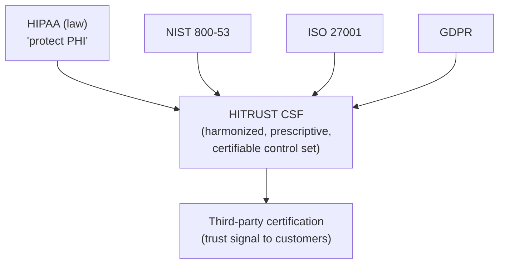

# HITRUST

## Learning objectives

After this chapter you will be able to:

- Explain what HITRUST is and how it relates to HIPAA, SOC 2, and ISO 27001.
- Distinguish the three HITRUST assessment types (e1, i1, r2) and when each fits.
- Describe what an SA does to prepare a system for HITRUST certification.

## What HITRUST is

HITRUST is a private organization that maintains the **HITRUST CSF (Common Security Framework)** — a certifiable, prescriptive control framework that harmonizes many other standards (HIPAA, NIST 800-53, ISO 27001, PCI DSS, GDPR) into a single, auditable set of requirements. The current version is **CSF v11.x**.

The key distinction from [HIPAA](./00-hipaa.md): HIPAA is a law that tells you *what* outcomes to achieve but is deliberately vague about *how*. HITRUST is a **prescriptive framework with a third-party certification** that tells you exactly which controls to implement and proves to customers that you did. For a B2B HLS vendor, "we are HITRUST certified" is often a precondition for selling to a health system — it short-circuits the customer's own lengthy security review.

## The three assessment types

HITRUST v11 offers a tiered ("threat-adaptive") portfolio so you can match assessment rigor to risk. The same CSF controls underlie all three; the depth and number of requirements differ.

| Assessment | Rigor | Requirements | Validity | Typical use |
| --- | --- | --- | --- | --- |
| **e1** | Foundational / essential cyber hygiene | ~44 core (within a 182-statement baseline) | 1 year | Low-risk systems; entry point; startups proving baseline hygiene |
| **i1** | Leading security practices | ~182 requirement statements | 1 year | Moderate-risk systems; a solid mid-tier certification |
| **r2** | Risk-based, expandable | Tailored to risk factors — often 300+ controls | 2 years | High-risk systems handling large PHI volumes; the "gold standard" |

A common path: start with **e1** to establish baseline hygiene, graduate to **i1**, then pursue **r2** as the business and risk profile grow. Many health-system customers will accept i1 for moderate-risk vendors and require r2 for those handling large PHI volumes.

## How HITRUST relates to SOC 2 and ISO 27001

- **SOC 2** is an attestation (a CPA firm's opinion) against flexible Trust Services Criteria — you largely define your own controls. **HITRUST** is a certification against a *fixed, prescriptive* control set. HITRUST is generally considered more rigorous and more healthcare-specific; SOC 2 is more general-purpose.
- **ISO 27001** certifies an information security *management system* (the process). HITRUST certifies the *controls themselves* against a healthcare-tuned baseline.
- HITRUST CSF maps to all of these, so a HITRUST assessment can be leveraged to support SOC 2 and ISO efforts ("assess once, report many").

## What an SA does to prepare for HITRUST

HITRUST certification is mostly an organizational and operational effort, but the architecture must *enable* the controls. As the SA, design the system so the controls are achievable and evidenceable:

- **Inventory and data flow** — maintain an accurate inventory of where PHI lives and how it flows. HITRUST assessors will ask; an out-of-date architecture diagram fails the assessment. (This is where your [C4 diagrams](../01-foundations/02-c4-and-adrs.md) earn their keep.)
- **Access control** — role-based access, MFA, least privilege, automatic session timeout — designed in, not bolted on.
- **Encryption** — at rest and in transit, with documented key management.
- **Audit logging** — comprehensive, immutable, retained per policy; assessors sample access logs.
- **Configuration management** — IaC so that the security configuration of every resource is declared, reviewed, and reproducible. Manual console changes are an audit liability.
- **Vulnerability management** — scanning, patching cadence, and documented remediation.
- **Incident response** — a tested runbook, not a document nobody has read.

The architectural pattern that makes HITRUST tractable: **policy-as-code + IaC + centralized logging**. If your controls are codified (e.g., a Terraform module that always enforces encryption and blocks public access), you can *prove* they are applied uniformly — which is exactly what an assessor wants to see.

## Check yourself

1. A health system asks your startup for proof of security before buying. Why might HITRUST certification be more useful here than simply asserting HIPAA compliance?
2. Your company handles a small volume of PHI and needs a certification quickly to close a deal. Which HITRUST assessment type is the right starting point?
3. How does designing your infrastructure as code (IaC) make a HITRUST r2 assessment easier to pass?

## Further reading

- [HITRUST CSF overview](https://hitrustalliance.net/)
- [HITRUST assessment portfolio (e1 / i1 / r2)](https://hitrustalliance.net/hitrust-framework)
- [NIST SP 800-53](https://csrc.nist.gov/publications/detail/sp/800-53/rev-5/final)
