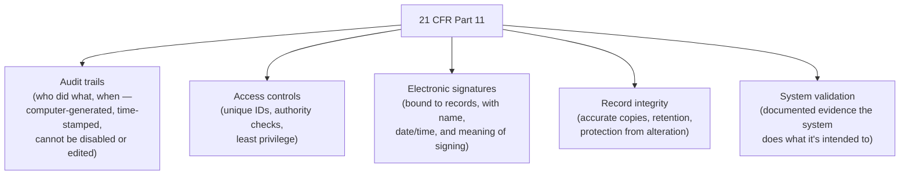
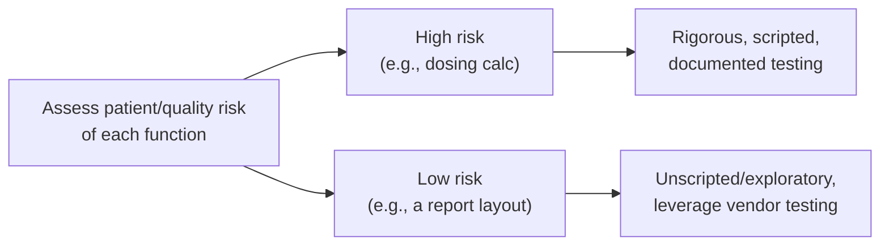

# GxP & 21 CFR Part 11

## Learning objectives

After this chapter you will be able to:

- Explain what GxP means and why it changes how you build systems in pharma and biotech.
- State the core requirements of 21 CFR Part 11 for electronic records and signatures.
- Apply a risk-based validation approach (GAMP 5 + FDA CSA) instead of validating everything equally.

## What GxP is

**GxP** is shorthand for the family of "Good Practice" quality regulations the FDA (and EMA) enforce in life science: GMP (Good Manufacturing Practice), GLP (Good Laboratory Practice), GCP (Good Clinical Practice), GDP (Good Distribution Practice), and others. If you build software for a pharma company's drug manufacturing, a lab running regulated studies, or a clinical trial, your system is **GxP-regulated**.

This is the dividing line introduced back in [the HLS industry map](../00-orientation/01-hls-industry-map.md): in the **provider/payer** world, [HIPAA](./00-hipaa.md) dominates and the question is "is PHI protected?" In the **pharma/biotech** world, GxP dominates and the question is "**is this data trustworthy and traceable?**" — because the data supports a regulatory submission that decides whether a drug reaches patients.

## 21 CFR Part 11: electronic records and signatures

**21 CFR Part 11** is the FDA regulation that makes electronic records and electronic signatures as legally trustworthy as paper and ink. It applies whenever a GxP-regulated system creates, modifies, maintains, or transmits records the FDA may inspect. The core requirements an SA must design for:

- **Audit trails** — secure, computer-generated, time-stamped records of every create/modify/delete, capturing the *old* and *new* value. The audit trail itself cannot be turned off or edited by users.
- **Access controls** — unique user identities, authority checks, and least privilege.
- **Electronic signatures** — when a record is signed electronically, the signature is permanently bound to it and records the signer's name, the date/time, and the *meaning* of the signature (approved, reviewed, authored).
- **Record integrity and retention** — accurate, retrievable copies for the full retention period; protection from alteration.
- **System validation** — documented evidence the system performs reliably and as intended (see below).

## Data integrity: ALCOA+

FDA data-integrity expectations are summarized as **ALCOA+**: data must be **A**ttributable, **L**egible, **C**ontemporaneous, **O**riginal, **A**ccurate — plus **C**omplete, **C**onsistent, **E**nduring, and **A**vailable. When you design a GxP data store, every one of these is an architectural requirement (e.g., "Contemporaneous" means timestamps are server-generated at the moment of the event, not entered later).

## Computer system validation: the modern, risk-based approach

Historically, GxP teams "validated" software by exhaustively scripting and testing *every* function equally — slow, expensive, and not actually risk-reducing. Two developments fixed this:

- **GAMP 5, Second Edition (2022)** — the ISPE's *Good Automated Manufacturing Practice* guide. It promotes a **risk-based, scaled** approach: categorize software by type (infrastructure, configured product, custom code) and apply effort proportional to risk and complexity. It explicitly embraces Agile, cloud, and continuous delivery.
- **FDA Computer Software Assurance (CSA)** — **finalized September 24, 2025** (issued in draft 2022). CSA reorients validation around *critical thinking and risk* rather than documentation volume: spend testing effort where a software failure could harm a patient or corrupt product quality, and use a "least-burdensome" approach (including unscripted/exploratory testing and leveraging vendor testing) for low-risk features. CSA is fully consistent with GAMP 5; teams already following GAMP best practice are well-positioned.

**As the SA:** don't propose validating a cloud platform the way you'd validate a custom dosing algorithm. Apply CSA/GAMP 5 thinking — concentrate validation effort on the functions where failure reaches the patient or the product, and take credit for the cloud vendor's own qualification of the underlying platform.

## Designing GxP systems on the cloud

- **Audit trail is non-negotiable and tamper-evident** — append-only logs, immutable storage (e.g., object-lock / WORM), server-side timestamps.
- **Validated, reproducible infrastructure** — IaC gives you a documented, repeatable environment, which is itself validation evidence.
- **Qualified cloud services** — AWS, GCP, and Azure provide GxP-oriented qualification documentation and shared-responsibility guidance; use it to scope what you must validate vs. what the provider has.
- **Change control** — every change to a GxP system follows a documented, approved change-control process. CI/CD pipelines can *be* the change-control evidence if designed for it (approvals, traceability, automated tests).
- **EU GMP Annex 11** is the European counterpart to Part 11 — similar expectations; design once to satisfy both where you operate internationally.

## Check yourself

1. A provider-facing app and a pharma-manufacturing app both store data in the cloud. Why does the pharma app's *audit trail* face a stricter standard, and which regulation drives it?
2. What does the "C" (Contemporaneous) in ALCOA+ imply about how your system generates timestamps?
3. Under CSA/GAMP 5, would you apply the same testing rigor to a report-formatting feature and to a dose-calculation feature? Explain the principle.

## Further reading

- [FDA 21 CFR Part 11](https://www.ecfr.gov/current/title-21/chapter-I/subchapter-A/part-11)
- [FDA Computer Software Assurance for Production and Quality System Software (final, 2025)](https://www.fda.gov/regulatory-information/search-fda-guidance-documents/computer-software-assurance-production-and-quality-system-software)
- [ISPE GAMP 5 (Second Edition)](https://ispe.org/publications/guidance-documents/gamp-5-guide-2nd-edition)
- [EU GMP Annex 11](https://health.ec.europa.eu/medicinal-products/eudralex/eudralex-volume-4_en)
