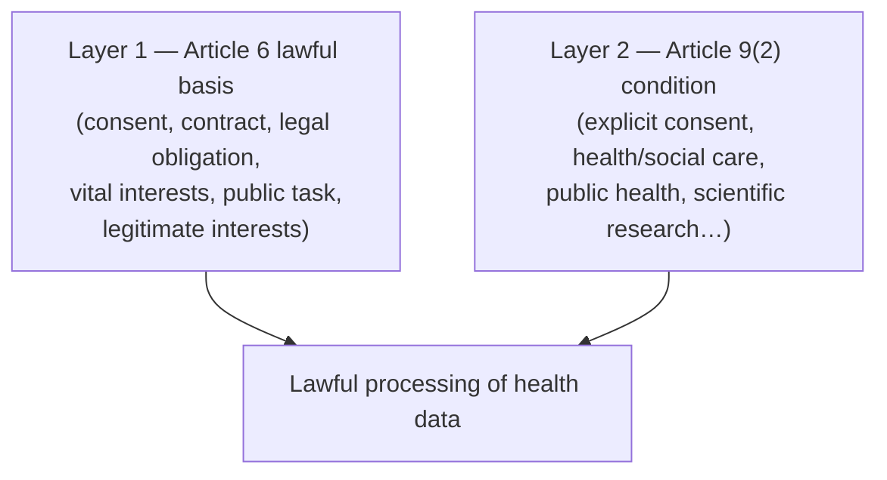
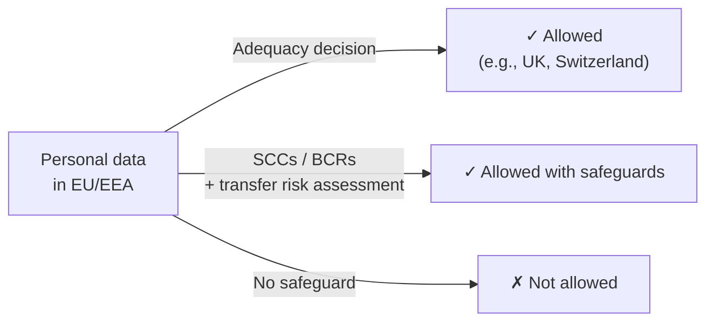

# GDPR & data residency

## Learning objectives

After this chapter you will be able to:

- Explain why health data gets special treatment under GDPR and what that requires.
- Identify when an HLS system needs a lawful basis *plus* an Article 9 condition.
- Design for data residency and cross-border transfer constraints.

## Why GDPR matters for HLS

The EU **General Data Protection Regulation (GDPR)** governs the processing of personal data of people in the EU/EEA. If your HLS system touches data about EU residents — patients, trial participants, app users — GDPR applies regardless of where your company is based. The UK has its own near-identical UK GDPR.

GDPR is broader than [HIPAA](./00-hipaa.md): HIPAA covers PHI held by covered entities and business associates; GDPR covers *all* personal data and grants individuals strong rights (access, erasure, portability, objection). Where HIPAA is sector-specific, GDPR is economy-wide — and health data sits in its most protected category.

## Health data is a "special category"

Under **GDPR Article 9**, data concerning health, genetic data, and biometric data are **special categories** whose processing is *prohibited by default*. To process them lawfully you need **two layers**:

You need **both** a Layer-1 lawful basis (Article 6) **and** a Layer-2 special-category condition (Article 9(2)). Common Article 9(2) conditions in HLS:

- **(a) Explicit consent** — the individual has explicitly agreed (note: a higher bar than ordinary consent, and for research, consent can be withdrawn).
- **(h) Health or social care** — processing for treatment, diagnosis, or care management by/under a health professional.
- **(i) Public health** — e.g., cross-border health threats.
- **(j) Scientific research** — research in the public interest under **Article 89(1)** safeguards. The research purpose must be explicitly identified; it is not enough to label something "research" after the fact.

> **Don't default to consent.** For clinical care, Article 9(2)(h) is usually the right condition; for research, (j) with Article 89 safeguards. Consent is fragile (it can be withdrawn) and often the wrong legal basis for systems that must keep operating.

## Required safeguards

For health data — and especially research use — GDPR expects:

- **Data Protection Impact Assessment (DPIA)** — mandatory for large-scale processing of special-category data. Conduct it during design, not after.
- **Pseudonymization** — replace direct identifiers with keys held separately. GDPR explicitly endorses pseudonymization as a safeguard (note: pseudonymized data is *still personal data* under GDPR — unlike fully anonymized data, which falls outside GDPR).
- **Data minimization** — collect and retain only what the purpose requires.
- **Encryption** — at rest and in transit.
- **Purpose limitation** — data collected for care cannot be freely repurposed for, say, marketing.

See [De-identification & consent](./04-deidentification-consent.md) for how anonymization and pseudonymization differ technically and legally.

## Data residency and cross-border transfers

GDPR restricts transferring personal data **outside the EU/EEA** unless the destination ensures adequate protection. This is the source of most cloud-architecture friction in EU HLS work.

Mechanisms that legitimize transfer:

- **Adequacy decisions** — the EU has ruled certain countries provide adequate protection (e.g., UK, Switzerland; the EU–US Data Privacy Framework for certified US organizations).
- **Standard Contractual Clauses (SCCs)** — EU-approved contract terms, increasingly paired with a *transfer impact assessment*.
- **Binding Corporate Rules (BCRs)** — for transfers within a multinational group.

### Architectural implications

- **Pin data to a region.** Deploy EU patient data into EU cloud regions and *keep it there*. All major clouds offer EU regions and EU-specific sovereign offerings.
- **Watch the hidden hops.** Logging, monitoring, support access, backups, and managed-service control planes can quietly move data out of region. Verify every service's data-residency behavior — a US-region log sink for EU PHI is a transfer.
- **Member-state law varies.** GDPR allows member states to add their own rules for health and research data (e.g., Germany, France). "GDPR-compliant" is necessary but sometimes not sufficient — check local law for the specific country.
- **Data subject rights need design.** Erasure ("right to be forgotten") and portability must be technically implementable — hard if PHI is smeared across immutable backups and an OMOP warehouse. Design for it up front.

## Check yourself

1. A digital-health app processes EU users' symptom data. Which *two* GDPR layers must it satisfy, and why isn't an Article 6 basis alone enough?
2. Why is explicit consent often the *wrong* Article 9 condition for a clinical-care system, and what is usually more appropriate?
3. Your EU patient data lives in an EU cloud region, but your centralized log aggregation ships logs to a US region. What GDPR problem does this create, and how do you fix it?

## Further reading

- [GDPR full text (Article 9, Article 89)](https://gdpr-info.eu/)
- [EDPB guidelines on scientific research and health data](https://www.edpb.europa.eu/)
- [EU adequacy decisions & international transfers](https://commission.europa.eu/law/law-topic/data-protection/international-dimension-data-protection_en)
