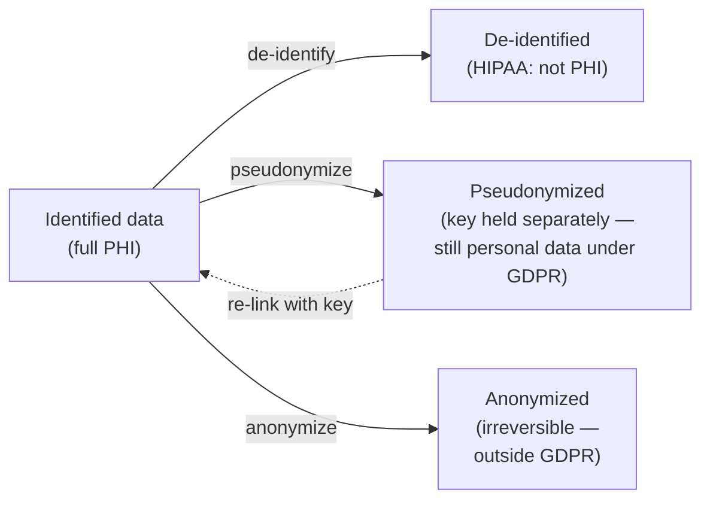

# De-identification & consent

> _Last reviewed: 2026-06-28 — see the [freshness policy](../appendix/maintenance.md)._

## Learning objectives

After this chapter you will be able to:

- Distinguish anonymization, de-identification, and pseudonymization — and their legal consequences.
- Apply HIPAA Safe Harbor and Expert Determination correctly.
- Reason about re-identification risk and when synthetic data is the right tool.

## Why this is an architecture decision, not a checkbox

Whether data is "identified" determines which regulations bind it. De-identified data under HIPAA can be used for analytics **without a BAA**; anonymized data under GDPR falls **outside GDPR entirely**. Getting this right unlocks data for research and AI; getting it wrong is a breach. The SA decides *where* in the architecture identification is removed and *how strongly* — which downstream systems then inherit a lighter compliance load.

## The three terms (and why the distinction matters)

| Term | Meaning | Reversible? | Legal effect |
| --- | --- | --- | --- |
| **De-identification** (HIPAA) | Remove/transform identifiers per HIPAA method | Depends on method | No longer PHI for HIPAA |
| **Pseudonymization** (GDPR) | Replace identifiers with a key held separately | Yes (with the key) | **Still personal data** under GDPR; a safeguard, not an exemption |
| **Anonymization** (GDPR) | Irreversibly prevent re-identification | No | Falls **outside** GDPR |

The trap: teams say "we anonymized it" when they actually *pseudonymized* it (kept a re-linking key). Under GDPR that data is still fully regulated. True anonymization is a high and contested bar.

## HIPAA de-identification: two methods

HIPAA recognizes exactly two ways to de-identify (see [HIPAA](./00-hipaa.md)):

### Safe Harbor

Remove **all 18 specified identifiers** (names, geographic subdivisions smaller than state, all date elements finer than year, contact details, SSN, MRN, device/biometric identifiers, full-face photos, etc.) and have no actual knowledge that the residual data could re-identify someone. Mechanical and auditable — the common default.

**Caveats that bite:**
- Dates must be generalized to year (ages over 89 aggregated into a single "90+" category).
- Geography below state is removed (ZIP3 allowed only for sufficiently populous areas).
- **Free-text notes and DICOM pixel data** routinely hide identifiers Safe Harbor misses — names in narrative, burned-in annotations on images. De-identifying unstructured data requires NLP scrubbing and image analysis, not just dropping columns.

### Expert Determination

A qualified statistician applies and documents methods showing the **re-identification risk is very small**. More flexible (you can retain useful detail like full dates) but requires expertise and documentation. Use it when Safe Harbor strips data you genuinely need for the analysis.

## Tokenization (privacy-preserving linkage)

A distinct technique with a distinct purpose: **tokenization** replaces a patient's direct identifiers with an irreversible, *consistent* **token** so that records about the same person can be **linked across organisations without anyone exposing PII**. The same patient yields the same token at every source, so datasets join on the token rather than on names or MRNs.

- Tokens are generated by privacy-preserving software (e.g. Datavant, HealthVerity) running **inside each data holder's environment** — raw identifiers never leave.
- It is the engine behind [RWD/RWE linkage](../05-data-platforms/02-rwd-rwe.md#patient-tokenization): connecting a clinical trial to downstream EHR, claims, and pharmacy data to follow the patient journey — see that chapter's [tools, best practices & scaling](../05-data-platforms/02-rwd-rwe.md#tools-best-practices--scaling) section for the operational side.
- **Tokenization ≠ a free pass.** The linked dataset still carries re-identification risk and must be governed and risk-assessed (Safe Harbor / Expert Determination still apply to what you publish), and consent must permit the linkage.

Contrast it with pseudonymization: tokenization is purpose-built for *cross-party linkage by design*, whereas pseudonymization is internal key-based reversibility. Both leave data that is still personal/PHI until you de-identify the result.

## Re-identification risk: it's about combinations

The danger is rarely a single field — it's **quasi-identifiers in combination**. The classic result: a large fraction of the US population is uniquely identifiable from just **ZIP + birth date + sex**. De-identification must consider linkage attacks, not just obvious identifiers.

Techniques that manage residual risk (the Expert Determination toolkit):

- **k-anonymity** — ensure every record is indistinguishable from at least *k–1* others on quasi-identifiers (generalize/suppress until true).
- **Generalization & suppression** — coarsen values (exact age → age band) or drop rare outliers.
- **l-diversity / t-closeness** — extensions that also protect sensitive attributes from inference.
- **Differential privacy** — add calibrated noise to *query results* so no individual's presence changes the output much; increasingly used for releasing aggregate statistics.

## Synthetic data

Synthetic data — artificially generated records that preserve the statistical shape of real data without corresponding to real people — is increasingly the right tool for development, testing, demos, and some ML. It sidesteps de-identification risk entirely when no real record maps to an output.

- **[Synthea](https://synthetichealth.github.io/synthea/)** generates realistic synthetic patient populations as FHIR/CSV — ideal for labs and load testing. (All companion-repo samples in this handbook use synthetic data.)
- Caveat: synthetic data can leak if the generator overfits real records, and may not preserve the rare edge cases that matter clinically. Validate utility and privacy before trusting it for analysis.

## Consent

Consent is a distinct axis from de-identification — and often a better-engineered one.

- **Broad vs. study-specific consent** — research consent may be broad (future unspecified research) or narrow (one study). The consent model constrains what the data platform may do.
- **Consent must be enforceable in the architecture.** A consent flag that no system checks is theater. Model consent as data (e.g., FHIR `Consent` resource) and *enforce it at query time* — filter or deny access to records whose consent does not cover the purpose. See [Consent management architecture](./09-consent-management-architecture.md) for the full technical treatment — granularity models, the four enforcement points, and revocation design.
- **Withdrawal** — under GDPR, consent can be withdrawn; the system must be able to stop processing and, where required, delete. Design for this before you smear data across immutable backups and an OMOP warehouse (see [GDPR & data residency](./03-gdpr-residency.md)).
- **IRB oversight** — research use of patient data typically requires Institutional Review Board approval; the IRB protocol defines allowed use, which your access controls should mirror.

## Check yourself

1. A team says their dataset is "anonymized" but admits they keep a mapping table to re-link records if needed. Under GDPR, is this data still regulated? What is the correct term?
2. Why can Safe Harbor de-identification fail on a dataset of free-text clinical notes even after all structured identifier columns are removed?
3. You need development data that carries no re-identification risk at all. What approach avoids the de-identification problem entirely, and what is its main caveat?

## Further reading

- [HHS guidance on de-identification (Safe Harbor & Expert Determination)](https://www.hhs.gov/hipaa/for-professionals/privacy/special-topics/de-identification/index.html)
- [NIST SP 800-188: De-identification of personal information](https://csrc.nist.gov/publications/detail/sp/800-188/final)
- [Synthea synthetic patient generator](https://synthetichealth.github.io/synthea/)
- [The Book of OHDSI — data privacy](https://ohdsi.github.io/TheBookOfOhdsi/)
