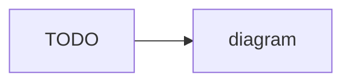

# De-identification & consent

> **Status:** outline — to be written.

## Learning objectives

After this chapter you will be able to:

- TODO objective 1
- TODO objective 2
- TODO objective 3

## Content

TODO: write this chapter.

## Diagram

## Check yourself

1. TODO question
2. TODO question
3. TODO question

## Further reading

- TODO
