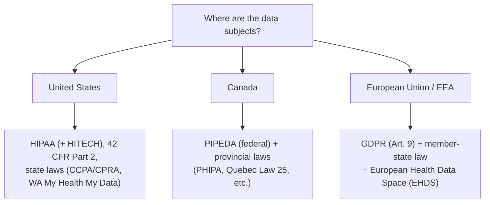

# Regional compliance: US, Canada & Europe

## Learning objectives

After this chapter you will be able to:

- Identify the dominant health-data laws in the US, Canada, and Europe.
- Reason about data residency and cross-border constraints per jurisdiction.
- Design for a multi-jurisdiction HLS system by mapping controls to each regime.

## Jurisdiction is determined by the data subject, not your data center

Which laws bind you depends on **where the patients/users are**, not where your company or cloud region sits. A US-built app serving EU residents is bound by GDPR; a system serving Canadians is bound by Canadian law. Multi-jurisdiction systems must satisfy **all** applicable regimes — usually by designing to the strictest one and pinning data residency. This chapter complements the deep dives on [HIPAA](./00-hipaa.md) (US) and [GDPR](./03-gdpr-residency.md) (EU) by giving the regional map and adding Canada.

## United States

The US has **no single national health-privacy law** — it is a federal floor plus sectoral and state layers:

- **HIPAA** (+ **HITECH**) — the federal baseline for PHI held by covered entities and business associates. See [HIPAA](./00-hipaa.md).
- **42 CFR Part 2** — stricter protection for **substance-use-disorder** treatment records; relevant for behavioral-health systems.
- **State laws** — **CCPA/CPRA** (California) and a growing patchwork of state privacy laws; some target health data specifically (e.g. **Washington's My Health My Data Act**, covering consumer health data outside HIPAA). State law can be stricter than HIPAA.
- **Interoperability mandates** — CMS/ONC rules and **TEFCA** (nationwide exchange) shape how data must be made available (see [FHIR](../02-interoperability/01-fhir.md)).

**Design implication:** HIPAA is necessary but not sufficient — check the states you operate in and whether substance-use or consumer-health data pulls in stricter rules.

## Canada

Canada layers **federal** and **provincial** law, with meaningful **data-residency** sensitivity:

- **PIPEDA** — the federal private-sector privacy law governing commercial collection, use, and disclosure of personal information. The rough analogue to a general privacy baseline (not health-specific).
- **Provincial "substantially similar" laws** — provinces with their own private-sector laws (e.g. **Quebec's Law 25**, BC's PIPA, Alberta's PIPA) displace PIPEDA for intra-provincial activity. **Quebec Law 25** modernized privacy with GDPR-like obligations (consent, breach reporting, privacy impact assessments).
- **Provincial health-privacy laws** — health information is governed provincially: **PHIPA** (Ontario), Alberta's HIA, and equivalents elsewhere set rules for custodians of personal health information.
- **Data residency** — public-sector and some health contexts have historically required data to be **stored in Canada** (e.g. BC and Nova Scotia public-sector rules); requirements have relaxed in places but residency remains a live design constraint. Confirm per province and per contract.
- **Interoperability** — **Canada Health Infoway** drives pan-Canadian standards (increasingly FHIR-based).

**Design implication:** determine the **province(s)** and whether public-sector/health-custodian rules apply; plan for **in-Canada residency** unless you have confirmed it is not required.

## European Union / EEA

- **GDPR** — the dominant regime; health data is a **special category** under Article 9 needing a lawful basis *plus* an Article 9 condition. See [GDPR & data residency](./03-gdpr-residency.md).
- **Member-state law** — GDPR lets member states add rules for health/research data; "GDPR-compliant" is necessary but check the specific country (Germany, France, etc.).
- **European Health Data Space (EHDS)** — an EU regulation (entered into force 2025, phased application) creating a common framework for **primary use** (patients' access to and portability of their own data) and **secondary use** (research, policy, innovation) of health data across the EU, with FHIR-based exchange. A major forward-looking driver for EU HLS architecture.
- **UK** — post-Brexit, the **UK GDPR** + Data Protection Act 2018 apply; the UK has an EU adequacy decision (subject to review).

## Side-by-side

| | United States | Canada | EU / EEA |
| --- | --- | --- | --- |
| Core health/privacy law | HIPAA (+ HITECH); state laws | PIPEDA + provincial (PHIPA, Law 25…) | GDPR (Art. 9) |
| Health-specific layer | 42 CFR Part 2; state health laws | Provincial health-custodian laws | Member-state law + **EHDS** |
| Data residency | Generally no federal mandate | Often **in-Canada** (province/sector) | Keep in EU/EEA; transfers need safeguards |
| Interop framework | CMS/ONC, TEFCA | Canada Health Infoway | EHDS (FHIR-based) |
| De-identification | Safe Harbor / Expert Determination | Provincial guidance | Anonymization vs pseudonymization (still personal) |

## Designing for multiple jurisdictions

1. **Map the data subjects to regimes.** List every jurisdiction you serve and the laws each triggers.
2. **Pin residency.** Deploy each population's data into the required region and keep it there — watch hidden hops (logs, backups, support, control planes), as covered in [GDPR & data residency](./03-gdpr-residency.md).
3. **Design to the strictest applicable control**, then document per-regime mappings (the [HITRUST](./01-hitrust.md) "assess once, report many" idea generalizes to multi-jurisdiction).
4. **Make data-subject rights implementable** — access, erasure, portability differ by regime but all need to be technically real, not aspirational.
5. **Re-verify periodically.** This area moves fast (EHDS phase-in, new US state laws, Canadian residency changes); treat the specifics as dated and confirm against primary sources.

This multi-jurisdiction reasoning is exactly what the [capstone](../10-sa-craft/03-capstone.md) exercises.

## Check yourself

1. A US company builds a mental-health app used by patients in California and Ontario. Name at least one law from each of the three layers (US federal, US state, Canadian) that could apply.
2. Why might you be required to store Canadian patient data in Canada, and what is the first thing to confirm?
3. What does the European Health Data Space (EHDS) add on top of GDPR, and why does it matter for EU HLS architecture?

## Further reading

- [HHS — HIPAA](https://www.hhs.gov/hipaa/index.html) and [42 CFR Part 2](https://www.samhsa.gov/about-us/who-we-are/laws-regulations/confidentiality-regulations-faqs)
- [Office of the Privacy Commissioner of Canada — PIPEDA](https://www.priv.gc.ca/en/privacy-topics/privacy-laws-in-canada/the-personal-information-protection-and-electronic-documents-act-pipeda/)
- [Quebec Law 25](https://www.cai.gouv.qc.ca/) · [Ontario PHIPA (IPC)](https://www.ipc.on.ca/)
- [European Health Data Space (EHDS)](https://health.ec.europa.eu/ehealth-digital-health-and-care/european-health-data-space_en)
