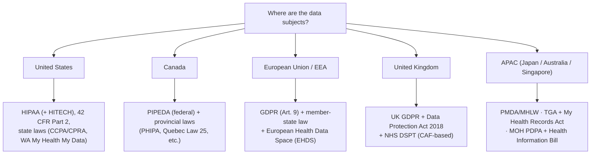

# Regional compliance: US, Canada, Europe & APAC

> _Last reviewed: 2026-06-28 — see the [freshness policy](../appendix/maintenance.md)._

## Learning objectives

After this chapter you will be able to:

- Identify the dominant health-data laws in the US, Canada, Europe, the UK, and major APAC markets.
- Reason about data residency and cross-border constraints per jurisdiction.
- Design for a multi-jurisdiction HLS system by mapping controls to each regime.

## Jurisdiction is determined by the data subject, not your data center

Which laws bind you depends on **where the patients/users are**, not where your company or cloud region sits. A US-built app serving EU residents is bound by GDPR; a system serving Canadians is bound by Canadian law. Multi-jurisdiction systems must satisfy **all** applicable regimes — usually by designing to the strictest one and pinning data residency. This chapter complements the deep dives on [HIPAA](./00-hipaa.md) (US) and [GDPR](./03-gdpr-residency.md) (EU) by giving the regional map — US, Canada, EU, UK, and the major APAC markets (Japan, Australia, Singapore).

## United States

The US has **no single national health-privacy law** — it is a federal floor plus sectoral and state layers:

- **HIPAA** (+ **HITECH**) — the federal baseline for PHI held by covered entities and business associates. See [HIPAA](./00-hipaa.md).
- **42 CFR Part 2** — stricter protection for **substance-use-disorder** treatment records; relevant for behavioral-health systems. See [Behavioral health data architecture](./07-behavioral-health-data.md) for the 2024 rule change that substantially aligned it with HIPAA.
- **State laws** — **CCPA/CPRA** (California) and a growing patchwork of state privacy laws; some target health data specifically (e.g. **Washington's My Health My Data Act**, covering consumer health data outside HIPAA). State law can be stricter than HIPAA.
- **Interoperability mandates** — CMS/ONC rules and **TEFCA** (nationwide exchange) shape how data must be made available; **CMS-0057** adds payer FHIR + prior-auth APIs (compliance generally **Jan 1, 2027**). See [FHIR](../02-interoperability/01-fhir.md) and [Document & claims standards](../02-interoperability/09-cda-x12-claims.md).
- **AI transparency — ONC HTI-1** — certified health IT carrying *Predictive* decision support must disclose model "source attributes" and meet FAVES (fair/appropriate/valid/effective/safe), in effect since **Jan 1, 2025**. See [MLOps & model governance](../06-ai-ml/04-mlops-governance.md).

**Design implication:** HIPAA is necessary but not sufficient — check the states you operate in, whether substance-use or consumer-health data pulls in stricter rules, and (for AI in EHRs) HTI-1.

## Canada

Canada layers **federal** and **provincial** law, with meaningful **data-residency** sensitivity:

- **PIPEDA** — the federal private-sector privacy law governing commercial collection, use, and disclosure of personal information. The rough analogue to a general privacy baseline (not health-specific).
- **Provincial "substantially similar" laws** — provinces with their own private-sector laws (e.g. **Quebec's Law 25**, BC's PIPA, Alberta's PIPA) displace PIPEDA for intra-provincial activity. **Quebec Law 25** modernized privacy with GDPR-like obligations (consent, breach reporting, privacy impact assessments).
- **Provincial health-privacy laws** — health information is governed provincially: **PHIPA** (Ontario), Alberta's HIA, and equivalents elsewhere set rules for custodians of personal health information.
- **Data residency** — public-sector and some health contexts have historically required data to be **stored in Canada** (e.g. BC and Nova Scotia public-sector rules); requirements have relaxed in places but residency remains a live design constraint. Confirm per province and per contract.
- **Interoperability** — **Canada Health Infoway** drives pan-Canadian standards (increasingly FHIR-based).

**Design implication:** determine the **province(s)** and whether public-sector/health-custodian rules apply; plan for **in-Canada residency** unless you have confirmed it is not required. See [Canadian HLS architecture](../02-interoperability/17-canadian-hls-architecture.md) for the architecture-level deep dive — provincial EHR-viewer patterns (Alberta Netcare, Ontario Health, BC PharmaNet/Health Gateway) and why each province's privacy act must be mapped independently.

## European Union / EEA

- **GDPR** — the dominant regime; health data is a **special category** under Article 9 needing a lawful basis *plus* an Article 9 condition. See [GDPR & data residency](./03-gdpr-residency.md).
- **Member-state law** — GDPR lets member states add rules for health/research data; "GDPR-compliant" is necessary but check the specific country (Germany, France, etc.).
- **European Health Data Space (EHDS)** — an EU regulation (**entered into force March 2025**, phased) creating a common framework for **primary use** (patients' access to and portability of their own data) and **secondary use** (research, policy, innovation) of health data across the EU, with FHIR-based exchange. Implementing acts (incl. the EU EHR exchange format) are due by **March 2027**, and the first primary-use priority categories (patient summaries, ePrescriptions) apply from around **March 2029** — so it is a plan-now, comply-later driver. HL7 Europe's EHDS implementation guides are being built on **FHIR R4**.

**Design implication:** GDPR Article 9 (see [GDPR & data residency](./03-gdpr-residency.md)) plus whichever member state's health-data law is strictest for your population; start tracking EHDS now even though enforcement is years out.

## United Kingdom

Post-Brexit, the UK runs its own regime that closely tracks but is legally distinct from EU GDPR:

- **UK GDPR + Data Protection Act 2018** — the UK's own retained/adapted GDPR; the EU granted the UK an adequacy decision (allowing EU→UK transfers), which is periodically reviewed and not guaranteed indefinitely.
- **NHS Data Security and Protection Toolkit (DSPT)** — the mandatory annual self-assessment for any organisation with access to NHS patient data/systems. As of the 2025/26 cycle (**v8**), higher-tier ("Category 1") organisations must assess against the **Cyber Assessment Framework (CAF)** and undergo **mandatory independent audit** — a materially stricter bar than earlier versions.
- **NHS-specific standards** — NHS England increasingly mandates FHIR UK Core (the UK's national FHIR profile set, the rough analogue of US Core/CA Baseline) for new NHS digital services.

**Design implication:** if you touch NHS data, DSPT is not optional paperwork — budget for the CAF-based assessment and independent audit cycle, distinct from (though overlapping) UK GDPR compliance.

## APAC: Japan, Australia, Singapore

APAC has no single regional framework — each major market runs its own regulator and law, and requirements move quickly:

- **Japan** — the **PMDA** (Pharmaceuticals and Medical Devices Agency, under MHLW) regulates drugs and devices, the FDA/EMA counterpart for Japan. Japan's 2025–26 legislative wave (Medical Care Act amendments, an AI Promotion Act) is actively reshaping health-data and AI rules — treat Japan as a **fast-moving** jurisdiction and re-verify before committing an architecture.
- **Australia** — the **TGA** (Therapeutic Goods Administration) regulates medical devices and software (including AI/ML-based SaMD, via the ARTG register); the **My Health Records Act 2012** and **Healthcare Identifiers Act 2010** govern the national health record system and patient identifiers specifically.
- **Singapore** — the **PDPA** (Personal Data Protection Act) is the general privacy law; the Ministry of Health's proposed **Health Information Bill** (2025) would *mandate* that licensed providers contribute data to the **National Electronic Health Records (NEHR)** system, with breach notification to MOH within an extremely tight **2-hour** window — among the most aggressive globally.

**Design implication:** APAC is not one jurisdiction with one design — treat each market as its own regional-compliance exercise, and budget for Singapore's 2-hour breach-notification SLA specifically if you operate there, since almost no other regime's incident-response process is fast enough by default.

## Side-by-side

| | United States | Canada | EU / EEA | UK | APAC (JP/AU/SG) |
| --- | --- | --- | --- | --- | --- |
| Core health/privacy law | HIPAA (+ HITECH); state laws | PIPEDA + provincial (PHIPA, Law 25…) | GDPR (Art. 9) | UK GDPR + DPA 2018 | PDPA (SG); sectoral (JP/AU) |
| Health-specific layer | 42 CFR Part 2; state health laws | Provincial health-custodian laws | Member-state law + **EHDS** | **NHS DSPT** (CAF-based) | My Health Records Act (AU); Health Information Bill (SG) |
| Data residency | Generally no federal mandate | Often **in-Canada** (province/sector) | Keep in EU/EEA; transfers need safeguards | Generally UK/EU-aligned | Varies; SG mandates NEHR contribution |
| Interop framework | CMS/ONC, TEFCA | Canada Health Infoway | EHDS (FHIR-based) | FHIR UK Core | Market-specific (no shared regional IG) |
| De-identification | Safe Harbor / Expert Determination | Provincial guidance | Anonymization vs pseudonymization (still personal) | Follows UK GDPR (as EU) | Varies by market |
| Breach notification | 60 days (HHS + individuals) | Varies by province | Without undue delay, ≤72h (GDPR) | Aligned with UK GDPR (≤72h) | **≤2 hours to MOH (Singapore)** |

## Designing for multiple jurisdictions

1. **Map the data subjects to regimes.** List every jurisdiction you serve and the laws each triggers.
2. **Pin residency.** Deploy each population's data into the required region and keep it there — watch hidden hops (logs, backups, support, control planes), as covered in [GDPR & data residency](./03-gdpr-residency.md).
3. **Design to the strictest applicable control**, then document per-regime mappings (the [HITRUST](./01-hitrust.md) "assess once, report many" idea generalizes to multi-jurisdiction).
4. **Make data-subject rights implementable** — access, erasure, portability differ by regime but all need to be technically real, not aspirational.
5. **Re-verify periodically.** This area moves fast (EHDS phase-in, new US state laws, Canadian residency changes, NHS DSPT annual cycles, and APAC markets — especially Japan — legislating rapidly); treat the specifics as dated and confirm against primary sources.

This multi-jurisdiction reasoning is exactly what the [capstone](../10-sa-craft/03-capstone.md) exercises.

## Check yourself

1. A US company builds a mental-health app used by patients in California and Ontario. Name at least one law from each of the three layers (US federal, US state, Canadian) that could apply.
2. Why might you be required to store Canadian patient data in Canada, and what is the first thing to confirm?
3. What does the European Health Data Space (EHDS) add on top of GDPR, and why does it matter for EU HLS architecture?
4. Your platform holds NHS patient data. Which UK-specific assessment applies beyond UK GDPR, and what changed for higher-tier organisations in the 2025/26 cycle?
5. You launch in Singapore. What breach-notification SLA must you design operational tooling around, and how does it compare to GDPR's?

## Further reading

- [HHS — HIPAA](https://www.hhs.gov/hipaa/index.html) and [42 CFR Part 2](https://www.samhsa.gov/about-us/who-we-are/laws-regulations/confidentiality-regulations-faqs)
- [Office of the Privacy Commissioner of Canada — PIPEDA](https://www.priv.gc.ca/en/privacy-topics/privacy-laws-in-canada/the-personal-information-protection-and-electronic-documents-act-pipeda/)
- [Quebec Law 25](https://www.cai.gouv.qc.ca/) · [Ontario PHIPA (IPC)](https://www.ipc.on.ca/)
- [European Health Data Space (EHDS)](https://health.ec.europa.eu/ehealth-digital-health-and-care/european-health-data-space-regulation-ehds_en)
- [NHS Data Security and Protection Toolkit](https://www.dsptoolkit.nhs.uk/) · [FHIR UK Core](https://simplifier.net/hl7fhirukcorer4)
- [Japan PMDA](https://www.pmda.go.jp/english/) · [Australia TGA — software/AI medical devices](https://www.tga.gov.au/resources/guidance/understanding-regulation-software-based-medical-devices) · [Singapore MOH — Health Information Bill](https://www.moh.gov.sg/)
