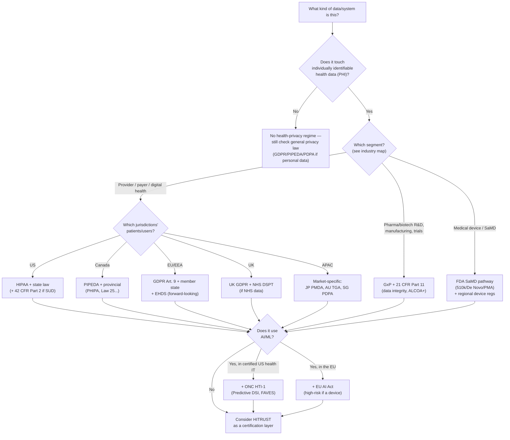

# Which compliance regime applies? A decision guide

> _Last reviewed: 2026-06-29 — see the [freshness policy](../appendix/maintenance.md)._

## Learning objectives

After this chapter you will be able to:

- Determine which compliance regimes apply to a given HLS system in one pass.
- Combine segment, jurisdiction, and data-type answers into a concrete control set.
- Use this guide as the entry point to the detailed chapters, not a replacement for them.

## Why this chapter exists

Parts 3's chapters — [HIPAA](./00-hipaa.md), [HITRUST](./01-hitrust.md),
[GxP](./02-gxp-part11.md), [GDPR](./03-gdpr-residency.md),
[de-identification](./04-deidentification-consent.md), and
[regional compliance](./05-regional-compliance.md) — are each excellent on their own regime.
What's missing is the **thirty-second triage**: given a real system, which of these actually
apply, and in what combination? This chapter is that triage — a decision tree you run once at
the start of [discovery](../10-sa-craft/00-discovery-requirements.md), then dive into the
relevant chapters for depth.

## The decision tree

## Worked triage examples

| System | Segment | Jurisdiction | Data type | Regimes that apply |
| --- | --- | --- | --- | --- |
| Hospital FHIR gateway | Provider | US | PHI, no AI | HIPAA, (HITRUST as a cert layer) |
| Genomics variant store for a Canadian diagnostics lab | Diagnostics | Canada | PHI + genomic | PIPEDA/PHIPA, [de-identification](./04-deidentification-consent.md) rigor for genomic data |
| Clinical-trial EDC for a US sponsor, EU sites | Pharma R&D | US + EU | Trial data | GxP/21 CFR Part 11 (US) **and** GDPR Art. 9 (EU sites) — both, not either |
| AI triage tool inside a certified US EHR | Digital health / AI | US | PHI + Predictive DSI | HIPAA + ONC HTI-1 |
| AI-enabled imaging SaMD sold in the EU | Medtech | EU | PHI + medical device AI | MDR CE mark + EU AI Act (Art. 6(1)/Annex I) |
| Patient app serving US, UK, and Singapore users | Digital health | US + UK + SG | PHI | HIPAA + UK GDPR/DSPT (if NHS-linked) + Singapore PDPA (2-hour breach SLA) |

## How to use this in discovery

1. **Run the tree once per system**, not once per company — a single platform can straddle
   multiple branches (the trial-EDC example above hits both GxP and GDPR).
2. **List every regime the tree surfaces** in your [requirements summary](../10-sa-craft/00-discovery-requirements.md)
   as a distinct NFR, not a single "must be compliant" line.
3. **Go deep on each hit.** This chapter tells you *which* regimes apply; the dedicated
   chapters tell you *what to build*.
4. **Re-run after scope changes.** Adding an AI feature, a new country's users, or a new data
   type (e.g. adding genomic data to a clinical platform) can add a branch.
5. **When in doubt, escalate to compliance/legal** — this tree is a triage tool for an SA, not
   a substitute for counsel on a genuinely ambiguous case.

This is exactly the exercise the [capstone](../10-sa-craft/03-capstone.md) grades on its
"Compliance" dimension — practice it there before you need it live.

## Check yourself

1. A US pharma company runs a trial with sites in Germany. Walk the tree — which two regimes both apply, and why is it "both," not "whichever is stricter"?
2. An AI-enabled diagnostic imaging device is sold in both the US and the EU. Which device pathway and which AI-transparency regime apply in each market?
3. Why should you re-run this tree when a product adds an AI feature, even if the underlying data hasn't changed?

## Further reading

- [HIPAA](./00-hipaa.md) · [HITRUST](./01-hitrust.md) · [GxP & 21 CFR Part 11](./02-gxp-part11.md)
- [GDPR & data residency](./03-gdpr-residency.md) · [Regional compliance](./05-regional-compliance.md)
- [EU AI Act & global AI regulation](../06-ai-ml/06-eu-ai-act.md) · [FDA SaMD & GMLP](../06-ai-ml/05-fda-samd.md)
