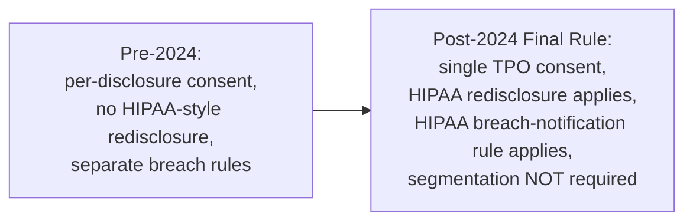

# Behavioral health data architecture

> _Last reviewed: 2026-07-03 — see the [freshness policy](../appendix/maintenance.md)._

## Learning objectives

After this chapter you will be able to:

- Explain what 42 CFR Part 2 protects and how the 2024 final rule changed its architecture.
- Decide whether to segment behavioral-health data from the rest of the record.
- Design consent, redisclosure, and breach-notification handling for SUD records post-2024.

## Why behavioral health gets its own chapter

[HIPAA](./00-hipaa.md) covers PHI broadly; **42 CFR Part 2** layers *additional* protection
specifically onto **substance use disorder (SUD)** treatment records from federally assisted
programs — historically the most restrictive category of health data in US law, requiring
patient consent for nearly every disclosure, even between treating providers. Behavioral
health data (SUD records specifically, and often mental-health data by extension of design
choice) has therefore always demanded special-case handling that the rest of this bootcamp's
HIPAA-only content doesn't cover — and a **major 2024 rule change** rewired much of that
architecture, so this is also a live freshness topic.

## The 2024 modernization: Part 2 moves toward HIPAA

HHS finalized a rule (effective **April 16, 2024**; compliance required by **February 16,
2026**) that substantially aligns Part 2 with HIPAA, mandated by the 2020 CARES Act. The
changes that matter architecturally:

- **Single consent for treatment, payment, and healthcare operations (TPO).** Previously,
  many uses required consent tracked and re-obtained per disclosure; now one consent can cover
  ongoing TPO uses, much closer to how HIPAA consent already works.
- **HIPAA redisclosure rules now apply** to Part 2 records once a HIPAA covered entity or
  business associate receives them under that consent — the old requirement to specially
  tag and restrict *every* downstream redisclosure is gone for these flows.
- **HIPAA Breach Notification Rule now governs Part 2 breaches** — one incident-response
  process instead of two parallel ones.
- **New patient rights** mirroring HIPAA: an accounting of disclosures, the right to request
  restrictions, and the right to file a complaint directly with HHS.
- **Explicit statement: segmenting/segregating Part 2 records is *not required*.** This is
  the detail most likely to surprise a team that assumed segmentation was mandatory — it
  isn't, though many organizations still choose to segment for other reasons (see below).

## So — do you still segment the data?

Segmentation (keeping SUD/behavioral-health data in a separately access-controlled part of
the record, rather than mixed with the general chart) is now a **design choice**, not a legal
requirement. Reasons teams still choose it:

- **Least privilege in practice** — even with unified consent, many organizations want a
  distinct access-control boundary for the most sensitive data category, auditable separately.
- **Multi-state operation** — some **state** laws are stricter than the federal floor and may
  still require segmentation or additional restrictions; check state law specifically (this is
  the same "federal floor, state ceiling" pattern as [regional compliance](./05-regional-compliance.md)).
- **Patient trust** — behavioral-health patients disproportionately avoid care if they don't
  trust the data will be protected; a visible, granular consent UX (not just backend
  compliance) matters for engagement, not just legal defensibility.

Reasons **not** to over-engineer segmentation: the 2024 rule explicitly removed the mandate,
and a heavily segmented architecture adds real complexity — a clinician who can't see a
patient's SUD history in an emergency is a **safety** risk the rule's authors were explicitly
trying to reduce.

## Architecture guidance

1. **Model consent as a first-class object**, not a boolean flag — capture what it covers
   (TPO vs. research vs. legal), not just "yes/no," and enforce it at query time (see
   [de-identification & consent](./04-deidentification-consent.md)).
2. **Route Part 2 breach handling through your existing HIPAA breach-notification process**
   post-2024 — don't maintain two incident-response runbooks where one now suffices.
3. **If you segment, make it a policy-driven access control** (row/column-level, tied to role
   and purpose-of-use), not a physically separate system that then needs its own integration
   and its own emergency-access break-glass procedure.
4. **Check state law before assuming the federal 2024 baseline is sufficient** — this is a
   per-state confirmation, not a one-time global answer.
5. **Design an emergency/break-glass access path** regardless of your segmentation choice —
   the clinical-safety argument against opaque segmentation applies whether or not you
   physically segment.

## Check yourself

1. What changed about redisclosure of Part 2 records once a HIPAA covered entity receives them under the 2024 rule's single-consent model?
2. Is segmenting behavioral-health data from the rest of the chart still legally required after 2024? What might still motivate an organization to do it anyway?
3. Why does over-segmenting behavioral-health data create a clinical-safety risk, not just an engineering cost?

## Further reading

- [HHS — 42 CFR Part 2 Final Rule fact sheet](https://www.hhs.gov/hipaa/for-professionals/regulatory-initiatives/fact-sheet-42-cfr-part-2-final-rule/index.html)
- [SAMHSA — Confidentiality of Substance Use Disorder Patient Records](https://www.samhsa.gov/about-us/who-we-are/laws-regulations/confidentiality-regulations-faqs)
- [HIPAA](./00-hipaa.md) · [De-identification & consent](./04-deidentification-consent.md)
