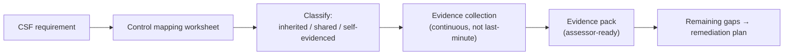

# HITRUST evidence pack lab

> _Last reviewed: 2026-07-03 — see the [freshness policy](../appendix/maintenance.md)._

## Learning objectives

After this chapter you will be able to:

- Build a control-mapping worksheet from a HITRUST requirement to your actual implementation and evidence.
- Correctly classify a control as inherited, shared, or self-evidenced under the cloud shared-responsibility model.
- Assemble an evidence pack an assessor can review without a round of follow-up questions.

## From "what HITRUST is" to "what you hand the assessor"

[HITRUST](./01-hitrust.md) explains the CSF, the tiered assessments, and the architectural pattern
(policy-as-code + IaC + centralized logging) that makes certification tractable. This chapter is
the concrete mechanics: **the actual worksheet and evidence pack an SA builds** to get a system
through an assessment without scrambling in the final weeks.

## Step 1 — the control-mapping worksheet

For every applicable CSF requirement (scoped by your target assessment — e1/i1/r2, per
[HITRUST](./01-hitrust.md)), map it to a concrete row before you think about evidence at all:

| Control ID | Control statement (paraphrased) | System(s) in scope | Implementation | Owner | Status |
| --- | --- | --- | --- | --- | --- |
| e.g. AC.1 | Access to ePHI-storing systems is restricted via unique user ID + RBAC | FHIR data store, analytics warehouse | SSO via IdP + role-based IAM policies | Platform team | Implemented |
| e.g. AU.3 | Audit logs capture all access to ePHI and are retained per policy | All PHI-touching services | Centralized logging (SIEM), 7-year retention | Security team | Implemented |
| e.g. CM.2 | Configuration changes are reviewed and tracked | Cloud infrastructure | IaC (Terraform) + PR review | Platform team | Implemented |

The worksheet is the artifact that turns "we think we're compliant" into "here is exactly what
satisfies this requirement, and who owns it" — and it's what surfaces gaps early, while there's
still time to fix them.

## Step 2 — evidence collection: design evidence vs. operating evidence

Assessors need two different kinds of proof, and conflating them is the most common evidence-pack
mistake:

- **Design evidence** — policies, procedures, and architecture diagrams (your [C4 diagrams](../01-foundations/02-c4-and-adrs.md)
  showing exactly where PHI flows) proving the control was *designed* correctly.
- **Operating evidence** — logs, exports, and sign-offs proving the control actually *operated*
  throughout the assessment period. A written access-control policy is design evidence; a
  quarterly access-review log showing it was actually performed four times is operating evidence.
  Assessors sample across the period, so evidence has to exist continuously — not be generated the
  week before the assessment.

**The fix is automation, not diligence.** A scheduled job that exports IAM policy state and
access-review sign-offs into an evidence repository monthly means you are never reconstructing a
year of history from memory. This is the same "policy-as-code + centralized logging" discipline
[HITRUST](./01-hitrust.md) already recommends — applied specifically to evidence generation.

## Step 3 — inherited controls and the shared-responsibility cut line

HITRUST allows **inheritance**: a control your cloud provider already satisfies (and has its own
certification for) doesn't need to be independently re-evidenced by you — but only if you draw the
cut line correctly. Cloud providers publish compliance packages (e.g. AWS Artifact) mapping their
own certifications to CSF requirements; use that as your starting point, then classify every row:

| Control area | Typical classification | Why |
| --- | --- | --- |
| Physical data-center security | **Fully inherited** | The provider's own certified control; you have no access to the physical facility |
| Hypervisor / host OS patching | **Fully inherited** | Below your responsibility boundary in a managed service |
| Network configuration (VPC, security groups) | **Your responsibility** | The provider gives you the tool; you configure it — a misconfigured security group is your finding, not theirs |
| IAM policy design & least privilege | **Your responsibility** | Entirely a configuration choice you make |
| Encryption at rest | **Shared** | The provider offers the capability and manages the underlying HSM; you must actually enable it and, for r2-level rigor, manage your own keys |
| Application-layer access control | **Fully your responsibility** | Nothing here is the provider's to inherit |

**The trap:** assuming a *capability* the provider offers is the same as a *control* you've
satisfied. "Encryption at rest is available" is not evidence; "customer-managed keys are enabled
on every PHI-storing resource, verified by this IaC scan" is. An assessor will ask you to prove
*your* configuration, not cite the provider's marketing page — cite the specific section of the
provider's SOC 2/HITRUST report you're relying on, not just its existence.

## Step 4 — assembling the pack

The final deliverable is one index (spreadsheet or repo) covering every applicable requirement,
classified into exactly one of three states:

1. **Inherited** — pointer to the specific provider certification/report section relied on.
2. **Self-evidenced** — pointer to your own design + operating evidence artifacts.
3. **Gap** — not yet satisfied, with an owner and a remediation date, surfaced *before* the
   assessment starts, not discovered during it.

An evidence pack with zero gaps because gaps were hidden rather than fixed fails harder than one
with an honest, dated remediation plan — assessors distinguish between the two.

## Design guidance

1. **Build the control-mapping worksheet first**, before collecting a single piece of evidence —
   it tells you what to collect and who owns it.
2. **Automate operating-evidence collection** on a schedule; never plan to reconstruct a year of
   history from memory or Slack.
3. **Never inherit a control you haven't actually configured** — a provider capability is not
   evidence of your control until you can point to your own configuration.
4. **Cite the specific section** of a provider's compliance report you're relying on, not just its
   existence.
5. **Surface gaps early with a dated remediation plan** — an honest gap list is stronger evidence
   of a mature program than a suspiciously clean one.

## Check yourself

1. Your platform enables AWS's default encryption-at-rest feature but never configures
   customer-managed keys. Is that control inherited, shared, or your own responsibility — and why
   does the distinction matter to an assessor?
2. What is the difference between design evidence and operating evidence, and why does an access
   control *policy* alone not satisfy an assessor?
3. Why might an evidence pack listing three known gaps with remediation dates score better with an
   assessor than one claiming zero gaps?

## Further reading

- [HITRUST](./01-hitrust.md)
- [Observability for clinical platforms](../10-sa-craft/07-observability-for-clinical-platforms.md) — treating the audit trail as a live signal, not just filed evidence
- [AWS Artifact — compliance reports mapped to frameworks](https://aws.amazon.com/artifact/)
- [HITRUST — assessment portfolio](https://hitrustalliance.net/hitrust-framework)
