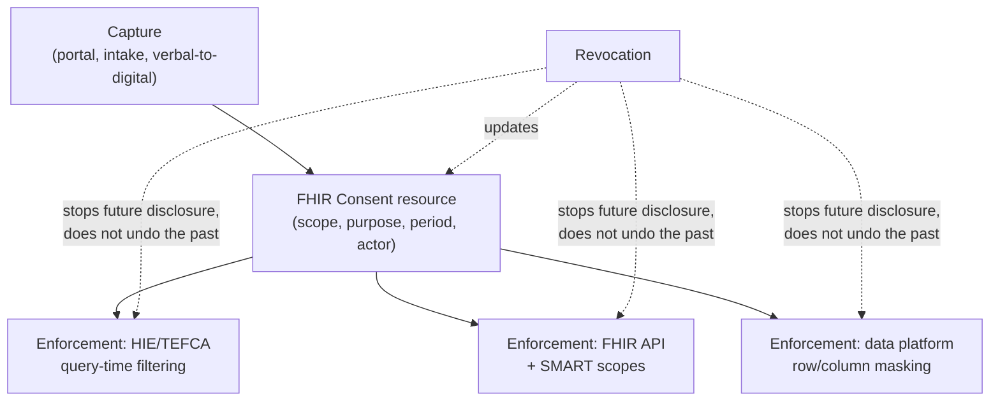

# Consent management architecture

> _Last reviewed: 2026-07-09 — see the [freshness policy](../appendix/maintenance.md)._

## Learning objectives

After this chapter you will be able to:

- Design a consent data model with the right granularity for a given use case, instead of a single boolean flag.
- Place consent enforcement at the specific points in an architecture where it actually has to run — not just where it gets recorded.
- Handle consent revocation correctly, including what it can and cannot retroactively undo.

## Consent needs an architecture, not just a policy

[De-identification & consent](./04-deidentification-consent.md) already states the core rule: "a
consent flag that no system checks is theater." This chapter is the technical follow-through —
because both the [HIE](../08-integration/06-hie-architecture.md) and
[TEFCA/QHIN](../02-interoperability/16-uscdi-tefca-labs.md) chapters flagged that **consent models
vary by state and network** without specifying how a system actually implements variable,
enforceable consent. That's the gap this chapter closes.

## The FHIR `Consent` resource

FHIR models consent as a first-class, computable resource rather than a flag: it carries a
**scope** (what kind of consent — treatment, research, data sharing), a **provision** (permit or
deny, and under what conditions), a **period** (when it's valid), and **actors** (who is granted or
excluded access). Modeling consent this way — instead of a boolean on a patient record — is what
makes the granularity models below actually implementable rather than aspirational.

## Four granularity models

Pick the granularity the use case actually needs — more granularity is not automatically better,
since each level adds real engineering and UX cost:

| Model | What it controls | Where it shows up |
| --- | --- | --- |
| **All-or-nothing** | Organization-level opt-in/opt-out | Common in [HIE](../08-integration/06-hie-architecture.md) participation — simplest, least patient control |
| **Category-based** | Sensitivity category (behavioral health, reproductive health, genetic data) | [42 CFR Part 2](./07-behavioral-health-data.md) SUD records; GA4GH's [DUO](../07-genomics/04-genomics-data-standards.md) data-use categories |
| **Purpose-of-use-based** | *Why* data is being accessed (treatment, payment, operations, research, public health) | HIPAA TPO; DUO's permitted-use encoding |
| **Recipient-based** | *Who* specifically is allowed access | Traditional Part 2 redisclosure consent, named-provider sharing |

Real systems usually combine two of these — e.g., purpose-of-use plus category — rather than
picking one in isolation.

## Enforcement points: where consent actually has to run

Recording consent is necessary but not sufficient — a consent record that nothing *checks* at the
moment of access is the "theater" [de-identification & consent](./04-deidentification-consent.md)
warns about. There are four distinct places enforcement has to happen, and missing any one of them
leaves a gap:

1. **At capture/intake** — tag the record with its consent context as it's created, so downstream
   systems inherit the scope rather than having to reconstruct it later.
2. **At HIE/TEFCA query time** — the [Record Locator Service](../08-integration/06-hie-architecture.md)
   or a TEFCA query must check consent **before** returning results, not log the access after the
   fact and hope for the best.
3. **At the FHIR API layer** — [SMART on FHIR](../02-interoperability/05-smart-on-fhir.md) scopes
   handle *what kind* of data an app can request; a consent-aware FHIR server additionally filters
   *which patients'* resources are returned based on whether their consent covers this requester's
   purpose. These are two different checks that are easy to conflate.
4. **In the data platform** — [governance](../05-data-platforms/03-governance-contracts.md)'s
   row/column masking should be driven by consent status as an input, not just role — the same
   masking mechanism, one more policy dimension.

## Revocation: what it does and doesn't undo

Consent is not fire-and-forget. When a patient revokes consent, the system must **stop future
disclosures immediately** — but it generally **cannot retroactively un-share data that already went
out** under a prior valid consent. This is a real, important nuance to design for explicitly rather
than discover during an incident: revocation changes what the next query returns; it does not
reach into a partner organization's system and delete what they already received. Audit logs of
what was disclosed under the old consent remain — and need to, since they're the evidence of what
was legitimately shared before the change.

## Case study: 42 CFR Part 2's segmentation history

[Behavioral health data architecture](./07-behavioral-health-data.md) already covers this in
depth, but it's worth re-reading here as a **concrete lesson in consent granularity's real cost**:
Part 2 historically required data **segmentation** — physically or logically separating SUD records
so they could be selectively withheld per the recipient-based consent model above. That's the
most granular, most expensive end of the spectrum: a distinct access-control boundary, its own
integration surface, and its own emergency break-glass procedure. The 2024 final rule relaxed the
mandate specifically because over-segmentation created a **clinical-safety risk** — a clinician who
can't see relevant history in an emergency. The lesson generalizes: **the most granular consent
model is not automatically the safest one** — it can trade privacy risk for clinical-safety risk,
and the right level depends on the specific data category, not a default instinct toward maximum
restriction.

## Data Segmentation for Privacy (DS4P)

For organizations that do need to segment (multi-state operation with stricter state law, or a
deliberate architecture choice per the case study above), **HL7's Data Segmentation for Privacy
(DS4P)** implementation guide provides the standard mechanism: metadata tags attached to a C-CDA
or FHIR resource (confidentiality codes, sensitivity codes, obligation/refrain policies) that
downstream systems can read and enforce consistently, rather than every organization inventing its
own tagging scheme.

## Design guidance

1. **Model consent as data, not a flag** — use the FHIR `Consent` resource's structure even if you
   don't run a full FHIR server, because the shape (scope, provision, period, actor) is the right
   shape regardless of implementation.
2. **Enumerate all four enforcement points explicitly** for any system that touches PHI — capture,
   network/query-time, API-layer, and data-platform — and confirm each one actually checks consent,
   not just the one that's easiest to instrument.
3. **Design for revocation from day one**, including the explicit design decision about what
   happens to data already disclosed under a prior consent — don't leave this ambiguous until a
   patient actually revokes.
4. **Don't default to maximum granularity** — the Part 2 segmentation history is a direct lesson
   that more restrictive consent architecture can itself become a safety risk.
5. **Use DS4P instead of inventing a tagging scheme** if segmentation is genuinely required —
   it's the standard your downstream partners are more likely to already support.

## Check yourself

1. Why is a consent flag that no system checks at query time equivalent to having no consent
   control at all?
2. A patient revokes consent for their data to be shared via an HIE. What changes immediately, and
   what does *not* get undone?
3. Why did the 2024 42 CFR Part 2 final rule remove the segmentation mandate, and what does that
   imply about choosing a consent granularity model in general?

## Further reading

- [HL7 FHIR — Consent resource](https://hl7.org/fhir/consent.html)
- [HL7 — Data Segmentation for Privacy (DS4P)](https://www.hl7.org/implement/standards/product_brief.cfm?product_id=354)
- [De-identification & consent](./04-deidentification-consent.md) · [Behavioral health data architecture](./07-behavioral-health-data.md)
- [HIE architecture](../08-integration/06-hie-architecture.md) · [USCDI, information blocking & TEFCA](../02-interoperability/16-uscdi-tefca-labs.md)
