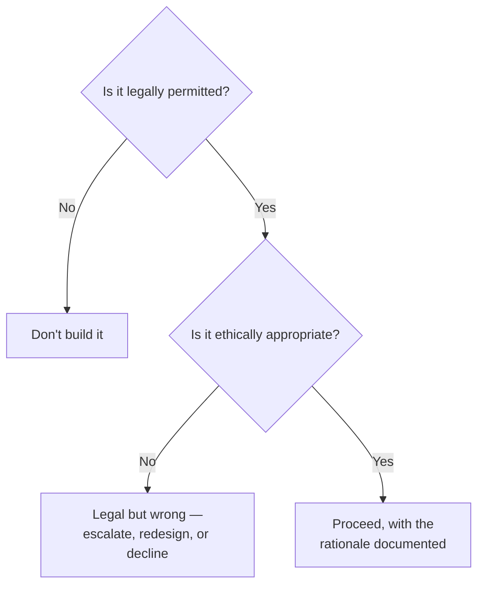

# Ethics in health informatics & AI

> _Last reviewed: 2026-07-16 — see the [freshness policy](../appendix/maintenance.md)._

## Learning objectives

After this chapter you will be able to:

- Distinguish an ethics question from a compliance question, and recognize when a design is legal but wrong.
- Apply the principle sets you will actually be cited in a health-AI review — bioethics' four principles and the WHO's six principles for AI in health.
- Identify the organizational bodies that adjudicate these questions, and what an SA owes each of them.

## Legal and right are different questions

Everything else in Part 3 answers **"what must we do?"** — [HIPAA](./00-hipaa.md),
[GDPR](./03-gdpr-residency.md), [GxP](./02-gxp-part11.md),
[consent](./09-consent-management-architecture.md). This chapter answers a question none of them
do: **"what should we do?"** Those diverge more often than they sound like they should. Selling
de-identified patient data to a data broker can be entirely HIPAA-compliant and still be the kind
of decision that ends up in a newspaper. A sepsis model that performs worse for one demographic
group breaks no law. Compliance is the floor, not the ceiling — and an SA who can only reason
about the floor will eventually design something defensible in an audit and indefensible in front
of the patients it affects.

The uncomfortable quadrant is **legal-but-wrong**, and it is the one an SA is most likely to walk
into unaided — because no compliance checklist will flag it for you.

## Two principle sets worth knowing by name

### Bioethics' four principles

The framework clinicians and IRBs already reason in, so it is the vocabulary that lands in a
hospital setting:

| Principle | Meaning | An informatics translation |
| --- | --- | --- |
| **Autonomy** | Respect the person's right to decide about themselves | Meaningful [consent](./09-consent-management-architecture.md), not a buried checkbox |
| **Beneficence** | Act to benefit the patient | The system must actually improve care, not just ship |
| **Non-maleficence** | First, do no harm | [Alert fatigue](../08-integration/04-realtime-streaming-analytics.md) and documentation burden are harms |
| **Justice** | Distribute benefits and burdens fairly | Performance must hold across the populations you serve |

### The WHO's six principles for AI in health

WHO published *Ethics and governance of artificial intelligence for health* (June 2021) — the
first global guidance of its kind — setting out six principles: **protect autonomy**; **promote
human well-being, safety, and the public interest**; **ensure transparency, explainability, and
intelligibility**; **foster responsibility and accountability**; **ensure inclusiveness and
equity**; and **promote AI that is responsive and sustainable**. WHO followed it in January 2024
with dedicated guidance on **large multi-modal models (LMMs)**, carrying 40+ recommendations —
the recognition that generative models raise questions the 2021 framing did not fully anticipate.

For an SA, the value of these is practical, not academic: they are the criteria a hospital AI
governance committee or an EU regulator is likely to actually evaluate you against, and the
[EU AI Act](../06-ai-ml/06-eu-ai-act.md)'s human-oversight and transparency obligations are
recognizably the same ideas with legal force attached.

## Ethics for health IT systems (not only AI)

AI attracts the ethics conversation, but ordinary health IT raises most of the same questions:

- **Secondary use of clinical data.** Data collected for care and reused for research, product
  development, or commercial partnership is the most common legal-but-contested decision in HLS.
  De-identification may make it lawful; it does not settle whether patients would consider it
  legitimate. **Ask whether a reasonable patient would be surprised** — surprise is the practical
  early-warning signal for an ethics problem.
- **Equity of access.** A patient portal that assumes reliable broadband, a smartphone, and English
  fluency systematically excludes some of the population it was built for — connecting directly to
  [SDOH & health equity](../02-interoperability/18-sdoh-health-equity.md). Access design is an
  ethics decision wearing a UX costume.
- **Transparency to patients.** Patients are often unaware their data flows through an
  [HIE](../08-integration/06-hie-architecture.md), a vendor's cloud, or a model's training set.
  Legal notice and genuine understanding are not the same thing.
- **Burden as harm.** A system that measurably worsens clinician burnout has caused harm, even
  though no regulation names it — see
  [EHR usability & documentation burden](../08-integration/07-ehr-usability-documentation-burden.md).
- **Dual use.** Data and models built for care can be repurposed for denial of coverage,
  employment screening, or law enforcement. Design the constraint in; don't rely on the current
  owner's good intentions persisting.

## What AI specifically adds

- **The accountability gap.** When a model contributes to a bad outcome, responsibility is
  genuinely unclear — developer, deploying institution, or clinician who accepted the
  recommendation? WHO's "responsibility and accountability" principle exists precisely because the
  answer defaults to *nobody* unless it is assigned deliberately. **Name the accountable party
  during design**, and write it into the [intended use statement](../06-ai-ml/07-regulated-ai-artifacts.md).
- **Explainability versus performance.** A more accurate model a clinician cannot interrogate may
  be ethically worse than a slightly less accurate one they can — because informed professional
  judgment, and the patient's ability to contest a decision, both depend on being able to ask
  "why?"
- **Consent for AI involvement.** Whether patients should be told a model participated in their
  care is unsettled and moving; it is a live design question, not a solved one.
- **Equity as a first-class metric.** A model trained on a population unlike the deployed one
  fails the justice principle regardless of aggregate accuracy. This is why subgroup performance
  belongs in the [validation plan](../06-ai-ml/07-regulated-ai-artifacts.md), not in a follow-up
  study — and why proxy-variable bias gets its own treatment in
  [AI risk & mitigation](../06-ai-ml/08-ai-risk-mitigation.md).

## Where these decisions actually get made

Ethics questions are adjudicated by real bodies with real authority, and an SA should know which
one applies before escalating:

| Body | Scope | What it needs from you |
| --- | --- | --- |
| **IRB** | Research involving human subjects | Protocol, data flows, consent model — engage early, per [discovery](../10-sa-craft/00-discovery-requirements.md) |
| **AI governance committee** | Clinical AI deployment (increasingly standard at health systems) | Intended use, validation and subgroup evidence, monitoring plan |
| **Data governance / stewardship board** | Secondary use and data-sharing requests | Purpose, recipients, [consent](./09-consent-management-architecture.md) basis, [lineage](../05-data-platforms/07-data-lineage-provenance.md) |
| **Privacy office / DPO** | Regulatory privacy compliance | The compliance floor — necessary, not sufficient |

**AMIA** publishes a code of professional and ethical conduct for informatics professionals — the
field's own statement that these obligations attach to the practitioner, not only to the
institution.

## Design guidance

1. **Run the "would a patient be surprised?" test** on every secondary-use and data-sharing design
   — it catches legal-but-wrong faster than any checklist.
2. **Assign accountability explicitly for any deployed model** — the gap defaults to nobody
   otherwise.
3. **Treat subgroup performance as a release gate**, not a post-launch study; justice is not a
   metric you retrofit.
4. **Escalate to the right body, early.** IRB, AI governance committee, and data-stewardship board
   are different doors; using the wrong one wastes a cycle you rarely have.
5. **Document the ethical rationale alongside the [ADR](../01-foundations/02-c4-and-adrs.md)** —
   "we considered X and chose Y because" is what makes a contested decision defensible a year
   later.

## Check yourself

1. Give an example of a health-data design that is fully HIPAA-compliant and still ethically
   questionable. Which principle does it strain?
2. What is the "accountability gap" in clinical AI, and why does it resolve to nobody by default?
3. A model is 3% more accurate overall but performs measurably worse for one demographic group.
   Which principle does this violate, and why isn't aggregate accuracy a sufficient answer?

## Further reading

- [WHO — Ethics and governance of artificial intelligence for health (2021)](https://www.who.int/publications/i/item/9789240029200) · [WHO — guidance on large multi-modal models (2024)](https://www.who.int/news/item/18-01-2024-who-releases-ai-ethics-and-governance-guidance-for-large-multi-modal-models)
- [AMIA — code of professional and ethical conduct](https://amia.org/about-amia/code-professional-and-ethical-conduct)
- [AI risk & mitigation](../06-ai-ml/08-ai-risk-mitigation.md) · [Regulated AI artifacts](../06-ai-ml/07-regulated-ai-artifacts.md) · [Consent management architecture](./09-consent-management-architecture.md)
