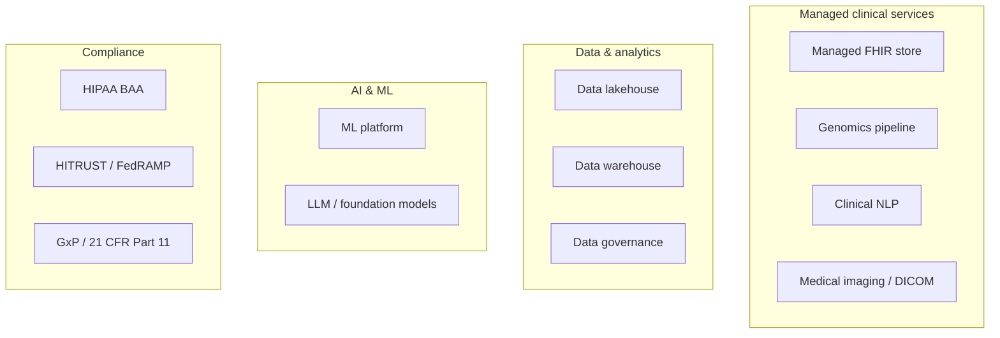

# Cloud capability map for HLS

## Learning objectives

After this chapter you will be able to:

- Identify which platform has a native managed service for each major HLS capability area.
- Apply selection heuristics to recommend a primary cloud for a given HLS customer context.
- Know when to reach for Databricks or Snowflake independently of the underlying cloud.

## Why a capability map first

The next five chapters dive into each platform in depth. Before going there, you need a one-page mental model of what each platform *specialises in for HLS* — so you can quickly narrow from five options to one or two realistic candidates for a given customer context.

> No platform excels at everything. Your job is to match the platform to the problem, not to defend a favourite.

## The capability map

| Capability | AWS | GCP | Azure | Databricks | Snowflake |
| --- | --- | --- | --- | --- | --- |
| **Managed FHIR store** | HealthLake | Cloud Healthcare API | Health Data Services (FHIR) | — (via partner or OSS) | — (via OSS) |
| **Genomics pipeline** | HealthOmics | Life Sciences (Batch) | Microsoft Genomics | runs on Databricks | — |
| **Clinical NLP** | Comprehend Medical | Healthcare NL API | Text Analytics for Health | via ML Runtime | — |
| **Medical imaging / DICOM** | HealthLake Imaging | Cloud Healthcare API (DICOM) | Health Data Services (DICOM) | — | — |
| **Data lakehouse** | S3 + Lake Formation | BigQuery / Cloud Storage | ADLS Gen2 + Fabric | Delta Lake (native) | Iceberg (native) |
| **Data warehouse** | Redshift | BigQuery | Synapse / Fabric | SQL Warehouse | Snowflake (native) |
| **Data governance** | Lake Formation | Dataplex | Purview | Unity Catalog | Snowflake governance |
| **ML platform** | SageMaker | Vertex AI | Azure ML | MLflow (native) | Snowpark ML |
| **Foundation models / LLM** | Bedrock | Vertex AI (Gemini) | Azure OpenAI | (via partner) | Cortex (LLM functions) |
| **HIPAA BAA** | Yes | Yes | Yes | Yes | Yes |
| **HITRUST CSF** | Yes | Yes | Yes | Yes | Yes |
| **GxP / 21 CFR Part 11** | Yes (partner) | Yes (partner) | Yes (partner) | Yes (partner) | Yes (partner) |

**Key:** "—" means no native first-party service; you use OSS, a partner offering, or the underlying cloud's service.

## Selection heuristics

These are starting-point heuristics, not rules. Always validate against the customer's actual constraints.

### Choose AWS when…

- The customer is a **provider or payer** deeply invested in the AWS ecosystem.
- They need **HealthOmics** for clinical-grade genomics pipelines with provenance tracking.
- They require **HIPAA + FedRAMP** in a GovCloud deployment (CMS, VA, DoD contractors).
- **Comprehend Medical** NLP fits the clinical NLP requirement without a custom model.

### Choose GCP when…

- The team is **data-science-heavy** and leans on BigQuery for large-scale analytics.
- The use case is a **RAG or AI application** on clinical corpora — Vertex AI + BigQuery ML is a strong combination. (See the [`RAGonGCP`](https://github.com/anothernoise/RAGonGCP) lab.)
- The customer has existing Google Workspace / Chrome investment.

### Choose Azure when…

- The customer is a **large health system** already committed to Microsoft (Teams, Office 365, Azure AD / Entra).
- They need deep **Epic MyChart integration** (Epic runs on Azure in many deployments).
- **Azure Health Data Services** (FHIR + DICOM + MedTech in one service) fits the interoperability footprint.
- They are a **pharma company** with existing Microsoft enterprise agreements.

### Choose Databricks when…

- The use case is a **data lakehouse** (Delta Lake), **real-world data/OMOP**, or large-scale ML.
- The team already has Databricks for data engineering; extending into HLS is lower friction than adopting a new cloud service.
- They need **Unity Catalog** for fine-grained governance of PHI at the column level.

### Choose Snowflake when…

- The customer has a **multi-cloud or cloud-agnostic** data strategy.
- The primary use case is **analytics and BI** over OMOP or claims data with strong SQL skills.
- They need **Snowflake Data Clean Rooms** for cross-organization RWD collaboration without data movement.
- Dynamic data masking on PHI columns is a key governance requirement.

### Don't forget on-premises

The five columns above are all cloud. In HLS, the system of record (EHR, PACS, genomics HPC) is frequently **on-premises**, and most real architectures are **hybrid** — on-prem for what must stay local, cloud for elastic analytics and AI. Treat on-prem and hybrid as first-class options, not a fallback. See [On-premises & hybrid for HLS](./06-on-prem-hybrid.md).

### Multi-platform (most real-world scenarios)

Most enterprise HLS systems use **more than one platform** — and often span on-prem too: an on-prem EHR feeding (via Azure Health Data Services or Cloud Healthcare API) a Databricks lakehouse for OMOP analytics, with Snowflake for the data-sharing layer. The SA's job is to understand where each platform wins and design the integration points cleanly.

## What to ask a customer before recommending

1. **What cloud contracts / enterprise agreements are already signed?** Switching costs matter.
2. **Where does your data team live?** A Databricks-native data team is a strong signal.
3. **Do you have clinical data (FHIR/HL7v2) or life science data (genomics, trials)?** Clinical → managed FHIR services matter. Life science → genomics and GxP matter.
4. **What are your compliance requirements?** GovCloud, FedRAMP, and GxP narrow the field.
5. **What is the AI/ML vision?** Foundation models → Bedrock or Azure OpenAI or Vertex. Custom models → SageMaker or Vertex. Lakehouse ML → Databricks.

## Check yourself

1. A payer running on AWS wants to expose FHIR APIs to patients per the CMS mandate. Which AWS service handles the FHIR store, and what does the connection to HIPAA look like?
2. A biotech company already uses Databricks for their OMOP pipeline. They want to add clinical NLP. What options do they have on Databricks, and when would it be better to use Comprehend Medical or Healthcare NL API instead?
3. A health system is Microsoft-first (Teams, Azure AD, Epic on Azure). They want to build a DICOM-based imaging analytics platform. Which platform fits, and why?

## Further reading

- [AWS Health: services overview](https://aws.amazon.com/health/)
- [GCP Healthcare & Life Sciences](https://cloud.google.com/solutions/healthcare-life-sciences)
- [Azure Health & Life Sciences](https://azure.microsoft.com/en-us/solutions/industries/health/)
- [Databricks Healthcare & Life Sciences](https://www.databricks.com/solutions/industries/healthcare-and-life-sciences)
- [Snowflake Healthcare Data Cloud](https://www.snowflake.com/en/solutions/industries/healthcare-and-life-sciences/)
