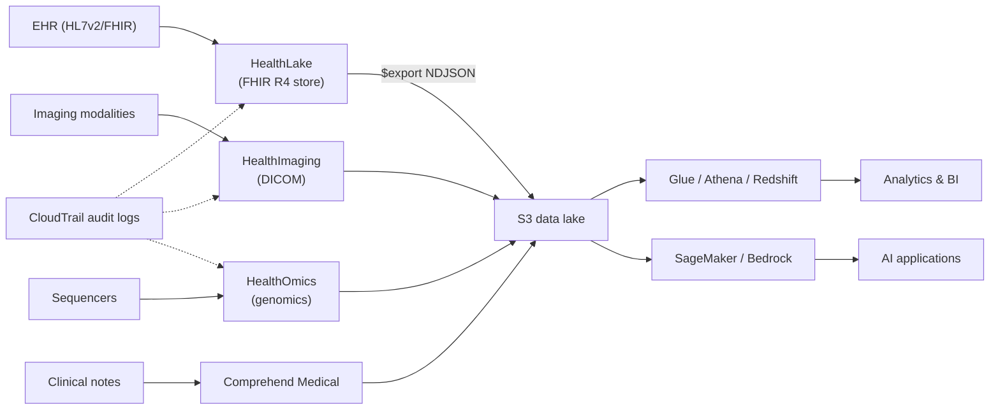

# AWS for HLS

## Learning objectives

After this chapter you will be able to:

- Name the purpose-built AWS health services and what each one does.
- Assemble them into a reference architecture for a clinical data platform.
- Reason about the HIPAA shared-responsibility boundary on AWS.

## AWS's HLS positioning

AWS offers the broadest set of **purpose-built managed health services** of any cloud, grouped under "AWS Health AI." The strategy: managed services for each clinical data modality (FHIR, imaging, genomics, clinical text), with the general AWS data and AI stack (S3, Glue, SageMaker, Bedrock) underneath. This makes AWS a strong default for providers, payers, and pharma already on AWS.

> Not every AWS service is HIPAA-eligible. AWS publishes a [HIPAA-eligible services list](https://aws.amazon.com/compliance/hipaa-eligible-services-reference/) (100+ services) — design only with services on it for any workload touching PHI, and sign the AWS BAA. See [HIPAA](../03-compliance/00-hipaa.md).

## The purpose-built health services

| Service | Modality | What it does |
| --- | --- | --- |
| **HealthLake** | FHIR | Managed FHIR R4 store: REST API, native search, Bulk `$export` to S3, SMART on FHIR. Includes a transformation capability to convert legacy records to FHIR. |
| **HealthImaging** | DICOM | Managed medical-imaging store, DICOMweb-native, petabyte-scale with tiered storage. |
| **HealthOmics** | Genomics | Purpose-built storage + managed workflow engine (runs Nextflow/WDL/CWL pipelines) + variant/annotation stores. |
| **Comprehend Medical** | Clinical NLP | Extracts conditions, medications, dosages, anatomy, and time references from unstructured clinical text; maps to ICD-10-CM, RxNorm, SNOMED CT. |
| **HealthScribe** | Ambient/clinical documentation | Generates structured clinical notes from patient–clinician conversations (uses speech + GenAI). |

These sit on top of the general stack you also use:

- **S3** — the data lake substrate (FHIR `$export` NDJSON, DICOM, genomics, lake tables).
- **Glue / Athena / Redshift** — ETL and analytics.
- **SageMaker** — custom ML training and hosting.
- **Bedrock** — managed foundation models (including agent capabilities) for GenAI over clinical data. See the [`aws-health-agents`](https://github.com/anothernoise/aws-health-agents) lab.

## Reference architecture: clinical data platform on AWS

The pattern: managed services ingest each modality, all roads lead to **S3 as the lake**, and analytics/AI build on top. CloudTrail provides the HIPAA-required audit trail across services.

## HIPAA shared responsibility on AWS

AWS signs a BAA covering the infrastructure and the HIPAA-eligible managed services. **You** remain responsible for configuration (see [HIPAA](../03-compliance/00-hipaa.md)):

- Encryption: enable SSE on S3, KMS keys for HealthLake/HealthImaging; TLS everywhere.
- Access: least-privilege IAM, MFA, no public S3 buckets, VPC endpoints for service traffic.
- Audit: CloudTrail enabled in all regions; logs immutable (S3 Object Lock) and retained ≥ 6 years.
- Network: keep PHI in private subnets; use PrivateLink to reach managed services without traversing the public internet.

Codify all of this as IaC (Terraform or CDK) so the controls are uniform and provable — exactly what a [HITRUST](../03-compliance/01-hitrust.md) assessor wants to see.

## When AWS is the right call

- The customer is already on AWS, or needs **GovCloud/FedRAMP** (CMS, VA, DoD contractors).
- The workload spans multiple modalities — FHIR + imaging + genomics — and the purpose-built services reduce build effort.
- Genomics at clinical scale: **HealthOmics** is the most complete managed genomics offering across the clouds. See [AWS HealthOmics](../07-genomics/01-healthomics.md).

## Labs

- [`aws-health-agents`](https://github.com/anothernoise/aws-health-agents) — agentic AI over health data on AWS (Bedrock + CDK).
- [`RNASEQ`](https://github.com/anothernoise/RNASEQ) — nf-core genomics pipeline that maps onto HealthOmics.

## Check yourself

1. A provider wants FHIR APIs, an imaging archive, and genomics analysis on AWS. Which three purpose-built services map to these, and where does all the data converge?
2. You enable HealthLake and assume HIPAA is "handled because AWS signed a BAA." What configuration responsibilities are still yours?
3. Why route managed-service traffic over PrivateLink/VPC endpoints rather than public endpoints for a PHI workload?

## Further reading

- [AWS for Health](https://aws.amazon.com/health/)
- [AWS HealthLake](https://aws.amazon.com/healthlake/)
- [AWS HealthOmics](https://aws.amazon.com/omics/)
- [AWS HIPAA-eligible services reference](https://aws.amazon.com/compliance/hipaa-eligible-services-reference/)
