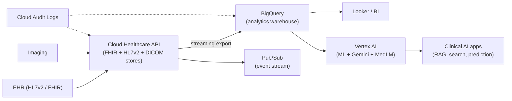

# GCP for HLS

## Learning objectives

After this chapter you will be able to:

- Use the Cloud Healthcare API as the interoperability hub of a GCP HLS architecture.
- Place BigQuery, Vertex AI, and the healthcare-specific AI models in a reference design.
- Reason about GCP's HIPAA posture and when GCP is the right platform.

## GCP's HLS positioning

Google Cloud's HLS strategy centers on a single, unified **Cloud Healthcare API** for clinical data ingestion and interoperability, feeding **BigQuery** for analytics and **Vertex AI** for ML and generative AI. Google's differentiators are its data-warehouse strength (BigQuery) and its healthcare-tuned AI models (MedLM, MedGemma). GCP is a strong fit for data-science-heavy organizations and AI-forward use cases.

> GCP signs a BAA and lists HIPAA-covered products. Configure encryption, IAM, VPC Service Controls, and Cloud Audit Logs correctly — the BAA covers the platform, not your misconfiguration. See [HIPAA](../03-compliance/00-hipaa.md).

## The key services

| Service | Role |
| --- | --- |
| **Cloud Healthcare API** | One API with **FHIR R4**, **HL7v2**, and **DICOM** stores. The interoperability hub: ingest, convert (HL7v2→FHIR), and stream to BigQuery / Pub/Sub. |
| **Healthcare Data Engine (HDE)** | Higher-level managed solution that harmonizes multi-source clinical data into a longitudinal patient record on top of the Healthcare API. |
| **Healthcare Natural Language API** | Clinical NLP — extracts medical concepts and maps to standard vocabularies from unstructured text. |
| **BigQuery** | Serverless data warehouse; the analytics engine. Cloud Healthcare API streams FHIR/DICOM directly into BigQuery. |
| **Vertex AI** | ML platform: training, hosting, and generative AI (Gemini), plus **Vertex AI Search for Healthcare** for patient-record Q&A. |
| **MedLM / MedGemma** | Healthcare-tuned models. **MedLM** (Med-PaLM 2-based) is offered via Vertex AI to US customers; **MedGemma** is an open Gemma-3 family for medical text and image comprehension (in Model Garden and Hugging Face). |

## Reference architecture: clinical analytics + AI on GCP

The pattern: **Cloud Healthcare API is the front door** for all clinical data; it streams to **BigQuery** for analytics and emits events to **Pub/Sub**; **Vertex AI** adds ML and generative AI on top. This tight Healthcare-API-to-BigQuery integration is GCP's signature strength.

## RAG and generative AI on clinical data

GCP is especially well-suited to retrieval-augmented generation over clinical and biomedical corpora: BigQuery (or Vertex AI Vector Search) holds the embeddings, Gemini/MedLM generates, and Vertex AI Search for Healthcare provides patient-record-aware retrieval. This is exactly the pattern in the [`RAGonGCP`](https://github.com/anothernoise/RAGonGCP) lab. See also [RAG over clinical corpora](../06-ai-ml/02-rag-clinical.md).

## HIPAA posture on GCP

- **VPC Service Controls** — create a security perimeter around your healthcare data services so data cannot be exfiltrated to projects outside the perimeter. A distinctive GCP control worth using for PHI.
- **CMEK** — customer-managed encryption keys via Cloud KMS for the Healthcare API and BigQuery.
- **IAM** — least privilege; avoid broad `roles/editor`; use predefined healthcare roles.
- **Cloud Audit Logs** — Data Access logs capture who read which PHI; enable and retain them.

## When GCP is the right call

- The team is **data-science-heavy** and already leans on BigQuery.
- The use case is **AI/ML over clinical data** — RAG, clinical search, prediction — where Vertex AI + healthcare models shine.
- You want one API spanning FHIR + HL7v2 + DICOM with native warehouse streaming.

## Lab

[`RAGonGCP`](https://github.com/anothernoise/RAGonGCP) — retrieval-augmented generation over a clinical/biomedical corpus on Vertex AI + BigQuery.

## Check yourself

1. In a GCP HLS architecture, what is the role of the Cloud Healthcare API, and how does clinical data reach BigQuery?
2. What is the difference between MedLM and MedGemma, and when would you reach for the open MedGemma models?
3. What does VPC Service Controls protect against that IAM alone does not?

## Further reading

- [Cloud Healthcare API](https://cloud.google.com/healthcare-api)
- [Vertex AI Search for Healthcare](https://cloud.google.com/generative-ai-app-builder/docs/about-healthcare-search)
- [MedLM on Vertex AI](https://cloud.google.com/vertex-ai/generative-ai/docs/medlm/overview)
- [MedGemma](https://github.com/google-health/medgemma)
- [GCP HIPAA compliance](https://cloud.google.com/security/compliance/hipaa)
