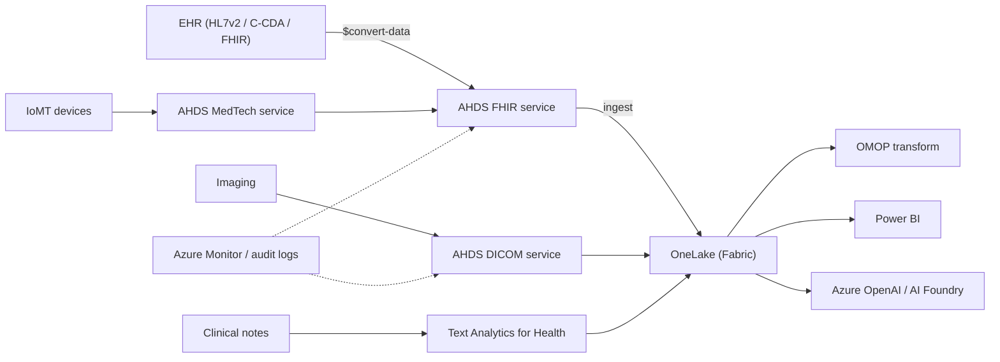

# Azure for HLS

> _Last reviewed: 2026-06-28 — see the [freshness policy](../appendix/maintenance.md)._

## Learning objectives

After this chapter you will be able to:

- Use Azure Health Data Services as the interoperability layer of an Azure HLS design.
- Place Microsoft Fabric's healthcare data solutions in an analytics architecture.
- Reason about when Azure is the right platform — especially for Microsoft-first health systems.

## Azure's HLS positioning

Microsoft's HLS strategy has two pillars: **Azure Health Data Services** for clinical-data interoperability (the transactional layer), and **healthcare data solutions in Microsoft Fabric** for analytics (the lakehouse layer). Azure's strongest pull is institutional: many health systems are already deeply invested in Microsoft (Entra ID, Teams, Office 365), and **Epic runs on Azure** in many deployments — making Azure the path of least resistance for provider organizations.

> Azure signs a BAA and documents HIPAA/HITRUST coverage. As always, the platform is covered; your configuration (encryption, RBAC, network isolation, audit) is your responsibility. See [HIPAA](../03-compliance/00-hipaa.md).

## The two pillars

### Azure Health Data Services (transactional / interoperability)

A managed, unified service spanning the three clinical modalities:

| Component | Modality | What it does |
| --- | --- | --- |
| **FHIR service** | FHIR R4 | Managed FHIR store: REST API, Bulk `$export`, SMART on FHIR, `$convert-data` for HL7v2/C-CDA → FHIR. |
| **DICOM service** | Imaging | DICOMweb-native managed imaging store (STOW/QIDO/WADO-RS). |
| **MedTech service** | Device data | Ingests high-frequency IoMT (Internet of Medical Things) device telemetry and normalizes it to FHIR Observations. |

### Healthcare data solutions in Microsoft Fabric (analytics)

An end-to-end SaaS analytics platform on **OneLake** that ingests, standardizes, and analyzes healthcare data. Key capabilities:

- **FHIR ingestion** into OneLake from the FHIR service.
- **DICOM transformation** into OneLake for imaging analytics.
- **Text Analytics for Health** (Azure AI Language) to structure unstructured clinical notes.
- **OMOP transformations** to prepare data for standardized analytics (see [OMOP CDM](../02-interoperability/04-omop-cdm.md)).

Fabric unifies structured, imaging, device, and unstructured data in OneLake and exposes it through familiar tools — Power BI, Data Factory, Synapse-style analytics.

## Reference architecture: interoperability + analytics on Azure

The pattern: **Azure Health Data Services** is the transactional clinical layer; **Microsoft Fabric / OneLake** is the analytics lakehouse; **Azure OpenAI** adds generative AI. The MedTech service makes Azure distinctive for **connected-device** and remote-monitoring scenarios.

## Compute & batch

For genomics, imaging AI, and large ETL: **Azure Batch** schedules large batch/HPC jobs (with Spot VMs), and **Azure CycleCloud** orchestrates Slurm-style HPC clusters — useful for [hybrid](./06-on-prem-hybrid.md) bursting from an on-prem cluster. **AKS** runs containerized pipelines and services; **Azure ML** handles GPU training and [MLOps](../06-ai-ml/04-mlops-governance.md); **ADLS Gen2** is the lake substrate feeding OneLake. Co-locate compute with storage and prefer Spot for fault-tolerant steps to manage cost.

## HIPAA / governance posture on Azure

- **Entra ID** (formerly Azure AD) for identity, MFA, conditional access — usually already the org's identity provider.
- **Private endpoints** to keep PHI traffic off the public internet.
- **Customer-managed keys** via Key Vault for the FHIR/DICOM services.
- **Microsoft Purview** for data governance, classification, and lineage across the estate.
- **Azure Monitor / diagnostic logs** for the HIPAA-required audit trail.

## When Azure is the right call

- The customer is a **Microsoft-first health system** (Entra ID, Teams, Office 365) — integration and identity are already there.
- **Epic on Azure** deployments where co-locating the analytics and interoperability layer reduces friction.
- **Connected medical devices / IoMT** — the MedTech service is purpose-built for device telemetry → FHIR.
- The analytics strategy already centers on **Microsoft Fabric / Power BI**.

## Lab

There is no dedicated Azure spoke repo yet. The [`hls-fhir-interop`](https://github.com/anothernoise/hls-fhir-interop) lab includes an Azure Health Data Services deployment variant for the FHIR interoperability pattern.

## Check yourself

1. A health system runs Epic on Azure and uses Entra ID and Power BI. Why is Azure likely the lowest-friction platform for their new clinical analytics project?
2. Which Azure Health Data Services component handles continuous device telemetry, and what does it normalize the data into?
3. In the Fabric-based architecture, where does standardized OMOP analytics happen, and what feeds it?

## Further reading

- [Azure Health Data Services](https://learn.microsoft.com/en-us/azure/healthcare-apis/)
- [Healthcare data solutions in Microsoft Fabric](https://learn.microsoft.com/en-us/industry/healthcare/healthcare-data-solutions/overview)
- [Text Analytics for Health](https://learn.microsoft.com/en-us/azure/ai-services/language-service/text-analytics-for-health/overview)
- [Azure HIPAA/HITRUST compliance](https://learn.microsoft.com/en-us/azure/compliance/offerings/offering-hipaa-us)
- [Azure Architecture Center — Health industry (reference architectures)](https://learn.microsoft.com/en-us/azure/architecture/industries/health)
