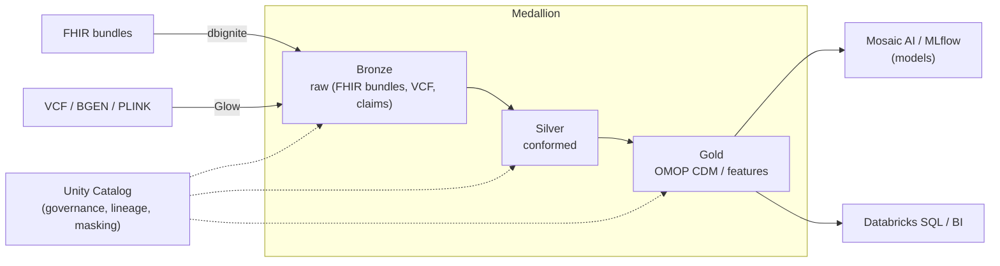
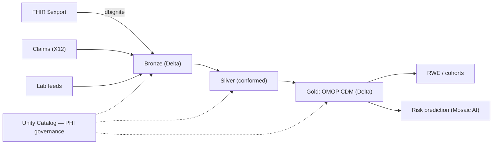

# Databricks for HLS

> _Last reviewed: 2026-06-28 — see the [freshness policy](../appendix/maintenance.md)._

## Learning objectives

After this chapter you will be able to:

- Explain the lakehouse model and why it suits HLS data engineering and ML.
- Use dbignite, Glow, and Unity Catalog in an HLS reference architecture.
- Decide when Databricks is the right layer — independently of the underlying cloud.

## Databricks's HLS positioning

Databricks is not a cloud — it runs **on** AWS, Azure, and GCP — so you choose it for the **lakehouse** and **ML** layer rather than for managed clinical endpoints. Its **Lakehouse for Healthcare and Life Sciences** unifies clinical, genomic, claims, imaging, and operational data on **Delta Lake**, governed by **Unity Catalog**, with first-class ML/AI. It is the strongest fit when the center of gravity is **data engineering, OMOP/RWE, genomics at scale, or ML** — not transactional FHIR serving.

## The lakehouse model

A lakehouse combines the cheap, open storage of a data lake with the reliability and performance of a warehouse, via **Delta Lake** (ACID transactions, schema enforcement, time travel on object storage). For HLS this matters because you have both petabyte-scale raw data (genomics, imaging) and the need for governed, query-ready tables (OMOP) in one place — without copying between a lake and a separate warehouse.

See [Lakehouse vs warehouse](../05-data-platforms/00-lakehouse-vs-warehouse.md) for the deeper comparison.

## The key HLS components

| Component | Role |
| --- | --- |
| **Delta Lake** | The storage format: ACID tables, time travel, schema evolution on object storage. |
| **Unity Catalog** | Unified governance: column/row-level access control, dynamic masking, lineage, and audit across all data and AI assets — the layer that makes PHI governance tractable. |
| **dbignite** | Solution accelerator that parses **FHIR bundles** into queryable Delta tables (and streams them into Unity Catalog). The FHIR→lakehouse on-ramp. |
| **Glow** | Open-source library for **distributed genomics** on Spark — reads VCF/BGEN/PLINK and lands results as Delta tables to join with clinical features. |
| **Mosaic AI / MLflow** | Model training, tracking, serving, and GenAI — next to the governed data. |
| **Solution Accelerators** | Prebuilt HLS patterns: Real-World Evidence suite, disease-risk prediction, digital pathology, NLP (with John Snow Labs). |

## Reference architecture: RWD/OMOP lakehouse

This is the architecture behind the [`hls-lakehouse-rwd`](https://github.com/anothernoise/hls-lakehouse-rwd) lab. Bronze→Silver→Gold (medallion), with OMOP CDM as Gold and Unity Catalog enforcing PHI access controls throughout.

## Governance and HIPAA on Databricks

- **Unity Catalog** is the centerpiece: tag PHI columns, apply dynamic masking and row filters, and get lineage + audit for every access — the evidence a [HITRUST](../03-compliance/01-hitrust.md) assessor wants.
- Databricks offers a **HIPAA-compliant deployment** (with BAA) and inherits the underlying cloud's controls — but you must enable the compliance security profile and configure workspace isolation.
- Keep data in customer-owned cloud storage; use customer-managed keys; restrict cluster egress.

## When Databricks is the right call

- The use case is **OMOP/RWD, genomics at scale, or ML** — not transactional FHIR serving.
- The team **already runs Databricks** for data engineering; extending into HLS is far lower friction than adopting a new managed service.
- You need **fine-grained PHI governance** (Unity Catalog) across a multi-modal data estate.
- You want **portability** across AWS/Azure/GCP — Databricks abstracts the underlying cloud.

A common enterprise pattern: a managed FHIR service (HealthLake / AHDS / Cloud Healthcare API) handles transactional interoperability, and **Databricks handles the analytical lakehouse** downstream of its `$export`.

## Lab

[`hls-lakehouse-rwd`](https://github.com/anothernoise/hls-lakehouse-rwd) — OMOP CDM lakehouse on Databricks (Delta + Unity Catalog) and Snowflake.

## Check yourself

1. Why do you choose Databricks for a *layer* rather than as a *cloud*, and what layer is that?
2. Which two accelerators turn FHIR bundles and genomic VCFs into Delta tables, and why is landing both in one lakehouse valuable?
3. How does Unity Catalog make a HITRUST assessment of a PHI lakehouse easier?

## Further reading

- [Databricks Lakehouse for Healthcare and Life Sciences](https://www.databricks.com/solutions/industries/healthcare-and-life-sciences)
- [dbignite FHIR interoperability accelerator](https://www.databricks.com/solutions/accelerators/fhir)
- [Glow — genomics on Spark](https://projectglow.io/)
- [Unity Catalog](https://www.databricks.com/product/unity-catalog)
- [Databricks Solution Accelerators (HLS reference implementations)](https://www.databricks.com/solutions/accelerators)
