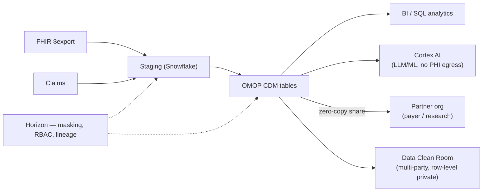

# Snowflake for HLS

> _Last reviewed: 2026-06-28 — see the [freshness policy](../appendix/maintenance.md)._

## Learning objectives

After this chapter you will be able to:

- Explain Snowflake's HLS value proposition: governed analytics, data sharing, and in-place AI.
- Use Horizon governance, Data Clean Rooms, and Cortex in an HLS architecture.
- Decide when Snowflake is the right platform — especially for multi-party data collaboration.

## Snowflake's HLS positioning

Like Databricks, Snowflake runs **on** AWS, Azure, and GCP and is chosen for the data layer, not for managed clinical endpoints. Its **Healthcare & Life Sciences AI Data Cloud** centers on three strengths: **strong built-in governance**, frictionless **cross-organization data sharing**, and **in-database AI (Cortex)** that runs next to the data so PHI never leaves the boundary. Snowflake is the standout choice when **multi-party data collaboration** and **SQL-centric analytics** dominate — payers and providers sharing data, pharma collaborating on RWD, or anyone preferring a near-zero-ops warehouse over a lakehouse to operate.

## The key capabilities

| Capability | Role |
| --- | --- |
| **Snowflake core** | Near-zero-ops cloud data platform; separate compute and storage; auto-suspend keeps cost down. The OMOP / claims / RWD analytics engine. |
| **Horizon Catalog** | Built-in governance: RBAC/ABAC, **dynamic data masking** (tag-based), auto-classification of sensitive data, lineage, and data-quality monitoring — PHI controls as platform primitives. |
| **Secure Data Sharing** | **Zero-copy** sharing — give another org live access to data without moving or duplicating it. The foundation for payer↔provider and research collaboration. |
| **Data Clean Rooms** | Multi-party analysis where no party sees another's row-level data — ideal for RWD collaboration and cross-org studies under privacy constraints. |
| **Cortex AI** | LLMs and ML **inside** Snowflake, next to the data — no PHI egress. **Cortex Guard** filters PII/PHI from LLM outputs. |
| **Snowpark** | Run Python/Java/Scala (including ML) inside Snowflake against governed data. |
| **Marketplace** | Acquire third-party datasets (claims, reference, social determinants) via live shares. |

## Reference architecture: governed RWD + collaboration on Snowflake

The pattern: land and transform data to **OMOP**, govern every column with **Horizon** (dynamic masking on PHI), run AI **in place** with **Cortex**, and collaborate externally via **zero-copy shares** and **Clean Rooms** — without copying PHI out. This in-place model is Snowflake's signature: data and analysis stay inside one governed boundary. See the [`hls-lakehouse-rwd`](https://github.com/anothernoise/hls-lakehouse-rwd) lab.

## Governance, privacy, and HIPAA on Snowflake

- **Dynamic data masking** — mask PHI columns at query time based on the querying role; analysts see de-identified values, authorized users see clear text. A clean way to serve one dataset to many trust levels.
- **Differential privacy & synthetic data** — Horizon offers privacy-preserving aggregate access and synthetic data generation (see [De-identification & consent](../03-compliance/04-deidentification-consent.md)).
- **Cortex Guard** keeps PHI out of LLM outputs — important when adding GenAI over clinical data.
- Snowflake signs a BAA, supports HITRUST, and documents **GxP** compatibility for life-science workloads (see [GxP & 21 CFR Part 11](../03-compliance/02-gxp-part11.md)).

## Snowflake vs Databricks for HLS

Both run multi-cloud and both do OMOP/RWD. A rough guide (see also the [capability map](./00-overview-capability-map.md)):

| Lean Snowflake when… | Lean Databricks when… |
| --- | --- |
| SQL-centric analytics, BI, near-zero ops | Heavy data engineering, Spark, notebooks |
| **Cross-org data sharing / clean rooms** is central | Large-scale **ML / genomics (Glow)** is central |
| You want masking/governance as turnkey primitives | You want open lakehouse + fine-grained Unity Catalog control |

Many enterprises run **both**: Databricks for engineering and ML, Snowflake for governed serving and external sharing.

## When Snowflake is the right call

- **Multi-party collaboration** — payers and providers sharing data, pharma RWD consortia — where zero-copy sharing and clean rooms are the point.
- **SQL-first analytics** teams who want minimal operational overhead.
- A **multi-cloud / cloud-agnostic** data strategy.
- Strong need for **turnkey PHI masking and governance**.

## Lab

[`hls-lakehouse-rwd`](https://github.com/anothernoise/hls-lakehouse-rwd) — OMOP CDM lakehouse with a Snowflake variant (dynamic masking, governed serving).

## Check yourself

1. Two organizations want to run a joint analysis on their combined patient populations without either seeing the other's row-level PHI. Which Snowflake capability fits, and why is it better than copying data?
2. What does Cortex (and Cortex Guard) let you do that calling an external LLM API would not, in terms of PHI boundaries?
3. You must serve one OMOP table to both analysts (de-identified) and authorized clinicians (clear text). Which Horizon feature handles this in a single table?

## Reference architectures

- [Snowflake Healthcare & Life Sciences (AI Data Cloud)](https://www.snowflake.com/en/solutions/industries/healthcare-and-life-sciences/) — reference architectures grounded in HL7/FHIR, OMOP, TEFCA, and GxP.
- [Snowflake Quickstarts](https://quickstarts.snowflake.com/) — production-ready, hands-on reference builds.
- **Native FHIR/HL7 ingestion pattern** — land FHIR JSON in `VARIANT` / Iceberg tables, ingest HL7v2 / X12 / NCPDP via connectors, and govern with Horizon.

## Further reading

- [Snowflake Healthcare & Life Sciences](https://www.snowflake.com/en/solutions/industries/healthcare-and-life-sciences/)
- [Snowflake Horizon Catalog](https://www.snowflake.com/en/product/features/horizon/)
- [Snowflake Data Clean Rooms](https://www.snowflake.com/en/data-cloud/workloads/data-collaboration/)
- [Snowflake Cortex AI](https://www.snowflake.com/en/product/features/cortex/)
- [Snowflake HLS solutions & Quickstarts (reference architectures)](https://quickstarts.snowflake.com/)
