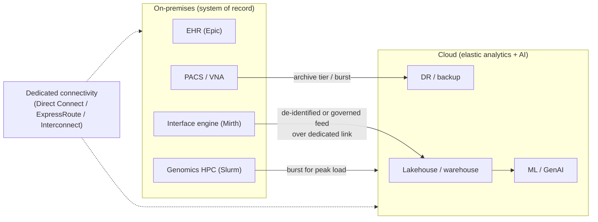

# On-premises & hybrid for HLS

## Learning objectives

After this chapter you will be able to:

- Explain why much of HLS still runs on-premises — and will for years.
- Design a hybrid architecture that keeps the system of record on-prem and extends to cloud.
- Choose connectivity and distributed-cloud options for a regulated HLS workload.

## Cloud is not the whole story

The previous chapters are cloud-first, but the operational reality of health & life science is **hybrid**: mission-critical systems run on-premises while new capabilities — FHIR APIs, analytics, AI — extend into the cloud. An SA who assumes "everything goes to the cloud" will design something the hospital cannot run and the CISO will not approve. You must be fluent in on-prem and hybrid, not just managed cloud services.

### Why HLS still runs on-prem

- **Legacy systems of record.** EHRs (Epic, Oracle Health/Cerner, MEDITECH) and PACS are often on-prem or in vendor-hosted data centers. **Epic** deploys on-premises, via Epic Cloud Hosting, or on a third-party cloud — many large systems still run it on-prem.
- **Disconnected operation.** A hospital must keep treating patients if its internet link drops. Clinical systems frequently require the ability to operate without a cloud control plane.
- **Latency to devices.** Imaging modalities, infusion pumps, monitors, and lab instruments are physically in the building; sub-millisecond, always-available local connectivity matters.
- **Data sovereignty & residency.** Law or policy may require that patient data never leaves the building, the country, or a sovereign boundary. See [GDPR & data residency](../03-compliance/03-gdpr-residency.md).
- **Sunk cost & existing HPC.** Large on-prem genomics HPC clusters and storage represent real investment; re-platforming is gradual.
- **Regulatory comfort.** Some GxP and clinical environments move to cloud cautiously; validated on-prem systems are not rebuilt lightly.

## On-prem building blocks

The on-prem HLS stack has direct analogues to the cloud services you already know:

| Capability | On-prem building block |
| --- | --- |
| Compute / virtualization | VMware vSphere, Nutanix, Red Hat OpenShift / Kubernetes |
| Object & file storage | MinIO, Pure Storage, Dell, NetApp |
| Clinical interop engine | Mirth Connect, Rhapsody, Cloverleaf (MLLP termination — see [HL7v2](../02-interoperability/00-hl7v2.md)) |
| Imaging | On-prem PACS / VNA (Vendor Neutral Archive) |
| Genomics compute | HPC clusters with Slurm/SGE schedulers (see [Sequencing pipelines](../07-genomics/00-sequencing-pipelines.md)) |
| Identity | On-prem Active Directory / LDAP |

## Hybrid patterns

The dominant pattern: **keep the system of record where it must live (often on-prem) and use the cloud for what it is best at** — elastic analytics, AI, and disaster recovery.

Common hybrid designs:

- **Cloud as the analytics/AI layer.** The on-prem interface engine streams a governed feed to a cloud lakehouse ([OMOP](../02-interoperability/04-omop-cdm.md), RWD) for analytics and AI, while the EHR stays on-prem.
- **Cloud bursting.** Genomics or imaging-AI batch workloads run on-prem normally and **burst** to cloud for peak demand, then release.
- **DR / archive to cloud.** Cold imaging archives and backups tier to cloud object storage.
- **Edge.** Inference (e.g., imaging triage) runs at the edge near the device; training and aggregation happen centrally.

## Connectivity

Hybrid stands or falls on the network. For PHI-bearing traffic, use **private, dedicated connectivity** rather than the public internet:

- **AWS Direct Connect**, **Azure ExpressRoute**, **Google Cloud Interconnect** — dedicated circuits with predictable latency and bandwidth.
- **Private endpoints** so cloud-managed services are reachable without traversing the public internet.
- Plan for **bandwidth** (imaging and genomics move terabytes) and for **egress cost** (see [Trade-offs, TCO & cost](../01-foundations/03-tradeoffs-tco.md)).

## Distributed cloud & sovereign options

When you need the cloud operating model **but the data must stay on-prem or in-country**, distributed-cloud appliances run cloud services in your own facility under a consistent control plane:

| Provider | Distributed-cloud / on-prem offering |
| --- | --- |
| AWS | **Outposts** (cloud hardware in your data center); European Sovereign Cloud for jurisdictional control |
| Azure | **Azure Local** (formerly Azure Stack HCI/Hub); sovereign private cloud |
| Google | **Google Distributed Cloud (GDC)** — connected and air-gapped variants |

These increasingly support **disconnected operation** (limited functionality when cut off from the cloud control plane) — important for clinical resilience and air-gapped/sovereign environments. Reach for them when latency, data residency, or disconnected operation rule out a public-region deployment but you still want managed-service consistency.

## Compliance shifts on-prem

The [HIPAA](../03-compliance/00-hipaa.md) shared-responsibility line **moves** when you run on-prem: there is no cloud provider handling the physical and infrastructure layers, so **you** own physical security, hardware lifecycle, patching, network segmentation, and the full audit chain. A hybrid design must reconcile two control regimes — your on-prem controls and the cloud's shared-responsibility model — into one coherent, evidenceable posture for [HITRUST](../03-compliance/01-hitrust.md)/GxP.

## A decision guide

| Lean on-prem when… | Lean cloud when… | Lean hybrid when… |
| --- | --- | --- |
| Data cannot leave the building/country | Elastic/variable demand | You have an on-prem system of record but want cloud analytics/AI |
| Disconnected operation is required | Greenfield, no legacy estate | DR/archive to cloud while keeping production local |
| Large existing validated/HPC investment | You want managed clinical services (FHIR/imaging/genomics) | Bursting peak genomics/imaging workloads |

Most real HLS architectures are **hybrid**. The SA's job is to place each component where its constraints are best satisfied and to design clean, governed, well-connected boundaries between them.

## Check yourself

1. A hospital insists its EHR must keep functioning during an internet outage. What does this requirement rule out, and what on-prem/hybrid pattern fits?
2. You need cloud-managed-service consistency but regulators require the data to stay in-country with no public-region option. Which class of offering addresses this?
3. How does the HIPAA shared-responsibility boundary differ between a fully managed cloud service and an on-prem deployment?

## Further reading

- [AWS Hybrid Cloud & Outposts](https://aws.amazon.com/hybrid/)
- [Azure Local](https://learn.microsoft.com/en-us/azure/azure-local/)
- [Google Distributed Cloud](https://cloud.google.com/distributed-cloud)
- [Epic deployment & hosting options](https://www.epic.com/)
